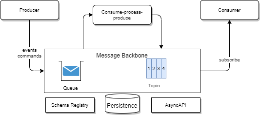
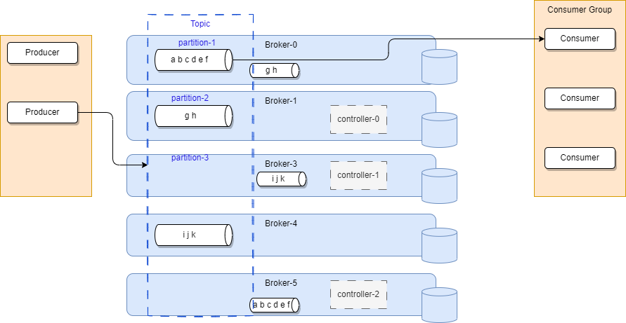

# Message Backbone

???- Info "Chapter updated 09/2024"
    **This page content reviewed 09/2024**
    Created 2020 - Updated 08/ 2024

As introduced before the messaging as a service enterprise may want to deploy support the following components:

Most of those components, withn this diagram, are described in separate chapters. 

**Message Backbone** serves as the core middleware that facilitates asynchronous communication and storage of events. It possesses high availability and replayability capabilities, ensuring the reliable handling and persistence of events.

## Selecting event bus technologies

As introduced in the [event backbone capabilities section](eda.md/#zooming-into-the-capabilities-of-the-event-backbone), there are different messaging capabilities to support. There is no product on the market that supports all those requirements. Enterprise deployment for an event-driven architecture needs to address all those capabilities at different level, and at different time. It is important to any EDA adoption to start small, and add on top of existing foundations but always assess the best fit for purpose.

### Message Backbone with queues

Consider queue system when we need to:

* Support **point-to-point** delivery (asynchronous implementation of the **Command** pattern): Asynchronous request/reply communication: the semantic of the communication is for one component to ask a second component to do something on its data. The state of the caller depends of the answer from the called component.
* Deliver **exactly-once** semantic: not loosing message, and no duplication. 
* Participate into **two-phase commit transaction** (certain Queueing system support XA transaction).
* Keep strict **message ordering**. This is optional, but FIFO queues are needed in many business applications.
* Scale, be resilient and always available.

Messages in queue are kept until consumer(s) got them. Consumer has the responsibility to remove the message from the queue, which means, in case of interruption, the record may be processed more than one time. So if wdevlopers need to be able to replay messages, and consider timestamp as an important element of the message processing, then streaming is a better fit.

Queueing system are non-idempotents, but some are.

**Products:** [IBM MQ](../techno/ibm-mq/index.md), open source RabbitMQ and Active MQ. Some Cloud vendor managed services like AWS SQS, Azure Storage Queues.

**IBM MQ Broker Cluster topologies**

### Pub/sub with topics

The leading event middleware in the market is Apache Kafka. Kafka's append-only log format, sequential I/O access, and zero-copy mechanisms enable high throughput with low latency. Its partition-based data distribution allows for horizontal scaling to hundreds of thousands of partitions.

Older queue systems are now supporting publish/subscribe (pub/sub) patterns, most of which are based on Java Messaging Service (JMS) APIs and protocols.

A typical Kafka cluster has multiple brokers, with their own persistence on disk and Zookeeper Ensemble to manage the cluster states (topology up to mid 2024:)

Since mid 2024 and the general availability of the Kraft protocol and the controller nodes, Zookeeper is not mandatory and not recommended.

Topics are key elements that support message persistence and access semantics. Most systems operate with topic subscriptions, where some publish messages only to active subscriptions. In contrast, Kafka allows consumers to connect at any time and replay events from the beginning.

---

### Criteria to select a technology

A Message as a Service (MaaS) platform must support both queues and topics. For topics, a specific Kafka packaging needs to be chosen. There are numerous packaging options available in the market, and cloud providers offer managed services that eliminate the need for infrastructure management and version upgrades.

There are a set of criteria to consider for selecting a Kafka packaging:

* Type of asynchronous expected interaction, queue or topic
* Data volume
* Easy to move data to Tiered storage
* Expected Latency
* Storage needs and retention time
* User interface to get visibility to topics, consumer groups and consumer lags
* Support to declarative configuration
* Monitoring with proprietary and shared platforms
* Access control: enforce strong access controls and authentication mechanisms
* Encryption for data in transit and at rest
* Support to a single glass for queue and topic management
* Legal and compliance requirements for data handling, with fine grained access control
* Cost of running the infrastructure and services.
* Support to address complex disaster recovery strategies

### Centralized Cluster vs multiple clusters

Adopting a centralized Kafka cluster in a production environment can offer numerous benefits, but it also necessitates careful considerations of various factors. It is essential to evaluate segregation strategies to maximize performance, optimize costs, and facilitate greater adoption of Kafka. The strategic dimensions to consider are:

* Geo-localization requirements
* Operational decoupling
* Tenant isolation
* Application optimization
* Service availability, and data criticality
* Cost and operating attention to each workload.

#### Factor for centralized

 Here are some key factors to consider:

* Number of applications and small number of topic per application.
* Application designed for real-time messaging and distributed data processing may better fit for leveraging common cluster. While ETL data pipeline can afford more downtime than a real-time messaging infrastructure for frontline applications.
* Data volume and data criticality
* Data isolation by applications and domains: a centralized Kafka cluster facilitates better data governance, data sharing, and data consistency across the organization. It enables a common data streaming strategy and reduces the risk of data silos. But domain specific data boundaries leads to adopt decentralized cluster.
* Retention time
* Network latency for producers and consumers connecting to the centralized cluster.
* Streaming processing of consumer-process-produce with exactly once semantic can only be done in the same cluster.
* Scalability needs in the future: data volume growth
* Maximun number of broker per clusters- Cluster with 100 brokers is alaready complex to manage. A small cluster needs at least 3 to 6 brokers and 3 to 5 Zookeeper node. Those components should be spread across multiple availability zones for redundancy.
* Level of automation to manage the cluster: a centralized approach simplifies management, and maintenance. It reduces the complexity of configuration, upgrades, and troubleshooting compared to managing multiple independent clusters
* Monitoring of the cluster health with a way to drill down to the metrics for root cause analysis
* Current expertise and resources to manage a centralized system effectively.
* Legal and compliance requirements for data handling.
* Cost with bigger hardware for each node, number of nodes, versus smaller cluster. Consider idle time. Centralized cluster should cost less thant multiple decentralized clusters. By consolidating resources and reducing redundant infrastructure and DevOps efforts, organizations can achieve significant cost savings. But if the data transfer to the centralized Kafka cluster is high then the benefits will be low.
* Evaluate how well a centralized cluster can integrate with existing systems and data sources.
* Plan for how the centralized system will handle failures and ensure data durability. Bigger failover is more complex and may be more costly.
* Replication Strategies: Assess the replication needs to prevent data loss in case of cluster issues.
* Determine if a centralized cluster promotes better collaboration among teams.
* Consider how operational responsibilities will be divided among teams.
* Kafka was not designed for multi-tenancy. Ther is no concept like namespaces for enforcing quotas and access control. Confluent has added a lot on top of the open-source platform to support.

*Sharing a single Kafka cluster across multiple teams and different use cases requires precise application and cluster configuration, a rigorous governance process, standard naming conventions, and best practices for preventing abuse of the shared resources.*

#### Adopting multiple clusters

The larger a cluster gets, the longer it can take to upgrade and expand the cluster due to rolling restarts, data replication, and rebalancing. Using separate Kafka clusters allows faster upgrades and more control over the time and the sequence of rolling out a change.

* There is nothing in Kafka for a bad tenant to monopolize the cluster resources, having smaller cluster for each functional area or domain, is better for isolation.

#### Practices

* Adopt a topic naming convention with prefixes becomes part of the security policy to be controlled with access control list.
* Limit admin access to one user per domains, clarify the rule of operations.
* There may be need for hundreds of granular ACLs for some applications that are less trusted, and coarse-grained ACLs for others.
* Add a way to manage metadata about cluster, topics, schema, producer and consumer apps.

## Streaming capabilities

Consider streaming system, like Kafka, AWS Kinesis Data Stream, as pub/sub and persistence system for:

* Publish events as immutable facts of what happened in an application.
* Get continuous visibility of the data Streams.
* Keep data once consumed, for future consumers, and for replay-ability.
* Scale horizontally the message consumption.
* When need to apply event sourcing, and time based reasoning. 

## Event router needs

Some vendors are proposing event routing capability to top of message broker. This is marginal and addresses a very limited problem of routing to target subscribers. Consider event router when:

* There is very basic logic to apply to the message to route to a target consumer
* Being able to apply filter and transformation on message in the message broker
* Many to many routing
* Point to point with enrichment
