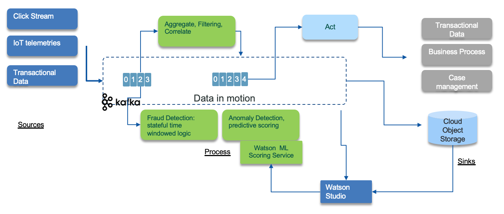
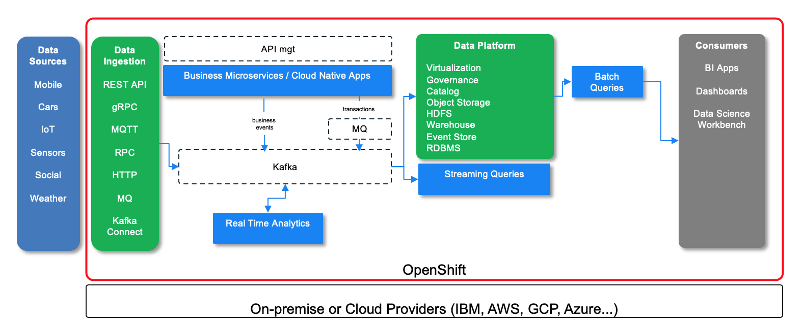

# Data pipeline

The extended architecture extends the basic EDA reference architecture with concepts showing how data science, artificial intelligence and machine learning can be incorporated into an event-driven solution. The following diagram illustrates the event sources on the left injecting events to topics where green components are consuming from. Those components apply filtering, compute aggregates and stateful operation with time window based rules. Some of those components can include training scoring model, to do for example anomaly detection. The model is built with data scientist workbench tool, like Watson Studio.

 

The starting point for data scientists to be able to derive machine learning models or analyze data for trends and behaviors is the existence of the data in a form that they can be consumed. For real-time intelligent solutions, data scientists typically inspect event histories and decision or action records from a system. Then, they reduce this data to some simplified model that scores new event data as it arrives.

### Getting the data for the data scientist:

With near real-time event streams, the challenge is in handling unbounded data or a continuous flow of events. To make this consumable for the data scientist you need to capture the relevant data and store it so that it can be pulled into the analysis and model-building process as required.

Following our event-driven reference architecture the event stream would be a Kafka topic on the event backbone.  From here there are two possibilities for making that event data available and consumable to the data scientist:

* The event stream or event log can be accessed directly through Kafka and pulled into the analysis process
* The event stream can be pre-processed by the streaming analytics system and stored for future use in the analysis process. You have a choice of store type to use. Within public IBM cloud object storage [Cloud Object Store](https://www.ibm.com/cloud/object-storage) can be used as a cost-effective historical store.

Both approaches are valid, pre-processing through streaming analytics provides opportunity for greater manipulation of the data, or storing data over time windows for complex event processing. However, the more interesting distinction is where you use a predictive (ML model) to score arriving events or stream data in real time. In this case you may use streaming analytics to extract and save the event data for analysis, model building, and model training and also for scoring (executing) a derived model in line in the real time against arriving event data.

* The event and decision or action data is made available in cloud object storage for model building through streaming analytics.
* Models may be developed by tuning and parameter fitting, standard form fitting, classification techniques, and text analytics methods.
* Increasingly artificial intelligence (AI) and machine learning (ML) frameworks are used to discover and train useful predictive models as an alternative to parameterize existing model types manually.
* These techniques lead to process and data flows where the predictive model is trained offline using event histories from the event and the decision or action store possibly augmented with some supervisory outcome labelling, as illustrated by the paths from the `Event Backbone` and `Stream Processing` store into `Learn/Analyze`.
* A model trained in this way includes some “scoring” API that can be invoked with fresh event data to generate a model-based prediction for future behavior and event properties of that specific context.
* The scoring function is then easily reincorporated into the streaming analytics processing to generate predictions and insights.

These combined techniques can lead to the creation of near real-time intelligent applications:

1. Event-driven architecture
2. Identification of predictive insights using event storming methodology
3. Developing models for these insights using machine learning
4. Near real-time scoring of the insight models using a streaming analytics processing framework

These are scalable easily extensible, and adaptable applications responding in near real time to new situations. There are easily extended to build out and evolve from an initial minimal viable product (MVP) because of the loose coupling in the event-driven architecture, , and streams process domains.

### Data scientist workbench

To complete the extended architecture for integration with analytics and machine learning, consider the toolset and frameworks that the data scientist can use to derive the models.  [Watson Studio](https://www.ibm.com/marketplace/watson-studio)  provides tools for data scientists, application developers, and subject matter experts to collaboratively and easily work with data to build and train models at scale.

For more information see [Getting started](https://dataplatform.cloud.ibm.com/docs/content/getting-started/overview-ws.html) with Watson Studio.

## Modern Data Lake

One of the standard architecture to build data lake is the lambda architecture with data injection, stream processing, batch processing to data store and then queries as part of the service layer. It is designed to handle massive quantities of data by taking advantage of both batch and stream processing methods. Lambda architecture depends on a data model with an append-only, immutable data source that serves as a system of record. The batch layer pre-computes results using a distributed processing system that can handle very large quantities of data. Output from the batch and speed layers are stored in the serving layer, which responds to ad-hoc queries by returning precomputed views or building views from the processed data.

The following figure is an enhancement of the lambda architecture with the adoption of Kafka as event backbone for data pipeline and source of truth and streaming processing to support real time analytics and streaming queries.

 

On the left the different data sources, injected using different protocols like MQTT, HTTP, or Kafka Connect... The business applications are supported by different microservices that are exposed by APIs and event-driven. The APIs is managed by API management product. Business events are produced as facts about the business entities, and persisted in the append log of kafka topic. Transactional data can be injected from MQ queues to Kafka topic, via MQ connectors. 

The data platform offers a set of capabilities to expose data for consumers like Data Science workbench (Watson Studio) via virtualization and data connections. The data are cataloged and governed to ensure integrity and visibility. The storage can be block based, document oriented or table oriented.

Batch queries and map reduce can address huge data raw, while streaming queries can support real time aggregates and analytics.