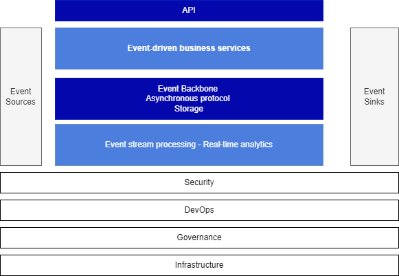

# Event-driven architecture

## Components of the architecture

To provide a comprehensive understanding of event-driven architecture (EDA) and its high-level building blocks, it is crucial to consider the following components without any technology bias. The diagram below illustrates these components:

<figure markdown="span">
  
  <figcaption><b>Event-driven architecture high level view</b></figcaption>
</figure>

The main goals of this architecture are to support scaling, decoupling, and acting on data as early as created, while enabling data pipelines for future batch processing and AI/ML development.

* **Event sources** encompass any applications from which we need to obtain data. While most of these sources may not be inherently event-oriented, we can retrieve events from them by pulling/querying their APIs or data storage (databases) or by connecting change data capture agents to receive continuous event feeds.

* **Event Backbone** serves as the core middleware that facilitates asynchronous communication and storage of events. It possesses high availability and replayability capabilities, ensuring the reliable handling and persistence of events.

* **New event-driven applications**: These applications, whether microservices or functions, are designed with events as a fundamental part of their architecture from day one. They act as both producers and consumers of events, exposing APIs for utilization by web apps, mobile apps, or B2B apps. As a result, they support both synchronous and asynchronous protocols.

* **Events** are stored within the event backbone for extended retention periods and can also be directed to target sinks such as data lakes for further processing and analysis.
* **Sinks** represent longer term storage or downstream backend processing destinations for event data. Integrating with sinks can be challenging, as the sink software may not inherently support idempotency or exactly-once delivery. Normally consistency boundaries are before reaching the sinks.  

* **Event Stream Processing:** The final component of the architecture involves acting on the events through a consume-process-publish semantic. Event processing encompasses activities such as data processing, real-time analytics, stateful aggregate computation, data transformation, data pipelines, and Complex Event Processing.

It is important to note that cross-cutting capabilities such as **security, devops and governance** must be applied across all these components. Infrastructure as Code practices should be leveraged with technologies that support this architecture. Governance efforts need to address critical aspects such as data lineage, schema management, and APIs management.

By considering these high-level building blocks and their interactions, organizations can create scalable, decoupled, and proactive architectures that enable early data actions, support future batch processing, and facilitate AI/ML development.

## Zooming into the capabilities of the Event Backbone

The Event Backbone is not tied to a specific technology, as different requirements necessitate the use of different tools. In the realm of asynchronous communication, applications produce messages, consume them, or do both in the form of consume-process-produce processing.

<figure markdown="span">
  
  <figcaption><b>Event backbone component view</b></figcaption>
</figure>

For **the producer**, two behaviors can be illustrated: 

1. When applications need to request another service to perform a task on their behalf, it follows the classical **command pattern**. In this scenario, there is a single interested consumer, and the exchange between the two applications employs request/reply messages. The communication requires exactly-once delivery, message ordering, and no data loss. **Queues** are the ideal technology for supporting this type of communication.
1. When applications need to broadcast changes in their main business entity's state, they produce events as immutable facts. The appropriate technology approach is the **pub/sub** model on a topic. Two technologies should be considered: the older topic-based approach like JMS, or the streaming approach supported by products like Apache Kafka.

For **consumers**, they can either subscribe to a queue or topic and pull messages or receive messages as part of their subscription in a push model. With pulling, the consumer needs to filter out messages that it is not interested in. With pushing, the event backbone can apply filtering and routing rules. It's important to note that in a queueing system, messages are deleted once read, while in classical topic implementations, messages are retained until all known subscribers have received the message. In Kafka, messages disappear after a retention time or upon reaching a log size threshold. With streaming from a topic, one consumer can read many messages from different topics, and one message can be read by many consumers arriving at different times.

The **consume-process-produce** pattern is prevalent in technologies like Kafka Streams. This pattern involves a three-step transactional process that supports exactly-once delivery. Other technologies like Apache Flink or Apache Spark Streaming may also support similar implementations. The key aspect of this pattern is the creation of new facts through processing, which are then published to another topic. This approach is valuable for building data pipelines, performing stateful aggregation using time windows, enabling real-time analytics, and implementing complex event processing.

When it comes to streaming and topics, messages can be ordered, and the topic itself may include timestamps. This allows for the implementation of complex event processing logic that can examine event sequencing, detect missing events, and handle out-of-order events.

Topics or queues should provide persistence for resilience purposes, allowing for the replaying of historical messages or restarting from a specific message. Persistence is implemented differently depending on the technology used. For example, Kafka employs offset management, partitions, and files on the event broker's disks.

The event backbone should be scalable and support clustering of brokers to handle increased loads.

There is an inherent peculiarity in the terminology used, as we refer to it as the "event backbone," while in the realm of queueing middleware, the concept of "event" does not exist, only messages do. A more appropriate name for this component would be "messaging middleware" or "messaging system." This distinction can be confusing, but if we examine the underlying APIs (such as JMS, Kafka, Amazon Kinesis, etc.), we find that the fundamental data structure is a record or message. In modern times, it is accepted that the term "message" is used when records are persisted until consumed, with message consumers typically being directly related to the producer, who cares about message delivery and processing. On the other hand, events are persisted as a replayable stream, and event consumers are not tightly coupled to the producer, being able to consume events at any point in time.

In most topic implementations, the concept of partition or shard exists to enable parallel scaling of the number of consumers.

Finally, two essential services are necessary in this middleware to support the minimal governance requirements of most EDA implementations:

* **Schema registry:** This service maintains control over the contract between producers and consumers by defining the data schema used for message exchange. The message includes metadata about the schema version, and it may also contain the URL of the schema registry. This allows consumers to dynamically retrieve the schema definition at runtime, enabling the replaying of both old and new messages from the same topic or queue.
* **AsyncAPI definition support**: The emerging [AsyncAPI](https://www.asyncapi.com/) standard provides a specification for asynchronous communication and binding. To manage AsyncAPI definitions effectively, an API manager solution should be utilized, which includes code generation for consumers based on the defined bindings.

By incorporating these services into the event backbone, organizations can ensure the necessary governance and standardization within their EDA implementations.

## Event sources

As introduced before, in this category, we include applications that were not originally designed to produce events. These applications often use queueing systems and databases. To capture data updates and gain visibility into them, tools like Change Data Capture (CDC) are employed to get records from SQL based database. CDC enables the injection of updated records as messages into queues or topics.

<figure markdown="span">
  
  <figcaption><b>Event sources component view</b></figcaption>
</figure>

For Document oriented database, some change stream softwares are used. Finally for legacy, transactional queueing system, some product, like IBM MQ offers message replication to streaming queue, which can be injected to pub/sub middleware via queue connector.

When dealing with event sources, several design considerations need to be taken into account. These considerations include:

* **Avoiding Message Duplication:** It is essential to implement mechanisms that prevent the duplication of messages. Duplicate messages can lead to inconsistent data processing and undesired side effects. Techniques like message deduplication or leveraging unique identifiers can help ensure that only unique and distinct events are processed.

* **Message Reliability:** Ensuring that messages are not lost during the event capture process is crucial. Reliable message delivery mechanisms, such as guaranteeing message persistence and employing acknowledgement mechanisms, should be implemented. This ensures that every captured event is successfully propagated and processed downstream.

* **Throughput Optimization:** Managing the throughput of event capture is vital for maintaining system performance and stability. Designing efficient mechanisms to handle high volumes of events, such as employing proper batching techniques, parallel processing, or throttling, can help optimize the overall throughput and prevent overloading downstream messaging systems.

## Event-driven microservices

Event-driven microservices are small, independent applications that expose a set of operations on a single entity and communicate with each other through web APIs, typically utilizing the RESTful protocol. They are developed by agile, a two-pizza size teams,  following DevOps practices and leveraging cloud-native development approaches.

When designing and implementing microservices, we employ domain-driven design (DDD) principles, focusing on the domain and sub-domain, identifying events, aggregates, commands, and bounded contexts. These DDD elements serve as the foundation for building robust microservices.

In the context of microservice implementation, it is beneficial to align with the principles outlined in the [reactive manifesto](https://www.reactivemanifesto.org/). By adhering to these principles, microservices exhibit the following essential characteristics:

* **Responsive**: delivers a consistent quality of service to end users or systems, react quickly and consistently to events happening in the system.
* **Elastic**: The system stays responsive under varying workload, it can scale up and down the resource utilization depending of the load to the system.
* **Resilient**: stays responsive in the face of failure, this is a key characteristics. Achieving resilience often involves implementing distributed systems and employing techniques such as replication, containment, isolation, and delegation.
* **Message driven**: the underlying behavior is to have an asynchronous, message-driven communication. This approach enables loose coupling between application components through the exchange of asynchronous messages. It helps to minimize or isolate the negative effects of resource contention, coherency delays and inter-service communication network latency. It is the base to support the other reactive characteristics. It also helps for isolation and support location transparency.

The relationships between those characteristics are very important to also illustrate the need for exchanging messages asynchronously:

{ width=500 }

For more information on reactive systems, see [this chapter](../patterns/reactive/index.md)

## Event sinks

Event sinks serve as targets for downstream processing, and their characteristics can vary depending on the asynchronous middleware employed.

Writing to a sink application presents challenges, particularly when ensuring exactly once delivery is crucial. Using idempotence identifier may be a solution if the sink backend supports it. The implementation needs to consider reliability of the sink backend and what do do in case of communication failure. Implementing appropriate retry logic can increase the chances of successful event delivery, byt dead letter queue needs to be in place too. The last challenge to overcome is when to consider the message from the event backbone to be really processed. There is no XA transaction between the pub/sub middleware and the backend, so we can not use transactional engine. The read commit to the messaging needs to be done after the write operation on the sink backend. But this means duplicate may occur.

The following diagram illustrates some of those challenges:

End to end monitoring may help assessing if some messages may be lost, or if event consumers to sink are behind.

Also schema management may be useful, and depending on the sink backend it may be necessary to do some data transformation within the message consumer logic. Finally end to end governance needs to be considered.

## Event streaming processing

Event streaming processing is a key value proposition of Event-Driven Architecture, particularly in addressing the requirements of modern data pipelines and enabling timely actions on data, especially in the context of AI/ML.

In event streaming, events are persisted over a long time period, ordered, timestamped, and immutable. Leveraging these characteristics, we can implement elements of traditional Transform operations performed in batch ETL jobs, but in real-time and consumable by any interested parties. This shift transforms black box ETL into transparent processing within a continuous data pipeline.

In the classical data preparation process for ML model development, data scientists typically discover raw data and perform feature engineering by applying transformations, often using Python notebooks. Feature stores are added into the pipeline, to better help model training and feature reuse. Once confident in the model scoring, a data engineer then operationalizes the data pipeline to feed data into the model, ensuring that the ML model is well-prepared for deployment. The model is integrated as a service, and any data issues can impact the model results. Traditionally, the implementation of the data pipeline is done using ETL products. However, in most modern pipelines, integration with streaming data is becoming necessary.

The following diagram illustrates this concept of modern data pipeline for preparing events/ features for ML models and a feature store.  

{ width=1000 }

This diagram showcases an example using an autonomous car system, where each car sends telemetry data to a topic. The raw data is consumed, transformed, and mapped according to the processing defined by the data engineer. This processing may involve computing aggregates and producing, what we used to call in the Complex Event Processing (CEP), synthetic events. The resulting synthetic event is published to another topic and may be relevant for other consumers. From an EDA perspective, this ability to share events for multiple use cases is a significant value proposition. One of the consumers in this scenario is a sink adapter, which writes the events to a feature store. The feature store, which also includes data from a warehouse or data lake, is then utilized by a predictive service to prepare data for the ML model. For instance, the car dispatcher service may leverage the predictive service to obtain estimated travel times. 

In many EDA deployments, the logic of consuming, processing, and publishing events is commonplace, offering tremendous flexibility in data processing. Data becomes a real-time asset, shareable as needed, and empowers organizations to unlock the full potential of their data resources.

## Scalability

Event-Driven architectures are highly scalable by design. 
By leveraging an event-driven backbone, these architectures enable the addition or removal of consumers based on the volume of messages awaiting consumption from a topic. This scalability is particularly beneficial in architectures where in-stream transformation is required, such as data pipeline workflows. Messages can be consumed and transformed rapidly, enabling near real-time decision-making processes that require millisecond-level responsiveness.

When using a system like Apache Kafka, the data within a given topic is partitioned by the broker. This partitioning enables parallel processing of the data for consumption. Consumers are typically assigned to specific partitions, allowing for efficient and concurrent processing of messages.

In addition to scaling up, EDA also offers the flexibility to scale down, even down to zero. The ability to autonomously scale up and down in response to workload demands is referred to as "elasticity". This elasticity promotes energy and cost efficiency by dynamically allocating resources only as needed, ensuring optimal utilization and minimizing waste.

By leveraging the inherent scalability and elasticity of Event-Driven Architectures, organizations can effectively handle varying workloads, accommodate increased data volumes, and respond to changing demands in a highly efficient and cost-effective manner.

## Resiliency

The reduced inter-dependency between applications in an Event-Driven architecture contributes to increased resiliency. When services experience failures, they have the ability to autonomously restart and recover events, even replaying them if necessary. This self-healing capability reduces the reliance on immediate availability of specific services, ensuring the overall functionality of the system remains intact. More details about consumer offset management and data projection rebuilding after recovery can be found [in the **Kafka Consumer article**](../techno/kafka/consumer.md).

The decoupling of services also means, the services do not need to know who are the consumer, and for consumer who produce the events. There are a number of advantages to this characteristics. For example, even if a service goes down temporarily, events will still be produced or consumed once it has recovered, ensuring guaranteed delivery. This decoupling reduces the impact of service failures on the overall system and enhances fault tolerance.

To illustrate this concept, let's consider a shipping company that operates a fleet of container ships equipped with smart IoT devices. These devices collect data about container health, such as temperature and GPS position. At the vessel level, edge computing with a local event backbone enables simple aggregations and correlations before periodically sending the data to a central onshore monitoring platform. If the vessel's network goes offline, preventing the refrigerator containers from sending data, the data can still be collected and transmitted once the network connectivity is restored. This demonstrates resilience between data centers, ensuring data continuity and availability.

 The following diagram illustrating those concepts with the underlying technologies involved.

 { width=700}

Applications on the right side run in a data center or cloud provider region and receive aggregated data from the Kafka cluster operating on the vessel. Data replication for the topic is achieved using [**Mirror Maker 2**](../techno/mirrormaker/index.md). A second level of real-time analytics can compute aggregates across multiple vessels even when the connection is lost, as the mirroring mechanism retrieves the records upon reconnection. On the vessel level, multiple brokers ensure high availability, while cross-broker data replication ensures data resilience. Real-time analytic components can scale horizontally, even when computing global aggregates, utilizing the Kafka Streams capability of KTables and stores.

## Kappa architecture

The Kappa Architecture is a software architecture designed for processing streaming data.

The primary premise behind the Kappa Architecture is that it enables both real-time and batch processing, especially for analytics, using a single technology stack. 

The Kappa Architecture achieves this by leveraging a unified, append-only log that serves as the source of truth for all data. This log can be processed in real-time, as events are generated, as well as in batch mode, allowing for flexible and efficient data processing to meet various analytical requirements.

* Streaming processing is the practice of taking action on a series of data at the time the data is created. It
can be done with different technologies like [Kafka Streams](../techno/kstreams/), Apache Sparks streaming,
[Apache Flink](https://jbcodeforce.github.io/flink-studies/), Redis streaming, or [Hazelcast](https://hazelcast.com/).
* The serving layer is where OLAP queries and searches are done, most of the time with indexing and other advanced
capabilities are needed to offer excellent response time, high throughput and low latency. 

It is a simpler alternative to the Lambda Architecture – as all data is treated as if it were a stream. Both architectures entail the storage of historical data to enable large-scale analytics.