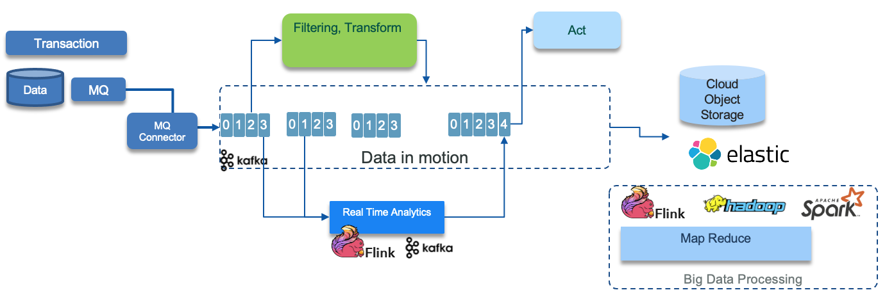
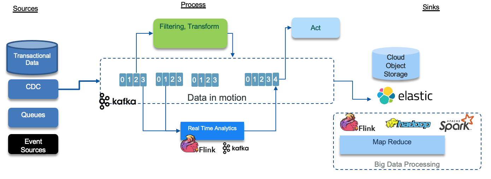
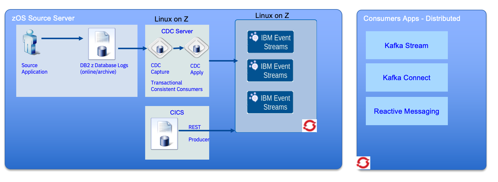

# Legacy Integration

When developing new digital business applications, developers often need to integrate legacy applications and databases into the event-driven architecture. There are two main approaches to directly connect these legacy systems to the event-driven system:

1. Legacy applications connected with IBM MQ. Developers can directly connect the IBM MQ messaging system to the Kafka event backbone. Refer to the [IBM Event Streams getting started with MQ article](https://ibm.github.io/event-streams/connecting/mq/) for guidance on this integration.. The key benefit of this approach is to leverage the transactional capabilities of IBM MQ. This allows writing to both the database and the message queue within the same transaction, ensuring data consistency and integrity:

    

2. Where databases support the capture of changes to data, developers can publish changes as events to Kafka integrating them into the event-driven infrastructure. This can be achieved by leveraging the transactional [outbox pattern](../patterns/index.md/#transactional-outbox):

    The application prepares the events representing the data changes and writes them to a dedicated 'outbox' table, as part of the same transaction that updates the main application tables.

    A change data capture (CDC) agent then reads the events from the outbox table and publishes them to the Kafka event backbone.

    

    This approach ensures that the events are consistent with the underlying data changes, as the event publication is part of the same atomic database transaction.

One of the challenges of basic CDC products, is the replication per table pattern, which leads to rebuild the transaction integrity using kafka stream by joining data from multiple topics. The [TCC (Transactionally consistent consumer) technology](https://www.ibm.com/support/knowledgecenter/SSTRGZ_11.4.0/com.ibm.cdcdoc.cdckafka.doc/concepts/kafkatcc.html) allows Kafka replication to have semantics similar to a relational database. This dramatically increases the types of business logic that can be implemented. Developer can recreate the order of operations in source transactions across multiple Kafka topics and partitions and consume Kafka records that are free of duplicates by including the Kafka transactionally consistent consumer library in your Java applications. 

TCC allows:

* Elimination of any duplicates, even in abnormal termination scenarios
* Reconstruction of exact transaction order, despite those transactions having been performance optimized and applied out of order to Kafka
* Reconstruction of exact operation order within a transaction, despite said operations having been applied to different topics and/or partitions.  This is not offered by default Kafka's "exactly once" functionality
* Ability for hundreds+ producers to participate in a single transaction.  Kafka's implementation has one producer create all messages for a transaction, despite those messages going to different topics.
* Provides a unique bookmark, so that downstream applications can check-point and resume exactly where they last left off if they fail.

*We recommend listening to this presentation from Shawn Roberston - IBM, on [A Solution for Leveraging Kafka to Provide End-to-End ACID Transactions](https://www.confluent.io/kafka-summit-sf18/a-solution-for-leveraging-kafka-to-provide-end-to-end-acid-transactions/)*

The second, very important, feature is on the producer side, with the Kafka custom operation processor (or KCOP) infrastructure. KCOP helps you to control over the Kafka producer records that are written to Kafka topics in response to insert, update, and delete operations that occur on source database tables. It allows a user to programmatically dictate the exact key an byte values of the message written to Kafka. Therefore any individual row transformation message encoding format is achievable. Out of the box it includes Avro, CSV, JSON message encoding formats. It is possible to perform column level RSA encryption on certain values before writing.
It also permits enriching of the message with additional annotation if needed.
Developers have the complete choice over how data is represented. Eg. Can write data in Kafka Compaction compliant format with deletes being represented as Kafka tombstones or can write the content of the message being deleted.

It also supports Kafka Header fields for efficient downstream routing without the need for immediate de-serialization.
The KCOP allows a user to determine how many messages are written to Kafka in response to a source operation, the content of the messages, and their destination.

* Allows for filtering based on column values.
* Allows for writing the entire row with sensitive data to highly restricted topics and a subset of the columns to wider shared topics.
* Allows for writing the same message in two different formats to two different topics.  Useful in environments where some consuming applications want JSON, others prefer Avro, both can be produced in parallel if desired.
* Allows for sending special flags to a monitoring topic.  Eg. when a transaction exceeds $500, in addition to the regular message, a special topic is written to notifying of the large value transaction

The two diagrams above, illustrate a common architecture for data pipeline, using event backbone, where the data is transformed into different data model, that can be consumed by components that act on those data, and move the data document into data lake for big data processing.

Finally it is important to note that the deployment of the event streams, CDC can be co-located in the mainframe to reduce operation and runtime cost. It also reduces complexity. In the following diagram, event stream brokers are deployed on OpenShift on Linux on Z and the CDC servers on Linux too.

 
 
This architecture pattern try to reduce the MIPs utilization on the mainframe to the minimum by still ensuring data pipeline, with transactional integrity. 

* Quality of Service – autoscaling / balancing between Linux nodes, Resilience.
* Latency  - memory speed (Network ->  HyperSocket, with memory speed and bandwidth)
* Reduce MIPS  (avoid Authentication-TLS overhead on z/OS as no network traffic is encrypted)
* Avoid network spend / management / maintenance between servers
* Improved QoS for the Kafka service – inherits Z platform  (Event Streams is the only Kafka variant currently supported on Linix on Z) 
* Reduced complexity / management cost
* Reduced latency / network infrastructure (apply – Kafka hop is now  in memory) – avoids need for encryption 

The CDC server uses [Transaction Capture Consumer](https://www.ibm.com/support/knowledgecenter/SSTRGZ_11.4.0/com.ibm.cdcdoc.cdckafka.doc/concepts/kafkatcc.html) to keep transaction integrity while publishing to kafka topic. CICS Business events are mechanism for declaratively emitting event from CICS routines.