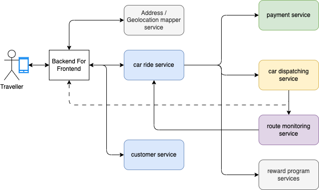
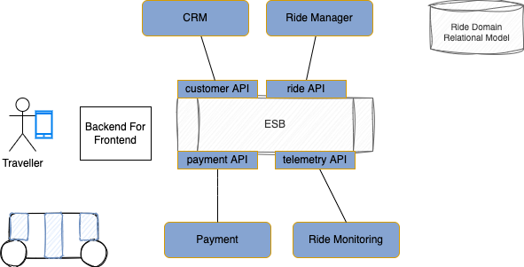
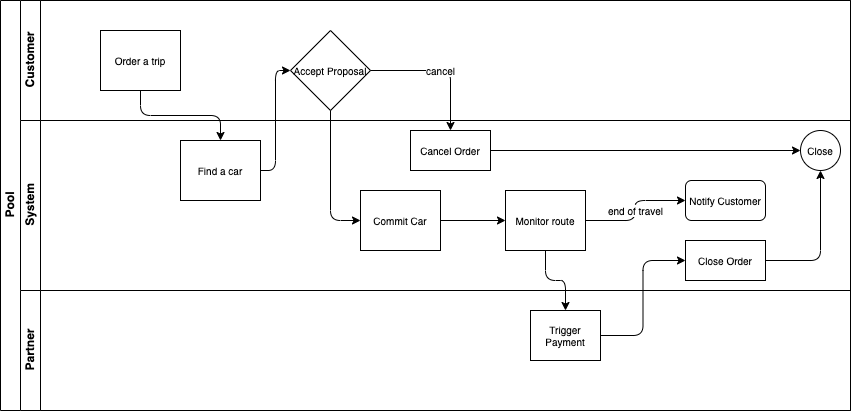

# From SOA to EDA

I will take a imaginary business case of car ride on autonomous vehicles. 

For this discussion, the simplest requirements include, booking a ride to go from one location to another location, manage a fleet of autonomous cars, get payment from the customer once the trip is done, get estimation for the ride duration and price to present a proposition to the end-users.   

The modern synchronous based microservice component view may look like in the following figure:

We will detail the solution design and implementation in [this note.](../solutions/autonomous-car/index.md)

In the early 2000s, when designing this kind of solution, we were using a service oriented architecture, with services being coarse grained and API definition based on service operations. So may be, the search for a trip, booking the trip, get the payment were supported by a unique Ride Service. Monitoring of the rides may be in a separate services, or payment. May be the persistence is within a single SQL database, and project leaders were spending time to design a domain data model, with a lot of relationships, even many-to-many relationships, to support interesting queries. The data model was domain oriented and query oriented. Service operations supported the classical Create, Update, Read and Delete (CRUD) operations, with all the query APIs as part of the same service interface definition.

{ width=900 }

Those big data schemas, the coarse grained service interfaces, the synchronous calls bring the coupling between components and generate frictions for change over time. Developers were reluctant to change the interface definitions. Enterprise Service Buses were used, to expose those interfaces so it was easier to reuse, do some data mappings, interface mappings, and implement the gateway patterns. SOA was synonyms of ESB.

In the 2010s, some of those business applications were considered as business process management solutions. Even when the process did not involved human tasks, the process was doing SOA services orchestration and BPEL was the technology of choice. Later BPMN engines took the lead, but process applications were fat, monolithic, including User Interfaces (server page serving), data model definition, service integrations, and flow definitions. The process execution was stateful.

To have some fun, this is how BPM experts would have modeled, at the high level, the riding application using BPMN:

{ width=1100 }

We will not dig into the details of this process flow, but what is interesting still, is the sequencing of actions over time which led to identify the commands to perform within the flow, which helped to design the service interfaces. The approach had vertu as it engages business users in modeling the business process. Defining terms, data elements, and business routing rules. The technology enforced creating monolithic applications.  

In previous diagram, the failover and compensation flows are not highlighted. But this is where all the architecture decisions have to be made, to select the best implementation choice, to identify when the process execution reached a non-idempotent service, to design the operations for compensation... 

Which leads to my next argument: there are a lot of people who are currently claiming that EDA will be the silver bullet to address service decoupling, scaling, resilience... From the previous example, I have heard architects claiming the following challenges that only could be addressed with EDA:

* Order service is responsible to talk to multiple services, and orchestrates service calls. 
* Orchestration logic should be outside of the microservice. I want to immediatly react on this one, as service orchestration is done to follow a business process. As seen in the process flow above, there is a business logic to route the execution flow among those steps: it is part of the context of the order service to implement the process about an order. We are in the domain-driven design bounded context. The implementation of this orchestration flow can be in code, or in business process engine, in state machine, but at least owned by one team.
* Strong coupling between the components. The order service needs to understand the semantic of the other services. Which is partially true, as what it really needs to understand, is the interface characteristic of the services. Which includes data model, protocol, SLA, interaction type, communication type, ... The data model is part of the interface contract and is the main argument for coupling. Any change to the API of the downstream services impact the order / orchestrator service. There are way to go over that, by using contract testing, so each change to the contracts can be seen during CI/CD pipeline executions. Now it is true that when a service is used by a big number of other services then API versioning becomes a challenge. On the other side of the argument, on most of simple business application the number of services stands to stay low and interface characteristics do not change that often. Data model coupling still exists in messaging based solutions. Schema registry and the metadata exchanged within the message helps to address those coupling, but it means now, consumers need to be aware of the producer. This is an inversion of control. 
* Choreography of APIs is hard to do. I touched on this point before, but one thing important is to differentiate choreography from orchestration. I have seen arguments for EDA by illustrating how difficult to implement compensation flow with synchronous processing. I am not sure about that, as it was done in the SOA world before. The problem is not the way we interact with service, but by the lack of transaction support in RESTful API as it was possible to do with SOAP WS-Transaction protocol. Asynchronous messaging, event bus,... do not help that much on compensation flow. 

??? "Choreography vs Orchestration"
    This different models are used in the context of the Saga pattern, which helps to support a long running transaction between distributed systems that can be broken up to a collection of sub transactions that can be interleaved any way with other transactions:

    * **Orchestration** is when one controller is responsible to drive each participant on what to do and when. 
    * **Choreography** applies each service produces and listens to other service’s events and decides if an action should be taken or not.

In the autonomous car ride example, choreography may be used, as it seems that some services are maintaining states of the overall ride transaction: the order, the car dispatching, the route...

* Another argument is related to availability: if one of the service is not responding quickly, then all the components in the calling chain are impacted. And in case of outages, if one component fails, error will propagate back to caller chain. There are patterns to handle such issues, like circuit breaker, throttling, or bulkhead. Now this is true, asynchronous processing helps to support failure and slower services.

