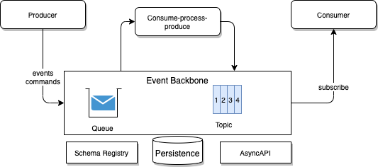
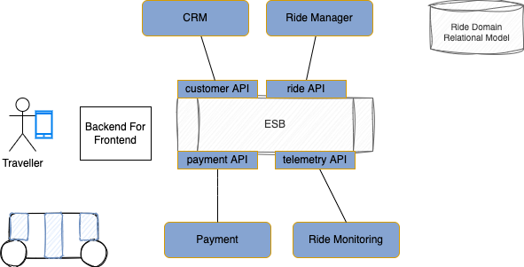

# Event-driven architecture

## Why EDA is important in 2020s

Since 15 years, we saw stories of different industries completely disrupted by the adoption of software solutions as a key strategic differentiator to run business. Examples in retail, movie rental, taxis, banking have demonstrated that new companies, focusing on using software, agile development, continuous deployment of new features, completely transformed legacy, brick and mortar, businesses.

This is what we could call an "industry becoming software": IT is no more a cost center or a set of computing capabilities used to run accounting, inventory, manufactoring applications... to improve a rigid business process.

So what are the key capabilities those companies used that makes them so successful. There are four major capabilities which are really defining the change to move to "business with software" at the core of the business model:

1. **Cloud**: is to rethink about data centers and optimize the compute power usage, changing the pricing model from capex to pay as you go. Cloud also provide elastic capability that developer will never be able to access in the past for adhoc use cases. 
1. **AI / machine learning** improves our way to take decisions, and automate complex tasks.
1. **Mobile** apps are redefining user experience and how we interact with businesses. Users expect a unified user interface to access the business services and get notifications when somethings interesting is happening.
1. **Data** and specially **data in motion** is very important to guide user experiences, take good decisions, automate processes, and enabling new type of applications. Data need to be available every where and in real-time, and then applications need to react when  data is created, updated...

Data architecture is evolving from a set of dedicated databases or data warehouse to distributed, decentralized architecture based on data in motion and data lake. 

The consideration of Data as a core differentiator to run a business, and as a competitive advantages, it is important that the IT architecture supports the need to get visibility of the data as soon as it created, and be able to act on it in close to real-time.

Recent studies demonstrate the quality of business decision on data are inversely proportional of the age of the data. The value of the data dismishes over time. They have a short shelf like of actionability. This is perfectly relevant in AI model and we will see how EDA helps in the data pipeline and feature engineering and storage for Machine Learning model.

Early 2000s, the adoption of service oriented architecture help to think about business applications as a group of business services that can be ubiquitous and accessible using internet. SOAP and XML were the technologies of choice. But as early as 2004, Event-driven architecture was positioned as an evolution of SOA to scale the number of data producer or data consumer and improve inter-dependencies. The following diagram illustrates this evolution.

{ width=800 }

What is clear is that asynchronous communication helps in decoupling and scaling. Since mid 2010s, EDA was adopted by startup companies as a way to scale their demands, at million of users, but also to get data visibility via events. With events, it is possible to act on data as soon as created, and improve business decision automation. 

Decoupling event producers and consumers from one another, helps increasing the scalability, resilience but also the development effort.

Cloud helps enterprises' software capabilities to scale horizontally, when needed for supporting workload peaks. Cloud native practice is helping to support rapid code change, adopting agile and continuous deployment to production of new feature versions, multiple times a week to million of users…

Budget allocated to run server, update operating system, apply security patch, is used for innovating on new features for end users.

## Components of the architecture

At first it is important to consider, without any technology bias, EDA in the term of high level building blocks which we will find in any architecture. The diagram below illustrates those high-level component.

{ width=800 }

The main goals of this architecture are to support scaling, decoupling, and acting on data as early as created, while enabling data pipelines for future batch processing and AI/ML development.

* **Event sources** are any applications we want to get data from. Most of those sources are not event oriented per design, but it is possible to get events from them by pulling/querying their APIs or the data storage (database), or by connecting change data capture agent to get continuous event feeds. 
* **Event Backbone** is the core middleware that supports asynchronous communication and storage of events, with high availability and replayability capabilities.
* **New event-driven applications**:  microservices or functions, producers and consumers of events. Event is part of their design on day one. Those services expose APIs to be used by web apps, mobile apps, or B2B apps. So they supports synchronous and asynchronous protocols.
* **Events** are persisted for very long time persistence to target sinks like data lakes. But it can be dat a warehouse, SaaS partners...
* **Sinks** represent longer term persistence of the event data or the downstream backend processing. Sink integrations are difficult to implement as the sink software may not support idempotency, and may be challenging to support exactly-once delivery. Normally consistency boundaries are before reaching the sinks.  
* The last piece of the architecture acts on those events (**Event Processing**), in the form of consume-process-publish semantic, used in data-processing, real-time analytics, where we will find stateful aggregate computation, data transformation ,data pipeline, and Complex Event Processing.

### A zoom into the Event Backbone

The Event Backbone is not supported by a unique technology as different needs bring different tools. We will go over a simple decision tree to facilitate when to use what in a section below. In asynchronous communication, the applications produce messages, consume them, or do both in the form of consume-process-produce processing.

{ width=800 }

For **the producer** we can illustrate two behaviors: 

1. applications want to ask another service to do something for themselves: this is the classical command pattern, there is one interested consumer, exchange request/reply messages, with exactly once delivery, message ordering, no data loss. **Queues** are the best technology to support that.
1. applications want to broadcast their main business entity state change. This is the events production as immutable facts. Pub/sub model on topic is the technology approach. There are two technology, the older one based on the topic semantic, like in JMS and the streaming one. Records are immutable.

For **consumers**, they subscribe to the queue or topic, and pull messages, or get messages as part of their subscription in a push model. With pulling the consumer needs to filter out the messages it is not interested of. With pushing the event bus can apply filtering and routing rules. It is important to note that in queueing system message read are deleted, and in classical topic implementation, messages are kept until all known subscribers received the message.

The consume-process-produce is a processing that we find in Kafka streaming, and the 3 step of this mini processus are transactional and supports exactly once delivery. Other technology like Flink or Spark streaming may support such implementation, the most important pattern is that the new facts are created from the processing. This is valuable approach for data pipeline, stateful aggregation using time window, real-time analytics. 

Talking about streaming, topic, can be ordered, and messages in the topic include timestamp. So complex-event processing logic can be implemented, with semantic to look at event sequencing, or not sequencing. 

Topic or queues should support persistence, for resiliance, and even being able to replay history, or restart from a specific message. This is supported differently depending of the technology, Kafka having offset management, partition and files on disk of the broker.

Event backbone should scale, and support clustering of brokers. 

There is something already strange about this, is why we call it event backbone as it supports queue, and in the world of queueing, there is no concept of event, but messages. A better name should be messaging middleware or system. This is indeed confusing but at the end, looking at APIs (JMS, Kafka, Kinesis,...) the underlying data structure is a record or message. It is admitted in modern days that the message concept is used when records are persisted until consumed, message consumers are typically directly targeted and related to the producer who cares that the message has been delivered and processed. Events are persisted as a replayable stream. Event consumers are not tied to the producer, and can consume at any point of time.

In most topic implementation, there is the concept of partition or shard to be able to scale the number of consumers in parellel. 

Finally there are two services that are necessary in this middleware to support the minimum governance: 

* the **schema registry** to control the contract between producer and consumer by defining the data model schema fo the message exchanged. The message includes metadata about the schema version, and may be the URL of the schema registry so the consumer can get, at run time, the schema definition of the message to consume. With this capability consumer can replay old messages and new ones from the same topic or queue.
* **AsyncAPI** support, this is a quite new capability that needs to be addressed: as we have standard, via OpenAPI to define HTTP interface, the [AsyncAPI](https://www.asyncapi.com/) is the open standard for asynchronous communication and binding. So the component is an api manager which faciliate the governance and consumer boilerplace code generation.

### Event sources

As introduced before, we group in this category applications that were not designed to produce events. They can use queueing, and they most likely use database. To get visibility of the data update, tool like change data capture, or CDC, are used to inject updated record as message to queue or topic.

There are design considerations to study like, how to avoid duplication of message, not loosing message, and how to pace the throughput.

### Event-driven microservices

A microservices are small applications that exposes a set of operations on a single entity and communicate with each other via web API, most of the time using RESTful protocol. Microservices are implemented by a two-pizza size team using agile development, devops approaches and cloud native development most of the time.

To find and design microservice, we apply the domain-driven design by addressing domain and sub-domain, searching of events, aggregates, commands and bounded contexts. All those DDD elements help building microservices.

I like to apply the [reactive manifesto principles](https://www.reactivemanifesto.org/) while looking at the microservice implementation. They need to support the following characteristics:

* **Responsive**: deliver a consistent quality of service to end users or systems, react quickly and consistently to events happening in the system.
* **Elastic**: The system stays responsive under varying workload, it can scale up and down the resource utilization depending of the load to the system.
* **Resilient**: stay responsive in the face of failure, this is a key characteristics. It implies distributed systems.
* **Message driven**: the underlying behavior is to have an asynchronous message driven backbone, to enable loose coupling of the application components by exchanging asynchronous messages to minimize or isolate the negative effects of resource contention, coherency delays and inter-service communication network latency. It is the base to support the other reactive characteristics. It also helps for isolation and support location transparency.

### Event sinks

### Event streaming processing

This is one of the major value of EDA as it helps addressing one of the major AI/ML requirements for modern data pipelines and act on data as early as possible after creation. 

For streaming, we have events persisted for a long time period, ordered, with timestamps and immutable. With these characteristics, we can implement elements of the classical Transform operations done in classical batch ETL jobs, but this time in real-time and consumable by any interested parties. Black box ETL becomes transparent processing in the continuous data pipeline.

In the classical data preparation process for ML model development, data scientist discover raw data than do feature engineering by applying transformation, mostly in python notebook, then trains the model. Once confident of the model scoring, a data engineer productionize the data pipeline, so data inject to the model, once the ML model is deployed are well prepare. The model is integrated as a service. If there is a data issue the model results will be impacted. The implementation of the data pipeline is traditionally done in ETL product. But most of modern pipeline needs to integrate with streaming data.

The following diagram illustrates this concept of modern data pipeline to prepare events/ features for ML model and feature store.  

{ width=1000 }

This is using the autonomous car system, where each car can send telemetries to a topic. The raw data is consumed, transformed, mapped according to the processing defined by the Data engineer, may compute some aggregate and produce, what we used to call in the CEP, a synthetic event. This event is in another topic, and may be relevant for other consumers. From a EDA this is an important value proposition to share events for multiple use cases. One of the consumer will be a sink adapter which write to a Feature store. The Feature store, which includes also data coming from warehouse or data lake, is used by the predictive service to prepare the data for the ML model. The car dispatcher service may be a user of the predictive service to get for example the Estimated travel time. 

In a lot of EDA deployments, this logic of consuming - processing - and publishing events is very common and bring a lot of flexibility on the data processing. Data becoming real asset, in real-time, shareable as needed.

## From SOA to EDA

I will take a fictuous business case of car ride on autonomous vehicles. 

For this discussion, the simplest requirements include, booking a ride to go from one location to another location, manage a fleet of autonomous cars, get payment from the customer once the trip is done, get estimation for the ride duration and price to present a proposition to the end-users.   

The modern synchronous based microservice component view may look like in the following figure:

We will detail the solution design and implementation in [this note.](./solutions/autonomous-car/index.md)

In the early 2000s, when designing this kind of solution, we were using a service oriented architecture, with services being coarse grained and API definition based on service operations. So may be, the search for a trip, booking the trip, get the payment were supported by a unique Ride Service. Monitoring of the rides may be in a separate services, or payment. May be the persistence is within a single SQL database, and project leaders were spending time to design a domain data model, with a lot of relationships, even many-to-many relationships, to support interesting queries. The data model was domain oriented and query oriented. Service operations supported the classical Create, Update, Read and Delete (CRUD) operations, with all the query APIs as part of the same service interface definition.

{ width=900 }

Those big data schemas, the coarse grained service interfaces, the synchronous calls bring the coupling between components and generate frictions for change over time. Developers were reluctant to change the interface definitions. Enterprise Service Buses were used, to expose those interfaces so it was easier to reuse, do some data mappings, interface mappings, and implement the gateway patterns. SOA was synonyms of ESB.

In the 2010s, some of those business applications were considered as business process management solutions. Even when the process did not involved human tasks, the process was doing SOA services orchestration and BPEL was the technology of choice. Later BPMN engines took the lead, but process applications were fat, monolithics, including User Interfaces (server page serving), data model definition, service integrations, and flow definitions. The process execution was stateful.

To have some fun, this is how BPM experts would have modeled, at the high level, the riding application using BPMN:

{ width=1100 }

We will not dig into the details of this process flow, but what is interesting still, is the sequencing of actions over time which led to identify the commands to perform within the flow, which helped to design the service interfaces. The approach had vertue as it engages business users in modeling the business process. Defining term, some data element, and some business rules. The technology enforced creating monolythic applications.  

In previous diagram, the failover and compensation flows are not highlighted. But this is where all the architecture decisions have to be made to select the best implementation choice, to identify when the process execution reached a non-idempotent service. 

Which leads to my next argument: there are a lot of people who are currently claiming that EDA will be the silver bullet to address service decoupling, scaling, resilience... For example, I have heard architects claiming the following challenges of the above component view diagram:

* order service is responsible to talk to multiple services, and orchestrates service calls. 
* orchestration logic should be outside of the microservice. I want to immediatly react on this one, as service orchestration is done to follow a business process. As seen in process flow above, there is a business logic to route the execution flow among those steps: it is part of the context of the order service to implement the process about an order. We are in the domain-driven design bounded context. The implementation of this orchestration flow can be in code, or in business process engine, in state machine, but at least owned by one team.
* strong coupling between the components. The order service needs to understand the semantic of the other services. Which is partially true, but it really needs to understand the interface characteristics of the services. Which includes data model, protocol, SLA, communication type, ... The data model is part of the interface contract and is the main argument for coupling. Any change to the API of the downstream services impact the order / orchestrator service. There are way to go over that, by using contract testing, so each change to the contracts can be seen during CI/CD pipeline executions. Now it is true that when a service is used by a big number of other services then API versioning becomes a challenge. On the other side of the argument, on most of simple business application the number of services stands to stay low and interface characteristics do not change that often. Data model coupling still exists in messaging based solutions. Schema registry and the metadata exchanged within the message helps to address those coupling, but it means now, consumers need to be aware of the producer. This is an inversion of control. 
* Choreography of APIs is hard to do. I touched on this point before, but one thing important is to differentiate choreography from orchestration. I have seen arguments for EDA by illustrating how difficult to implement compensation flow with synchronous processing. I am not sure about that, as it was done in the SOA world before. The problem is not the way we interact with service, but by the lack of transactionality support in RESTful API as it was possible to do with SOAP WS-Transaction protocol. Asynchronous messaging, event bus,... do not help that much on compensation flow. 

??? "Choreography vs Orchestration"
    This different models are used in the context of the Saga pattern, which helps to support a long running transaction between distributed systems that can be broken up to a collection of sub transactions that can be interleaved any way with other transactions:

    * **Orchestration** is when one controller is responsible to drive each participant on what to do and when. 
    * **Choreography** applies each service produces and listens to other service’s events and decides if an action should be taken or not.

In the autonomous car rideexample, choreography may be used, as it seems that some services are maintaining states of the overall ride transaction: the order, the car dispatching, the route...

* Another argument is related to availability: if one of the service is not responding quickly, then all the components in the calling chain are impacted. And in case of outages, if one component fails, error will propagate back to caller chain. There are patterns to handle such issues, like circuit braker, throttling, or bulkhead. Now this is true, asynchronous processing helps to support failure and slower services. 

## Selecting event bus technologies

As introduced in the event backbone component description above, there are different messaging capabilities. Consider queue system for:

* Exactly once delivery, and to participate into two phase commit transaction.
* Asynchronous request / reply communication: the semantic of the communication is for one component to ask a second to do something on its data. This is a command pattern with delay on the response.
* Messages in queue are kept until consumer(s) got them.

Consider streaming system, like Kafka, AWS Kinesis data stream, as pub/sub and persistence system for:

* Publish events as immutable facts of what happened in an application.
* Get continuous visibility of the data Streams.
* Keep data once consumed, for future consumers, and for replay-ability.
* Scale horizontally the message consumption.