In this article we are presenting an end to end set of activities to run a successful Minimum Viable Product for an event-driven solution using cloud native microservices and event backbone as the core technology approach.

The discovery and analysis of the MVP scope starts with an [event storming workshop](./#event-storming-workshop-introduction) where designer, architect work hand to hand with business users and domain subject matter experts. From the different outcomes of the workshop, the development team starts to outline components, microservices, business entity life cycle, etc... in a short [design iteration](./#design-iteration). The scope is well defined Epics, Hill and user stories defined, at least for the first iterations, and the MVP can start.

## Event Storming workshop introduction

Event storming is a workshop format for quickly exploring complex business domains by focusing on *domain events* generated in the context of a business process or a business application. A **domain event** is something meaningful to the experts that happened in the domain. The workshop focuses on communication between product owner, domain experts and developers.

The event storming method was introduced and publicized by Alberto Brandolini in ["Introducing event storming book"](https://www.eventstorming.com/book/). This approach is recognized in the [Domain Driven Design (DDD)](https://en.wikipedia.org/wiki/Domain-driven_design) community as a technique for rapid capture of a solution design and improved team understanding of the domain. Domain represents some area of the business that has the analysis focus. This article outlines the method and describes refinements and extensions that are useful in designs for an event-driven architecture. This extended approach adds an insight storming step to identify and capture value adding predictive insights about possible future events. The predictive insights are generated by using data science analysis, data models, artificial intelligence (AI), or machine learning (ML).

This article describes in general terms all the steps to run an event storming workshop.

## Conducting the event and insight storming workshop

Before conducting an event storming workshop, complete a Design Thinking Workshop in which Personas and Empathy Maps are developed and business pains and goals are defined. The event storming workshop adds more specific design on the events occuring at each step of the process, natural contexts for microservices and predictive insights to guide operation of the system. With this approach, a team that includes business owners and stakeholders can define a Minimal Viable Prototype (MVP) design for the solution.  The resulting design is organized as a collection of loosely coupled microservices linked through an event-driven architecture and one or more event backbones. This style of design can be deployed into multicloud execution environments and allows for scaling and agile deployment.

Preparations for the event storming workshop include the following steps:

* Get a room big enough to hold at least 6 to 8 persons and with enough wall space on which to stick big paper sheets: you will need a lot of wall space to define the models.
* Obtain green, orange, blue, and red square sticky notes, black sharpie pens and blue painter's tape.
* Discourage the use of open laptops during the meeting.
* Limit the number of chairs so that the team stays focused and connected and conversation flows easily.

### Concepts

Many of the concepts addressed during the event storming workshop are defined in the Domain Driven Design approach.
The following diagrams present the elements used during the analysis.  The first diagram shows the initial set of concepts that are used in the process.

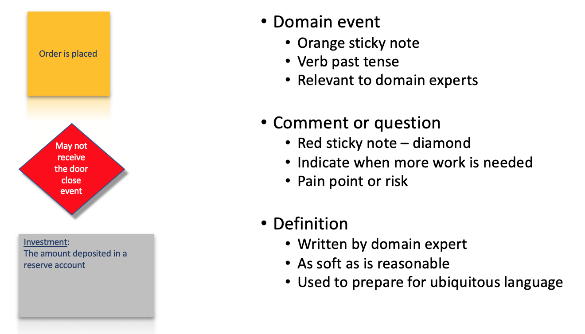

Domain events are also named *business events*.  An event is some action or happening which occurred in the system at a specific time in the past. The first step in the event storming process consists of these actions:

* Identifying all relevant events in the domain and specific process being analyzed,
* Writing a very short description of each event on a "sticky" note
* and placing all the event "sticky" notes in sequence on a timeline.

The act of writing event descriptions often results in questions to be resolved later, or discussions about definitions that need to be recorded to ensure that everyone agrees on basic domain concepts.

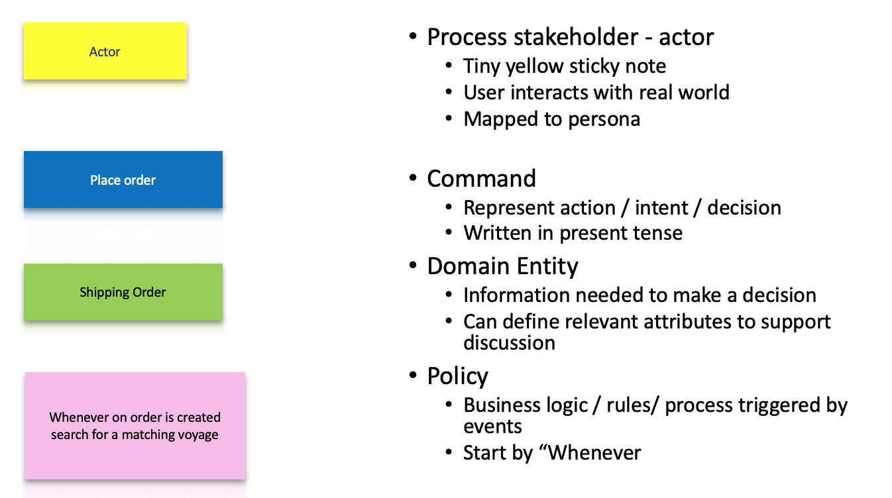

A timeline of domain events is the critical output of the first step in the event storming process.  The timeline gives everyone a common understanding of when events take place in relation to each other.  You still need to be able to take this initial level of understanding and move it towards an implementation.  In making that step, you must expand your thinking to encompass the idea of a command, which is the action that kicks off the processing that triggers an event.  As part of understanding the role of the command, you will also want to know who invokes a command (actors) and what information is needed to allow the command to be executed.  This diagram show how those analysis elements are linked together:

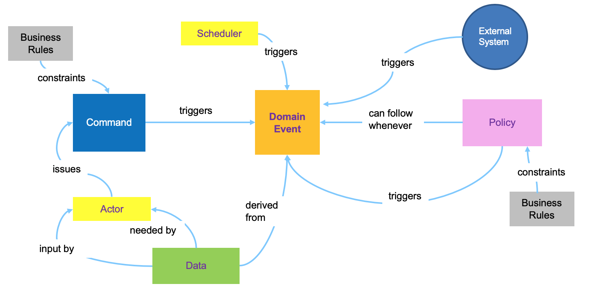

One-View Figure.

* **Actors** consume data by using a user interface and use the UI to interact with the system via commands. Actors could also be replace by articial intelligent agents.
* **Commands** are the result of some user decision or policy, and act on relevant data which are part of a Read model in the [CQRS](../../patterns/cqrs/) pattern.
* **Policies** (represented by lilac stickies) are reactive logics that take place after an event occurs, and trigger other commands. Policies always start with the phrase "whenever...". They can be a manual step a human follows, such as a documented procedure or guidance, or they may be automated. When applying the [Agile Business Rule Development methodology](http://abrd.github.io) it will be mapped to a Decision within the [Decision Model Notation](https://www.omg.org/spec/DMN/About-DMN/).
* **External systems** produce events.
* **Data** can be presented to users in a user interface or modified by the system.

Events can be created by commands or  by external systems including IOT devices.  They can be triggerred by the processing of other events or by some period of elapsed time. When an event is repeated or occurs regularly on a schedule, draw a clock or calendar icon in the corner of the sticky note for that event.
As the events are identified and sequenced into a time line, you might find multiple independent subsequences that are not directly coupled to each other and that represent different perspectives of the system, but occur in overlapped periods of time. These parallel event streams can be addressed by putting them into separate swimlanes delineated by using horizontal blue painter's tape. As the events are organized into a timeline, possibly with swim lanes, you can identify pivotal events. Pivotal events indicate major changes in the domain and often form the boundary between one phase of the system and another. Pivotal events will typically separate (a [bounded context](https://martinfowler.com/bliki/BoundedContext.html) in DDD terms). Pivotal events are identified with vertical blue painters tape (crossing all the swimlanes).

An example of a section of a completed event time line with pivotal events and swimlanes is shown below.

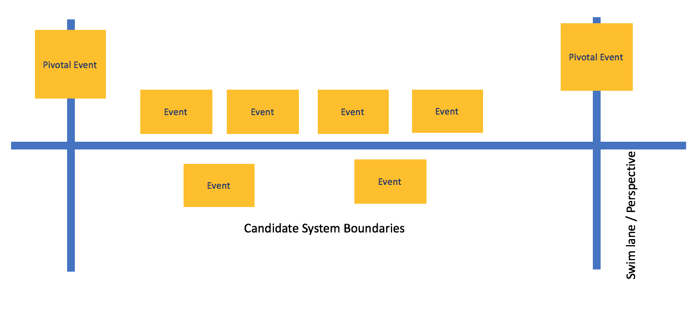

### Conducting the workshop

The goal of the workshop is to better understand the business problem to address with a future application. But the approach can also apply to finding solutions to bottlenecks or other issues in existing applications. The workshop helps the team to understand the big picture of the solution by building a timeline of domain events as they occur during the business process life span.
During the workshop, avoid documenting processing steps. The event storming method is not trying to specify a particular implementation. Instead, the focus in initial stages of the workshop is on identifying and sequencing the events that occur in the solution. The event timeline is a useful representation of the overall steps, communicating what must happen while remaining open to many possible implementation approaches.

#### Step 1: Domain events discovery

Begin by writing each domain event on an orange sticky note with a few words and a verb in a past tense. Describe **What's happened**. At first just "storm" the events by having each domain expert generate an individual lists of domain events. You might not need to initially place the events on the ordered timeline as they write them.  The events must be worded in a way that is meaningful to the domain experts and business stakeholder. You are explaining what happens in business terms, not what happens inside the implementation of the system.

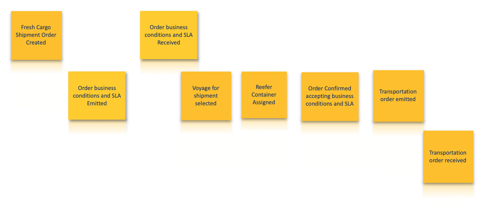

You don't need to describe all the events in your domain, but you must cover the process that you are interested in exploring from end to end. Therefore, make sure that you identify the start and end events and place them on the timeline at the beginning and end of the wall covered with paper. Place the other events that you identified between these two endpoints in the closest approximation that the team can agree to a sequential order. Don’t worry about overlaps at this point; overlaps are addressed later.

#### Step 2: Tell the story

In this step, you retell the story by talking about how to relate events to particular personas. A member of the team (often the facilitator, but others can do this as well)  acts this out by taking on the perspective of a persona in the domain, such as a "manufacturer" who wants to ship a widget to a customer, and asking which events follow which other events. Start at the beginning of that persona's interaction and ask "what happens next?". Pick up and rearrange the events that the team storms.  If you discover events that are duplicates, take those off the board.  If events are in the wrong order, move them into the right order.

When some parts are unclear, add questions or comments by using the red stickies.. Red stickies indicate that the team needs to follow up and clarify issues later. Likewise you want to use this time to document assumptions on the definition stickies. This is also a good time to rephrase events as you proceed through the story. Sometimes you need to rephrase an event description by putting the verbing in past tense, or adjusting the terms that are used to relate clearly to other identified events.
In this step you focus on the mainline "happy" end-to-end path to avoid getting bogged down in details of exceptions and error handling. Exceptions can be added later

#### Step 3: Find the Boundaries

The next step of this part of the process is to find the boundaries of your system by looking at the events. Two types of boundaries can emerge; the first type of boundary is a time boundary. Often specific key "pivotal events" indicate a change from one aspect of a system to another. This can happen at a hand-off from one persona to another, but it can also happen at a change of geographical, legal, or other type of boundary. If you notice that the terms that are used on the event stickies change at these boundaries, you are seeing a "bounded context" in Domain Driven Design terms. Highlight pivotal events by putting up blue painter’s tape vertically behind the event.

The second type of boundary is a subject boundary. You can detect a subject boundary by looking for the following conditions:

* You have multiple simultaneous series of events that only come together at a later time.
* You see the same terms being used in the event descriptions for a particular series of events.
* You can “read” a series of events from the point of view of a different persona when you are replaying them.

You can delineate these different sets of simultaneous event streams by applying blue painter’s tape horizontally, dividing the board into different swim lanes.

Below is an example of a set of ordered domain events with pivotal events and subject swim lanes indicated.  This example comes from applying event storming to the domain of container shipping process. When the reefer container is plugged to the Vessel, it starts to emit telemetries, we change context.

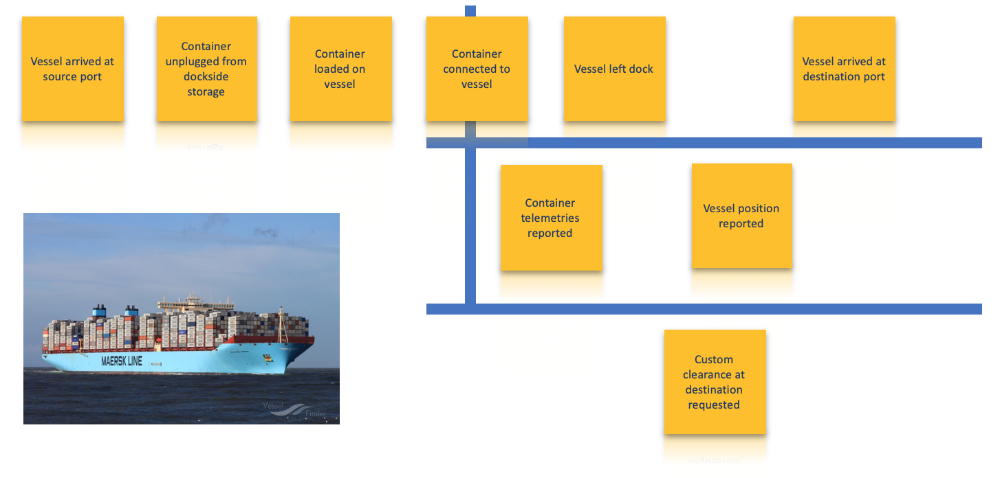

#### Step 4: Locate the Commands

In this step you shift from analysis of the domain to the first stages of system design.  Up until this point, you are simply trying to understand how the events in the domain relate to one another - this is why the participation of domain experts is so critical.  However, to build a system that implements the business process that you are interested in, you have to move on to the question of how these events come into being.

Commands are the most common mechanism by which events are created.  The key to finding commands is to ask the question: "Why did this event occur?". In this step, the focus of the process moves to the sequence of actions that lead to events. Your goal is to find the causes for which the events record the effects. Expected event trigger types are:

* A human operator makes a decision and issues a command
* Some external system or sensor provides a stimulus
* An event results from some policy - typically automated processing of a precursor event
* The completion of some determined period of elapsed time.

The triggering command is identified in a blue (sticky) note. Command may become a microservice operation exposed via API. The human persona issuing the command is identified and shown in a yellow note.
Some events may be created by applying business policies.
The diagram below illustrates the manufacturer actor using the place a shipment order command to create a shipment order placed event, as well as .

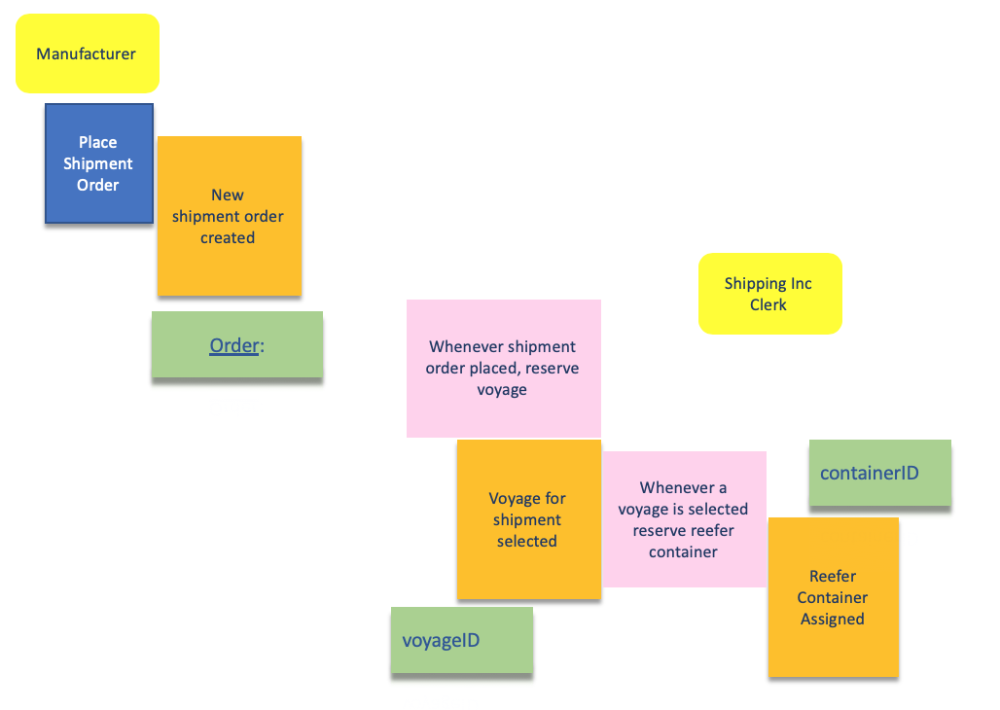

It is possible to chain events and commands as presented in the "one view" figure above in the concepts section.

#### Step 5: Describe the Data

You can't truly define a command without understanding the data that is needed for the command to execute in order to produce the event. You can identify several types of data during this step.  First, users (personas) need data from the user interface in order to make decisions before executing a command.  That data forms part of the read model in a [CQRS](../../patterns/cqrs/) implementation. For each command and event pair, you add a data description of the expected attributes and data elements needed to take such a decision. Here is a simple example for a `shipment order placed` event created from a `place a shipment order action`.

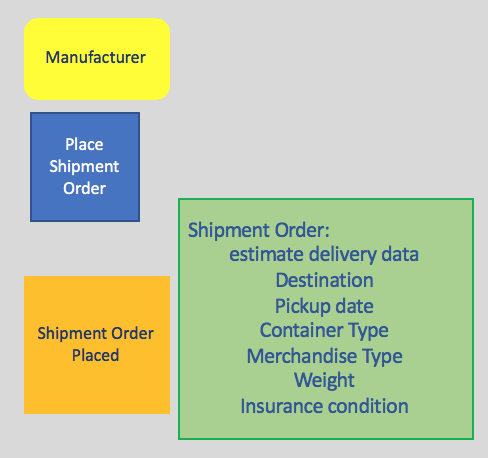

Another important part of the process that becomes more fully fleshed out at this step is the description of *policies* that can trigger the generation of an event from a previous event (or set of events).

Assess if the data element is a main business entity, uniquely identified by a key, supported by multiple commands. It  has a life span over the business process. This will lead to develop an entity life cycle analysis.

This first level of data definition helps to assess the microservice scope and responsibility as you start to see commonalities emerge from the data used among several related events.  Those concepts become more obvious in the next step.

#### Step 6: Identify the Aggregates

In DDD, entities and value objects can exist independently, but often, the relations are such that an entity or a value object has no value without its context.  [Aggregates](https://martinfowler.com/bliki/DDD_Aggregate.html) provide that context by being those "roots" that comprise one or more entities and value objects that are linked together through a lifecycle. The following diagram illustrates a detailed example of aggregates for shipment of a temperature sensitive product overseas.

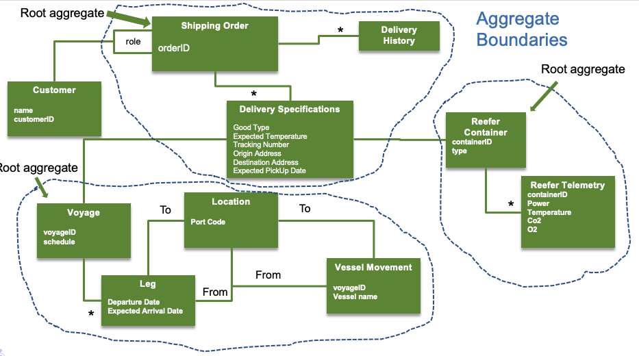

In event storming, we may not be able to get this level of detail during the first workshop, but aggregates emerge through the process by grouping events and commands that are related together.  This grouping not only consists of related data (entities and value objects) but also related actions (commands) that are connected by the lifecycle of that aggregate. Aggregates ultimately suggest microservice boundaries.

In the container shipment example, you can see that you can group several commands and event pairs (with their associated data) together that are related through the lifecycle of an order for shipping.

#### Step 7: Define Bounded Context

In this step, you define terms and concepts with a clear meaning valid in a clear boundary and you define the context within which a model applies. (The term definition can change outside of the business unit for which an application is developed). The following items may be addressed:

* Which team owns the model?
* Which part of the model transit between team organization?
* What are the different code bases foreseen we need to implement?
* What are the different data schema ? (database or json or xml schemas)

Here is an example of bounded context that will, most likely, lead to a microservice:

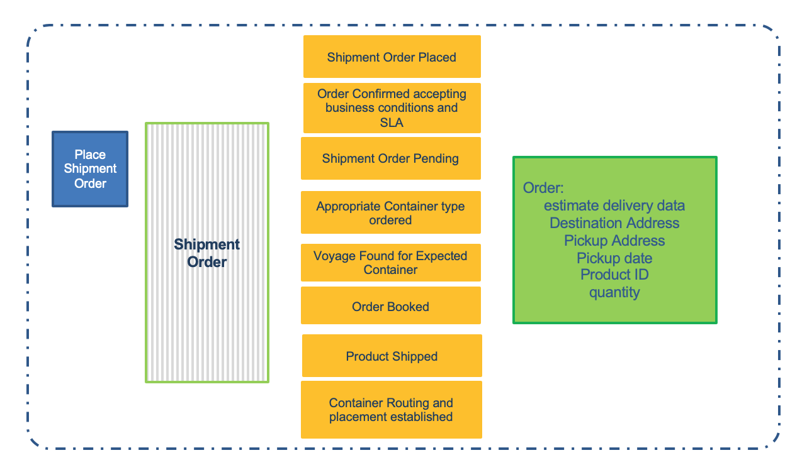

Keep the model strictly consistent within these bounds.

#### Step 8: Looking forward with insight storming

In event atorming for Event Driven Architecture (EDA) solutions it is helpful to include an additional method step at this point identifying useful predictive analytics insights.

Insights storming extends the basic methodology by looking forward and considering what if you could know in advance that an event is going to occur. How would this change your actions, and what would you do in advance of that event actually happening?
You can think of insight storming as extending the analysis to **Derived Events**.  Rather than being the factual recording of a past event, a derived event is a forward-looking or predictive event, that is, "this event is probably going to happen at some time in the next n hours”.

By using this forward-looking insight combined with the known business data from earlier events,   human actors and event triggering policies can make better decisions about how to react to new events as they occur. Insight storming amounts to asking workshop participants the question: "What data would be helpful at each event trigger to assist the human user or automated event triggering policy make the best possible decision of how and when to act?"

An important motivation that drives the use of an event-driven architecture is that it simplifies design and realization of highly responsive systems that react immediately and intelligently, that is, in a personalized and context-aware way, and optimally to new events as they occur.  This immediately suggests that predictive analytics and models to generate predictive insights have an important role to play. Predictive analytic insights are effectively probabilistic statements about which future events are likely to occur and what are the likely properties of those events. These probabilistic statements are typicaly generated by using models created by data scientists or using AI or ML. Correlating or joining independently gathered sources of information can also generate important predictive insights or be input to predictive analytic models.

Business owners and stakeholders in the event storming workshop can offer good intuitions in several areas:

*  Which probabilistic insights are likely to lead to improved or optimal decision making and action?
    * The action could take the form of an immediate response to an event when it occurs.
    * The action could be proactive behavior to avoid an undesirable event.
*  What combined sources of information are likely to help create a model to predict this insight?

With basic event storming, you look backwards at each event because an event is something that has already happened. When you identify data needed for an actor or policy to decide when and how to issue a command, there is a tendency to restrict consideration to properties of earlier known and captured business events. In insight storming you extend the approach to explicitly look forward and consider what is the probability that a particular event will occur at some future time and what would be its expected property values? How would this change the best action to take when and if this event occurs? Is there action we can take now proactively in advance of an expected undesirable event to prevent it happening or mitigate the consequences?

The insight method step amounts to getting workshop participants to identify derived events and the data sources needed for the models that generate them.  Adding an insight storming step using the questions above into the workshop will improve decision making and proactive behavior in the resulting design. Insights can be published into a bus and subscribed to by any decision step guidance.

By identifying derived events, you can integrate analytic models and machine learning into the designed solution. Event and derived event feeds can be processed, filtered, joined, aggregated, modeled and scored to create valuable predictive insights.

 Use the following new notations for the insight step:

 * Pale blue stickies for derived events.
 * Parallelogram shape to show when events and derived events are combined to enable deeper insight models and predictions. Identify predictive insights as early as possible in the development life cycle. The best opportunity to do this is to add this step to the event storming workshop.

The two diagrams below show the results of the insight storming step for the use case of container shipment analysis.  The first diagram captures insights and associated linkages for each refrigerated container, identifying when automated changes to the thermostat settings can be made, when unit maintenance should be scheduled and when the container contents must be considered spoiled.

The second diagram captures insights that could trigger recommendations to adjust ship course or speed in response to expected severe weather forcasts for the route ahead or predicted congestion and expected docking and unloading delays at the next port of call.

## Design iteration

Attention we are not proposing to apply a waterfall approach, but before starting the deeper implementation with iterations, we want to spend sometime to define in more details what we want to build, how to organize the CI/CD projects and pipeline, select the development, test and product plaform, and define epics, user stories, components, microservices... This iteration can take from few hours to a week, depending on the expected MVP goals.

For an event-driven solution a MVP for a single application should not take more than 3 to 4 iterations.

### Event storming to user stories and epics

In agile methodology, creating user stories or epics is one of the most important elements in project management. The commands and policies related to events can be easily described as user stories, because commands and decisions are done by actors. The actor could be a system as well.
For the data you must model the "Create, Read, Update, Delete" operations as user stories, mostly supported by a system actor.

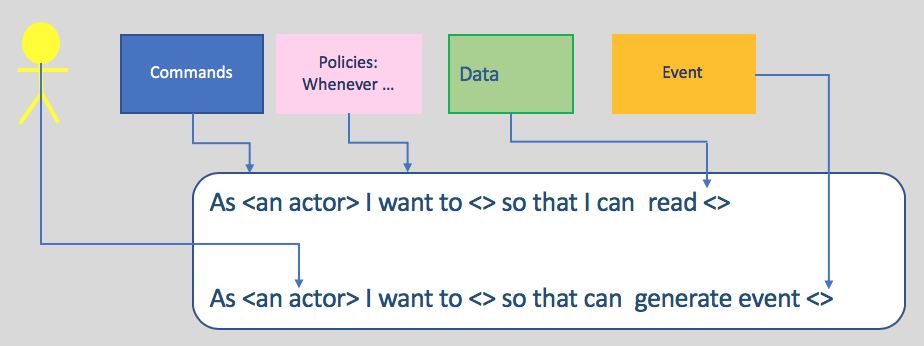

An event is the result or outcome of a user story. Events can be added as part of the acceptance criteria of the user stories to verify that the event really occurs.

## Some practice notes

* We can apply event storming at different level: for example at the beginning of a project to understand the high level process at stake. with a big group of people, we will stay at the high level. But it can be used to model a lower level microservice, to assess event consumed and produced.

## Further Readings

* [Introduction to event storming from Alberto Brandolini ](http://ziobrando.blogspot.com/2013/11/introducing-event-storming.html#.VbhQTn-9KK1)
* [Event Storming Guide](https://www.boldare.com/blog/event-storming-guide/)
* [Wikipedia Domain Driven Design](https://en.wikipedia.org/wiki/Domain-driven_design)
* [Eric Evans: "Domain Driven Design - Tacking complexity in the heart of software"](https://www.amazon.com/Domain-Driven-Design-Tackling-Complexity-Software)
* [Domain drive design with event storming introduction video](https://learning.oreilly.com/videos/domain-driven-design-distilled/9780134593449/9780134593449-DDDD_07_01?autoplay=false)
* [Patterns related to Domain Driven Design](https://martinfowler.com/tags/domain%20driven%20design.html) by Martin Fowler

