# Vaccine Delivery Design Session

This section outlines how to apply our design thinking methodology combined with [event storming](./index.md) to understand the business problem to address, the main stakeholders, the vaccine delivery process, and then design the future components

## Business scenario

2020 - As the world awaits the release of the COVID-19 vaccines; we’ve learned four things about the vaccines themselves:

1. The vaccine once manufactured needs to be in a stable very cold state up until inocculation.
1. The vaccine travels through various sites across the globe from manufacturing sites to remote clinical trial sites, to actual distribution sites, to clinical settings and other points of administration to the population
1. The vaccines when ready for release may rise to be the #1 counterfeit product in the world
1. There will be a need for billions of vaccine doses, so the vaccines will be manufactured in multiple locations and delivered worldwide

## Problem statement

How do we involve business users, subject matter experts, and developers to put in place an innovative solution to improve shipping vaccine at scale?

How to quickly start an implementation without doing three months of requirements gathering and design up-front?

This is where Design Thinking, Event Storming and Domain-driven design help enterprises to innovate and implement cloud native solution with best practices. 

We start our jounrey with the design thinking workshop as illustrated in the following agenda:

* **Understand**

    * Assess business opportunity
    * Develop empathy map
    * Define challenges and pains
    * Review as-is process with Event Storming

* **Explore**

    * Big ideas
    * Vision Statement
    * To-Be scenario with Event Storming

* **Define**

    * Domain-driven design
    * MVP statement
    * High level architecture views
    * Architecture decisions

### Vaccine delivery

Opportunity the Covid vaccine delivery needs to maintain the cold chain at very low temperature, so lots of vaccine need to be carried in special containers.

* Define the three personas you think are relevant for the process of delivering vaccine worldwide
* Select one main persona for which the new solution will bring more value
* For that persona, define the empathy maps
* You'll also probably have a few ideas about how to solve the persona's problems, so try using ideation to generate as many ideas as possible. Then, organize those ideas into clusters and decide which clusters have the greatest promise.

*See next sessions for possible approach*

## Design Thinking applied

Enterprise Design Thinking starts by bringing together a series of traditional design techniques, such as personas, empathy maps, as-is scenarios, design ideation, to-be scenarios, hypothesis-driven design, and minimum viable product (MVP) definition.

### Empathy maps

The following three personas were identified:

* **Julia** is the vaccine delivery coordinator, who addres vaccine orders and ensure the end to end delivery runs well
* **Ganesh** is the in country minister of health official, focusing to get vaccines for his population
* **Maria** the medical coordinator to administer the vaccine to patiens.  

 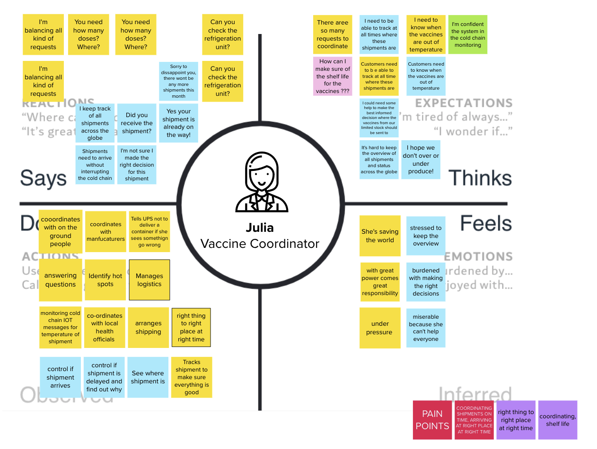

 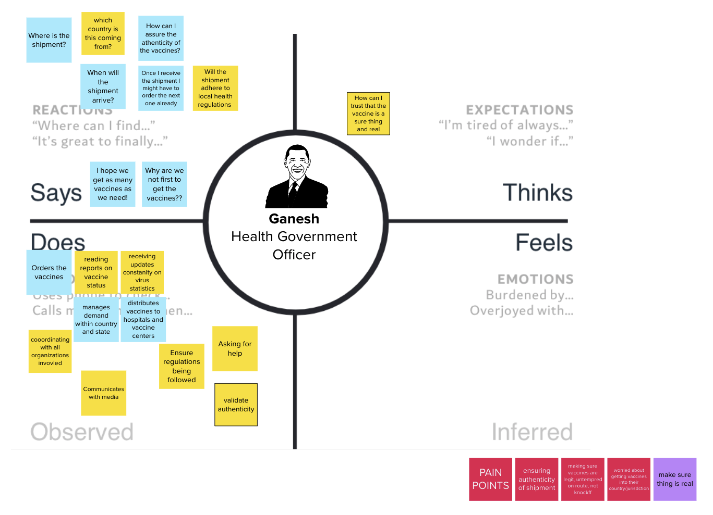

 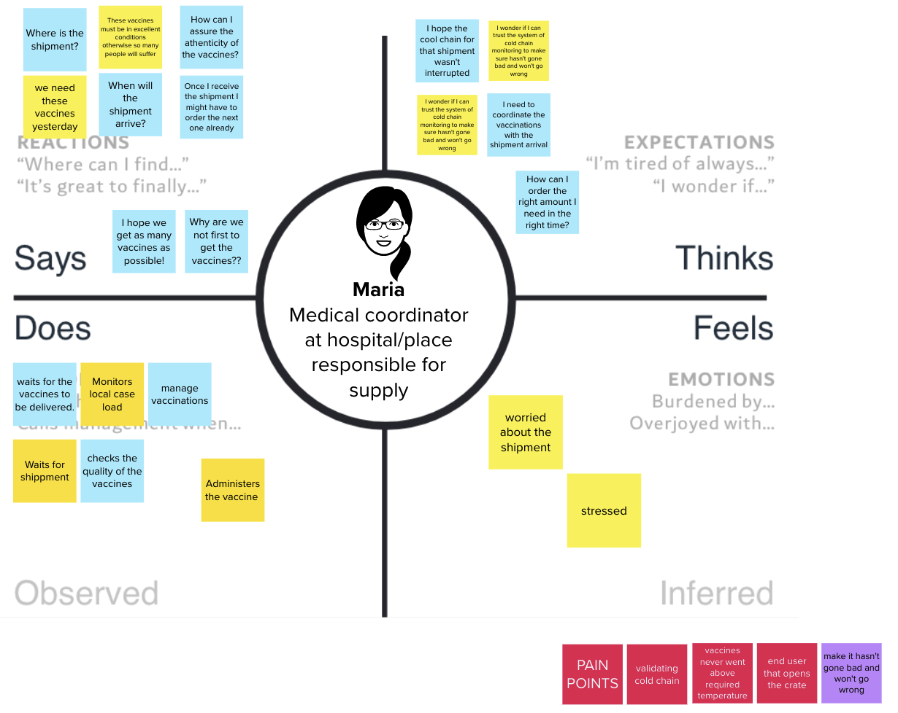

### Pain points

The following figure illustrates potential pain points discovered during the design thinking workshop:

 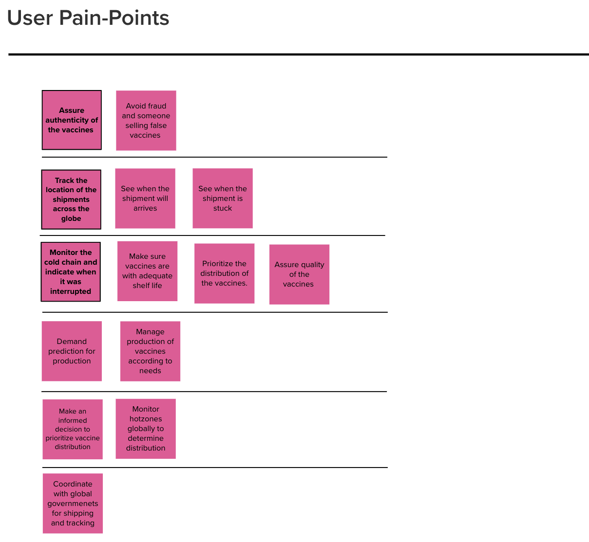

### Vision statement

The team arrives to some vision for two personas:

  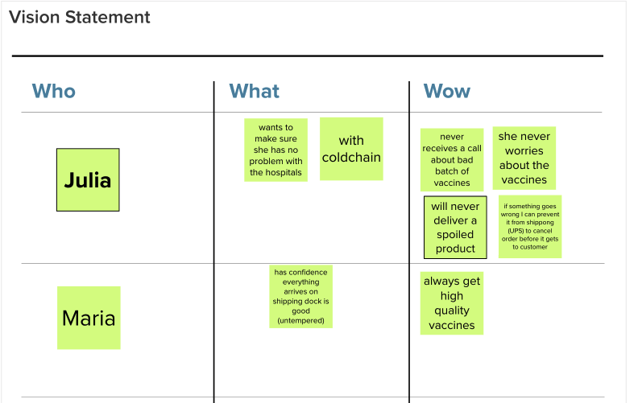

???+ info "Warming"
    It is important to note in the context of this simple exercise, we did not document a full blend design thinking workshop and all the artifacts we develop during such real workshop. The current diagrams illustrate just enough content to give you context for the implementation of the solution.

## Event Storming applied

After the design thinking workshop, we want to model the `to be` scenario for the vaccine delivery. We use the event storming approach as presented in [this article](../event-storming/index.md).

Starting from the high level process outlined in the [problem statement introduction](#business-scenario), we have worked with the subject matter experts to discover the end-to-end process using an event point of view. Recalls that **events** are fact of what happen within the process, and we organize them over a time line running from left to right. Orange stickers represent Events.

### Lab exercice

1. Focusing on the delivery part, start by an epidemic hot spot is identified,  an order to ship vaccine is created in the ordering system.
1. Brainstorm and put orange stickers on a time line from left to right

*Recall: the elements of the event storming sementic are described below. Domain events and actors are the primary elements to consider during the first phase of the workshop* 

 

The first three figures below, represent the start of this business process:

* Process start, with raw material and bulk antigen steps

 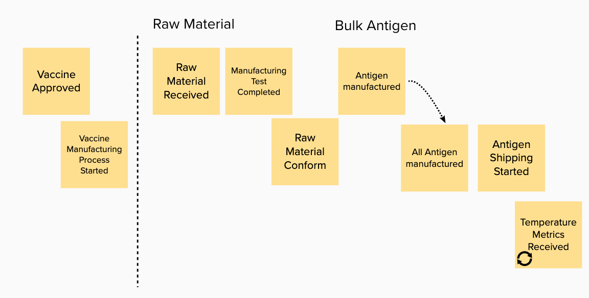

* formulation and filling

 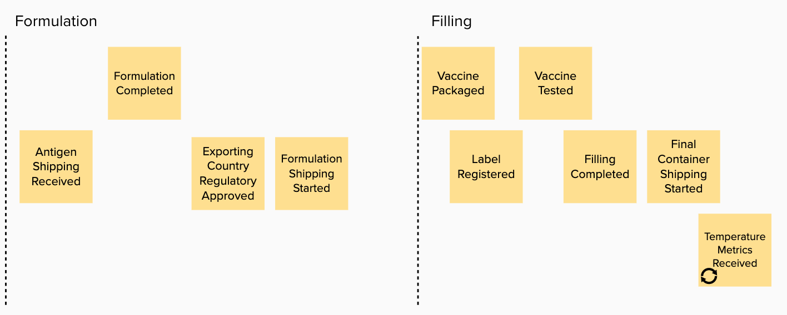

* Vaccine packaging and lot release and order intiation:

 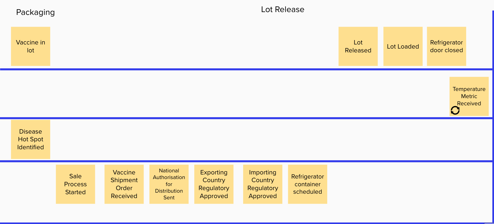

While the last part of the process, shipment and cold chain monitoring, is addressing the lot delivery up to the target hospital or medical institution:

 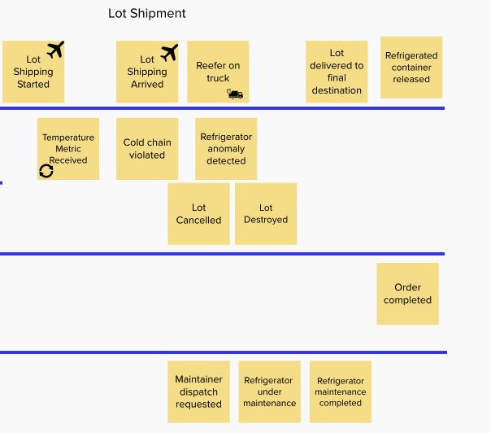

Adding blue lines to separate transition between teams or organizartions, helps to define the different domains of the process. In the lot packaging and delivery, we can see the following sub-domains:

* The vaccine manufacturing domain
* The Order management domain
* The regulatory domain
* Reefer monitoring domain

 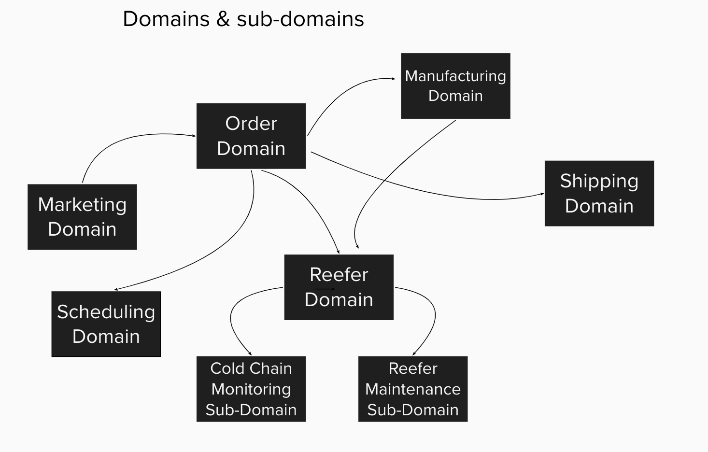

While for the shipment we have:

* The transportation logistic domain, airplane and truck being different domains
* The order management domain
* The cold chain monitoring and anomaly detection domain
* The refrigerator container maintenance

For the minimum viable product we will support part of the order and cold chain monitoring.

For the discovered events, we follow the methodology by adding commands, actors and business entities for the lot release and cold chain monitoring domains.

## Domain-driven design

After the event discovery we have events organized over time as a process flow. We can copy those events to 
add to actors, commands and entities to start doing some domain driven design.

### Domain - sub domains

Extracting the domain from the events is not easy, and looking at Pivotal events, and swim lanes should help a lot. It is not that important to do domain representation in details, the most important is to get the SME point of view. When going to term definitions review, it may help that when a term changes of definition, it may demonstrate a change to the domain.

We could burn a lot time to do analysis of the relationship between domains.

Starting from the domain diagram above, it is important to focus on the domains, we want to address during a MVP: order, reefer, cold chain monitoring.

The order needs reefers that are allocaded via an optimum scheduling to maximize refrigerator container usage,  and reduce shipping cost.

The vaccine lots produced by the different manufacturers are allocated to an order.

### Entities

Once we have events, it is quite interesting to look at the type of information related to those events. In the context of components generating those events, there will be a business entity with some states. State changes should generate events. So looking at events can help assess the main business entities.

Looking from the order domain, we can derive the following entity diagram.  

 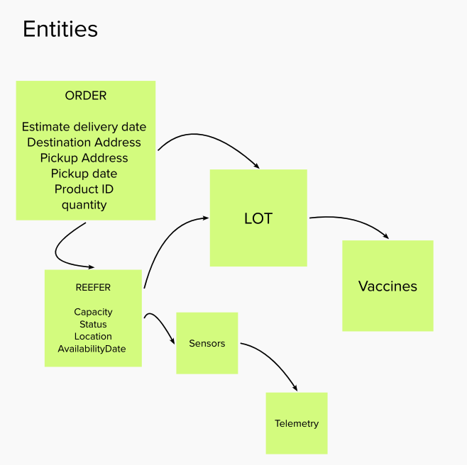

Order will ship lots that includes vaccines. A reefer, or refrigerator containers includes one to many lots.

From a reefer monitoring point of view we are interested by sensors and telemetries and lots inside the refrigerator.

When doing the order fulfillment planning, we are interested by transportation characteristics, lot inventory, order and reefer inventory.

 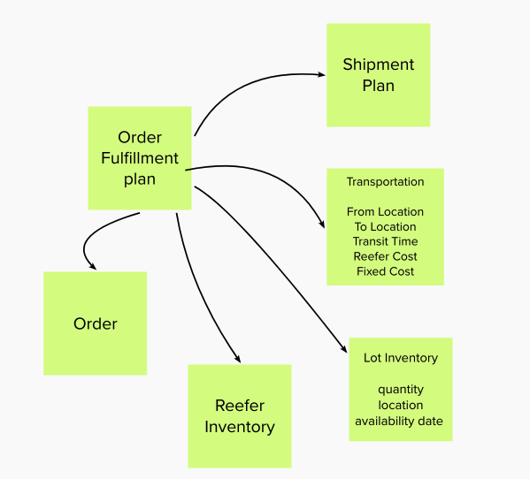

### Bounded contexts

We have done just enough entity modeling, to start considering the order entity, as part of the *order domain*, to become an aggregate which is an important concept to define bounded context.

Defining bounded context within a domain is not an easy exercise, using aggregate is a good approach and apply the practice of clear separation of concern. The blue stickers represent commands, which may be mapped to API verb, or batch job, or user interface widget... The Yellow stickers are for actors. 

 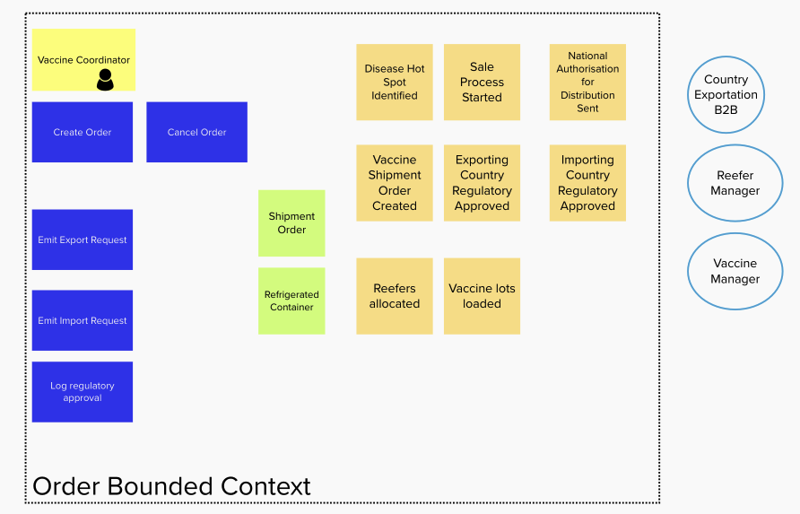

Doing the same from a reefer domain, we get:

 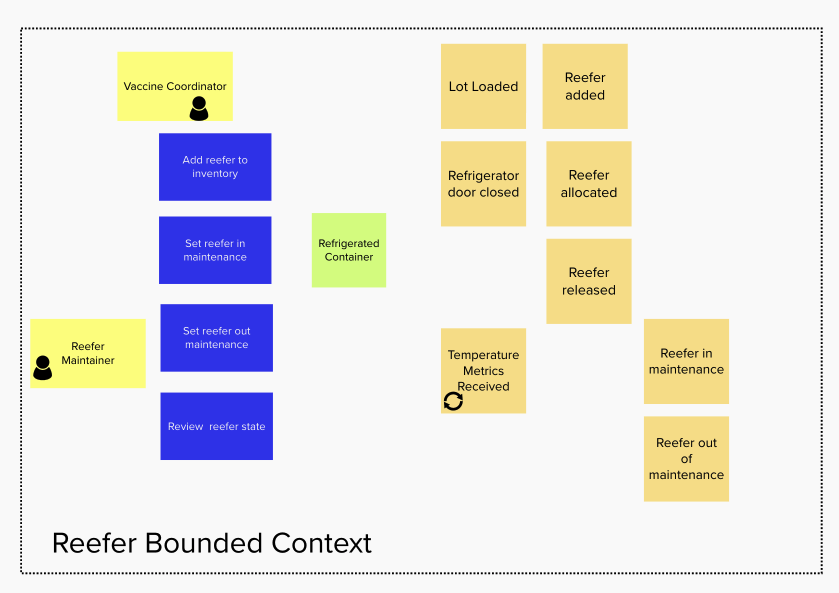

Those two things mean we want to have two separate services to manage order and reefer.

Now the vision statement and the deeper analysis of the order domain, have lead the architect to think about an optimization component to compute the  **Order fulfillment plan** taking into consideration lot inventory, order, reefer inventory, transportation constraints... Now the bounded context is becoming functional and team oriented. We need to engage Operational Research specialist, and bundle the developed mathematical model as a function or service exposed via APIs and consumable by the order management service. We can see from the second entity diagram that the aggregage is becoming the  **Order fulfillment plan**, so a new service for that makes a lot of sense.

### Cold chain monitoring sub domain

 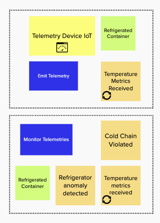

### Commands to APIs

For the order bounded context we have identified a set of commands that can lead to a development of an open APIs specifications. 

 

### Event Driven?

Well, event storming helps to focus on events. Also a lot of the processing is asynchronous and some of the operation could be long running. Adopting an event-driven implementation of the above services (order and reefer) will make a lot of sense. Also using the event sourcing pattern may help to have an audit trail of what happen to an order, a reefer and the vaccine lots.

## System context

The application system context looks like in the following diagram.

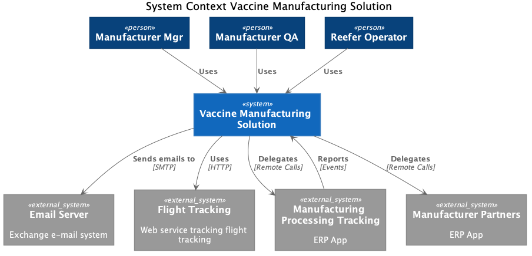

The actors are the same as discovered during the design thinking session:

* Manufacturing manager
* Manufacturing QA engineer
* Refrigerator manager

The external systems to integrate are:

* Email server: for the MVP we will not use this integration
* Flight Tracking: for the MVP we will not use this integration, but it could be to integrate with flightstats.com
* Manufacturing processing: an ERP based platform, for the MVP we will not use this integration.
* Other Manufacturer partners

## Solution component view
 
From a design point of view, it is interresting to apply the top 2 or 3 diagrams from the [C4 models](https://c4model.com/). We use the container as components view for the level of elements that are deployable as a standalone service / docker container.

 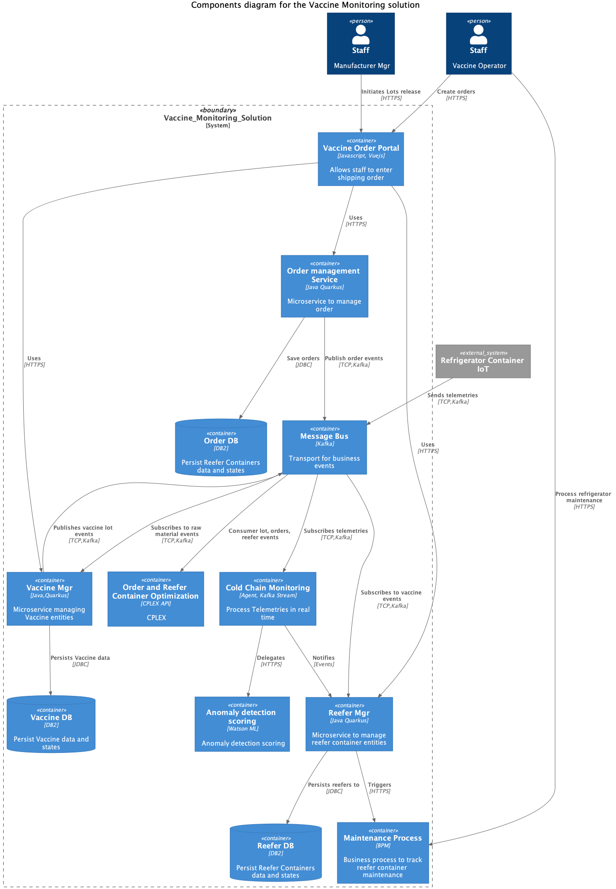

* Vaccine manager service: responsibles of managing the vaccine as an entity, and support CRUD operations on the vaccine lots.
* Order management service: support the operations to manage a Vaccine Shipping Order
* Reefer manager service: to manage the refrigerator container life cycle.
* Vaccine Order & Reefer Optimization: to manage an optimized delivery plan for each vaccine order
* Refrigerator container IoT as a simulator to help for the demonstration
* Kafka event backbone and event store
* Reefer monitoring agent: subscribe to telemetry events to assess cold chain violation and detect refrigerator anomalies
* Anomaly detection scoring: Deployed as a ML service, this is the scoring for predicting a reefer failure.
* Reefer maintenance business process to dispatch field engineers to do the maintenance of the reefer when anomaly was detected.

???+ info "Not a complete story"
    Once again we do not pretend to cover the full coverage of a domain driven design approach for this vaccine problem. We focused on a very minimal viable product to get us started.
