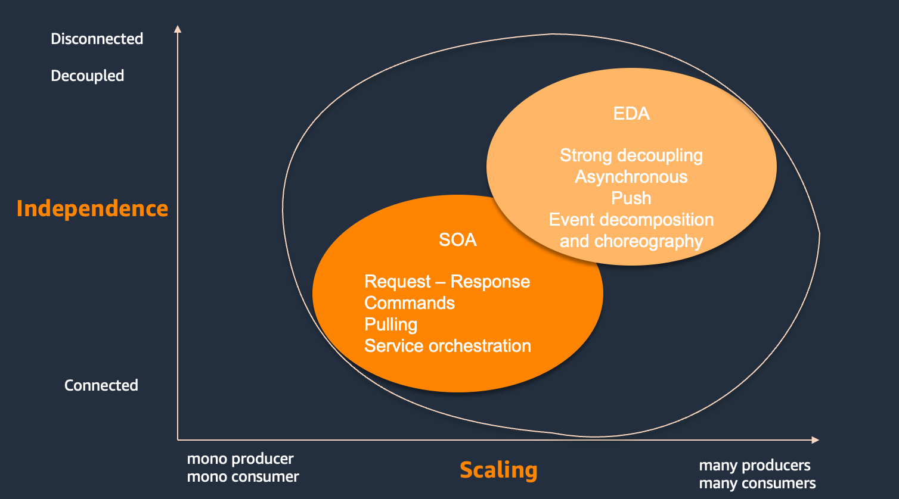

# Introduction

???- Info "Site updated 11/27/2023"
    November:
    
    - Update to event storming
    - Add event storming example for vaccine delivery
    - Added summary of IBM MQ
    
    September:

    - microservice challenges in patterns chapter
    - flow architecture summary
    - Dead letter queue pattern

    August:
    
    - Reactive systems
    - EDA content for event backbone criteria

    July: 
    
    - Add Choreography and orchestration introduction in design pattern
    - Add Scatter-gather in design pattern
    - Add Kafka connect content
    - Add event sourcing 
    - Tune Saga pattern content

## Why this site?

This virtual book,  isn't just another static resource on Event-Driven Architecture (EDA). It's your dynamic companion on the journey to mastering this transformative approach.

While the value of cloud adoption and microservices is no longer in question, the "how" of implementing them often remains a challenge. Here, you'll find a comprehensive, continuously evolving source of knowledge tailored to bridge that gap.

Imagine a living textbook on EDA, constantly updated with the latest insights and practical guidance. That's the experience this blog aims to deliver. As I delve deeper into this exciting realm, so too will the content on this site, ensuring you stay ahead of the curve.

Why choose this book?

* **Dynamic learning**: Unlike static books, this web content allows for continuous updates, ensuring access to the latest knowledge and best practices.
* **Practical focus**: Filled with actionable insights and real-world examples, the content goes beyond theory to help you apply EDA concepts effectively.
* **Evolving expertise**: As I learn and grow, so does this website, providing you with access to a constantly expanding knowledge base.
Join me on this journey to unlock the full potential of Event-Driven Architecture!

## Target audience: Architects and Leaders Building Modern Applications

Event-Driven Architecture (EDA) empowers you to create modern, responsive, and scalable applications. Adopting EDA enables new solution based on real-time analytics, complex event processing, distributed and loosely coupled micro-services, this book is specifically aimed at individuals who play a crucial role to deploy event-driven solution, including:

* **Enterprise Architects**: Who oversee the overall technical vision and strategy for an organization. They will find valuable guidance on how EDA aligns with and supports long-term IT goals.
* **Solution Architects**: Who translate business needs into technical solutions. This content will equip them with the knowledge and expertise to design and implement robust EDA-based solutions.
* **Developer Leaders**: Who guide and mentor development teams. They will gain insights into fostering a culture of collaboration and best practices for building effective event-driven systems, by using well established practices of Domain-driven design and event storming.

If you are passionate about building cutting-edge applications and want to explore the potential of EDA, I wish this book is your resource.

## What kind of problems are we trying to solve?

In today's software landscape, the rise of cloud computing and distributed systems has brought new challenges and opportunities. The term Event-driven architecture is heavily influenced by the capabilities of software vendors, and sometime is becoming a marketing play. But in reality traditional architectures often struggle with:

* **Scalability and Performance**: As applications grow, maintaining responsiveness and handling increasing load may become very difficult.
* **Microservice Complexity**: While microservices offer advantages, managing the complexity of distributed systems and well designed loose coupled components can be challenging.
* **Synchronous Communication Bottlenecks**: Point-to-point, synchronous communication between services can create tight coupling, hindering agility and making changes cumbersome.
* **Limited Real-Time Processing**: Traditional architectures often lag in processing data as it's generated, leading to delays in insights and actions.
* **Data Consistency Concerns**: Achieving consistency across distributed systems can be complex, especially when dealing with eventual consistency models.

Event-Driven Architecture (EDA) is as a powerful solution to these challenges. It offers a paradigm shift by focusing on events as the primary driver of communication and data flow. This blog delves into the core principles of EDA, guiding you in harnessing its potential to build scalable, responsive, and resilient applications – regardless of specific software vendors or products.

While this site does include some implementations using specific open-source products, its primary aim is to remain product-agnostic and to outline the essential principles of EDA.

## Why EDA is important in 2020s

The past two decades have witnessed a radical transformation in how businesses operate. The rise of software as a key strategic differentiator has disrupted entire industries, from retail and media to transportation and finance. This shift, often referred to as **"industry becoming software",** goes beyond simply using software for traditional functions like accounting or CRM. It's about leveraging the power of software to create entirely new business models, engage customers in innovative ways, and gain a competitive edge.

In this new landscape, four key capabilities have emerged as critical drivers of success:

1. **Cloud**: This shift from on-premises data centers to cloud computing unlocks unprecedented scalability, elasticity, and cost-efficiency. It enables continuous optimization of the compute power usage, changing the pricing model from capex to pay-as-you-go. Cloud elastice resources are readily available, allowing businesses to adapt to changing demands much faster.
1. **AI / machine learning**: These technologies are transforming how businesses make decisions and automate complex tasks. By automating data analysis and insights generation, AI/ML empowers businesses to act when data are created with greater intelligence and efficiency.
1. **Mobile**: The rise of mobile apps has fundamentally altered user experiences and interactions with businesses. Users expect seamless mobile access to services and notifications that keep them informed and engaged.
1. **Data**, especially **data as event**: Data has become the lifeblood of modern businesses, guiding user experiences, driving decisions, and fueling innovation. However, static data stored in traditional warehouses is no longer enough. Businesses require real-time access to **data as events** to react instantly to changes and opportunities.

This evolution necessitates a shift in data architecture. Traditional, centralized databases struggle to meet the demands of real-time data access and processing. As a result, data architectures are evolving towards distributed, decentralized models based on data in motion and data lakes.

Event-Driven Architecture (EDA) emerges as a critical enabler in this evolving data landscape. By treating *data as a stream of events*, EDA empowers businesses to:

* **Gain real-time visibility into data**: Capture and process data immediately as it's generated, eliminating the latency associated with traditional approaches.
**React to changes instantly**: Trigger actions and processes based on specific events, enabling real-time decision-making and automated workflows.
* **Improve agility and scalability**: Decouple components and enable independent scaling, ensuring the architecture can adapt to changing data volumes and business needs.

Studies reveal a strong correlation between the age of data and the quality of business decisions based on it. Fresh, real-time data holds significantly greater value compared to stale information. The value of the data dismisses over time. This is especially crucial for AI models, where data freshness directly impacts performance and accuracy. EDA plays a critical role in supporting data pipelines for AI/ML, facilitating feature engineering and efficient data storage for machine learning models.

While Service-Oriented Architecture (SOA) laid the groundwork for decomposing applications into reusable business services in the early 2000s, EDA emerged as a natural evolution in the mid-2000s. It addressed the limitations of SOA in terms of scalability and inter-dependencies, particularly when dealing with a large number of data producers and consumers. The following diagram, from 2004, illustrates this evolution.

{ width=800 }

The mid-2010s witnessed a surge in asynchronous communication and the adoption of Event-Driven Architecture (EDA), particularly among internet startups, to address scalability.  Asynchronous communication, one axe of the adoption, decouples event producers from consumers, enabling independent scaling and improved overall system agility. As EDA leverages data as events, allowing businesses to gain immediate visibility into changes and act on them swiftly. This facilitates faster decision-making and automated workflows.

However, it's important to acknowledge that decoupling also introduces complexities in development efforts.

The rise of cloud computing has further empowered businesses. Cloud platforms offer:

* **Horizontal Scalability**: Organizations can scale their software capabilities on-demand to meet fluctuating workloads, ensuring optimal performance during peak periods: consumers are added, horizontally, to process events.
* **Rapid Development and Deployment**: Cloud-native practices promote agile methodologies and continuous deployment, allowing for frequent feature releases (even multiple times per week) to large user bases.
* **Focus on Innovation**: By removing the burden of infrastructure management (server maintenance, OS updates, security patches), IT teams can dedicate more resources to developing innovative features that deliver value to end users.

In essence, Event-Driven Architecture presents a powerful architectural approach for the modern business landscape, enabling organizations to leverage real-time data effectively and gain a competitive advantage in the age of "industry becoming software."

## The Power of Event-Driven Architecture

Event-Driven Architecture (EDA) offers a compelling paradigm for building modern, scalable, and responsive applications. Here's how EDA empowers you:

**Superior Scalability and Performance**: EDA thrives on asynchronous processing. Components react to messages independently, eliminating bottlenecks and enabling seamless scaling to handle heavy workloads efficiently. This translates to consistently high performance and responsiveness for your users.

**Loose Coupling for Agile Development**:  EDA fosters loosely coupled systems. Components communicate through events, minimizing dependencies and simplifying maintenance, updates, and individual component scaling. This promotes modularity, extensibility, and a development approach that's developer-friendly and agile.

**Real-Time Capabilities**:  EDA excels at building real-time and reactive systems. Applications react to events instantaneously, enabling features like real-time analytics, instant notifications, and dynamic user experiences. This ensures your applications stay responsive and users remain engaged.

**Microservices and Distributed Systems**: EDA aligns perfectly with the tenets of microservices and distributed systems. It provides a communication framework where services interact via events. This fosters service autonomy, allowing independent deployment and evolution of individual components. It's ideal for organizations that value a modular and agile software development approach.

**Event Sourcing and Integration**: EDA plays a pivotal role in both event sourcing and event-driven integration. Event sourcing uses events to reconstruct application state, while event-driven integration facilitates data and action exchange across diverse systems. This simplifies the development of complex, interconnected ecosystems.

**Enhanced Flexibility and Adaptability**: EDA promotes decoupled communication, making it easier to introduce new features or third-party services with minimal disruption to existing systems. This inherent flexibility allows your systems to readily adapt and evolve as your business needs change.

**Business Alignment**: EDA aligns naturally with business and domain-driven design approaches. Business events and domain concepts are directly captured and represented within the system's architecture. This facilitates a clear understanding and better alignment between the technical and business domains.

[>> Next: - EDA concepts](./eda.md)