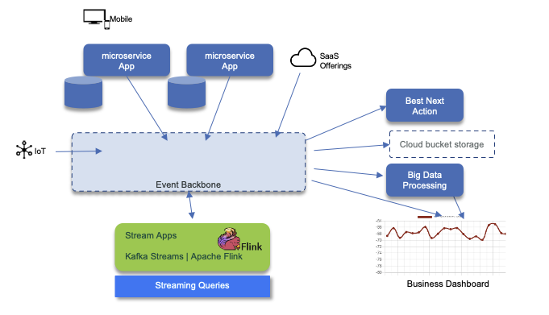

# Data lineage

When it comes to adopting a streaming data platform, there are multiple components that work together to handle data, encompassing both online and offline processing. 

In this chapter, we will explore these components and concepts that are crucial for understanding the data lineage within such a platform. To provide visual clarity, the following figure illustrates the key components involved:



1. **Event Sources**: Our streaming data platform receives events from various sources, including mobile applications, web single page applications, IoT devices, microservice applications, change data capture (not depicted here), and SaaS offerings. These sources generate valuable data that forms the foundation of our real-time analytics.
2. **Event Backbone:** To ensure data durability and reliability, we persist the incoming events in an append log within the event backbone. This backbone acts as a central hub, storing events with a long retention time (typically spanning multiple days). This approach allows us to maintain a complete and historical record of the data.
3. **Stream Applications:** Using streaming technologies such as Kafka Streams and Apache Flinks, our stream applications perform stateful operations to process and analyze the incoming events in real-time. These applications also enable us to perform complex event processing, providing valuable insights and actionable information.
4. **Next Best Action:** On the right side of the architecture, consumers have the ability to trigger the next best action based on specific events. This action could be a business process, some product recommendations, alerts, or any other relevant response. By leveraging the insights derived from the stream applications, we can make informed decisions and take proactive steps in real-time.
5. **Long-Term Data Storage:** While the event backbone retains data for a limited period, we often require the ability to persist data for longer durations. To achieve this, we leverage storage solutions like S3 buckets, which offer full cloud availability. Whether it's Cloud Object Storage or on-premise deployments, these storage options allow us to securely store and access data for extended periods.
6. **Big Data Processing:** To extract further value from the accumulated data, we employ big data processing platforms like Apache Spark. These platforms enable us to perform batch processing and map-reduce operations on the data at rest. By leveraging the data ingested through the event backbone, we can derive valuable insights and patterns that can drive informed decision-making.
7. **Business Dashboards:** To provide a comprehensive view of the data, our streaming data platform integrates with business dashboards. These dashboards enable users to query both static data at rest and dynamic data in motion. By utilizing interactive and streaming queries, users gain real-time access to critical information, empowering them to make data-driven decisions.


## Data lineage requirements

Data lineage is a comprehensive concept that encompasses various aspects of data management. It describes the origins, movements, characteristics, ownership, and quality of data. As part of a larger data governance initiative, data lineage may also include considerations such as data security, access control, encryption, and confidentiality.

To effectively implement data lineage, organizations should consider the following requirements:

1. **Data Source Identification**: Clearly identify and document all data sources, including internal systems, external providers, and any other origins of data.

2. **Data Ownership**: Establish clear ownership and responsibilities for each dataset. Assign data owners who are accountable for the accuracy, completeness, and quality of the data.

3. **Data Access Control**: Define and enforce access controls to ensure that only authorized individuals or systems can access specific datasets. Implement role-based access control (RBAC) and maintain an audit trail of data access activities.

4. **Data Quality Measures**: Establish data quality metrics and implement processes to monitor and maintain the quality of data throughout its lifecycle. This may include data validation, cleansing, and reconciliation procedures.

5. **Data Transformation Tracking**: Keep track of all data transformations and modifications that occur as data moves through the platform. Document the logic, algorithms, and any manual interventions applied to the data.

6. **Data Lineage Visualization**: Utilize tools and technologies that provide visual representations of data lineage, making it easier to understand the flow of data and identify dependencies.


By addressing these requirements and implementing robust data lineage practices, organizations can gain a clear understanding of their data landscape, ensure data quality, and make informed decisions based on reliable and traceable data.


## Contracts

In the world of REST APIs and Service-Oriented Architecture (SOA), request/response interactions are defined using standards such as OpenAPI (formerly known as Swagger) or Web Services Description Language (WSDL). These standards provide a way to describe the structure and format of the data being exchanged between the client and the server.

Similarly, in the realm of event-driven and streaming architectures, [AsyncAPI](https://www.asyncapi.com/) has emerged as a specification for defining message-driven APIs. AsyncAPI allows you to describe the schema of the messages being exchanged and the middleware bindings used for communication.

AsyncAPI is designed to be protocol-agnostic, meaning it can be used with various messaging protocols such as MQTT, AMQP, Kafka, WebSocket, and more. It provides a standardized way to define the structure and format of the messages, as well as the channels or topics on which the messages are published and subscribed.

By using AsyncAPI, you can:

1. Define the message payload structure using JSON Schema or Avro.
2. Specify the channels or topics for publishing and subscribing to messages.
3. Describe the message exchange patterns, such as publish/subscribe or request/reply.
4. Define the security mechanisms and authentication requirements for the API.
5. Generate documentation, code snippets, and client libraries based on the AsyncAPI specification.

AsyncAPI promotes interoperability, and easier integration between different systems and languages as it enables the creation of tooling and frameworks that can generate code, perform validation, and provide testing capabilities based on the AsyncAPI specification.

---

### OpenAPI

We do not need to present [OpenAPI](https://www.openapis.org/) but just the fact that those APIs represent request/response communication and may be managed and integrated with the development life cycle. Modern API management platform should support their life cycle end to end but also support new specifications like GraphQL and AsynchAPI.

### AsynchAPI

Without duplicating the [specification](https://www.asyncapi.com/) is the specification to define schema and middleware binding. we want to highlight here what are the important parts to consider in the data governance:

* The Asynch API documentation which includes:
    * The server definition to address the broker binding, with URL and protocol to be used. (http, kafka, mqtt, amqp, ws)
    * The channel definition which represents how to reach the brokers. It looks like a Path definition in OpenAPI
    * The message definition which could be of any value. Apache Avro is one way to present message but it does not have to be.
    * Security to access the server via user / password, TLS certificates, API keys, OAuth2...
* The message schema

The format of the file describing the API can be Yaml or Json. 

## Schema

Schema is an important way to ensure data quality by defining a strong, but flexible, contract between producers and consumers and to understand the exposed payload in each topics. Schema definitions improve applications robustness as downstream data consumers are protected from malformed data, as only valid data will be permitted in the topic.
Schemas need to be compatible from version to version and Apache Avro supports defining default values for non existing attribute of previous versioned schema. Schema Registry enforces full compatibility when creating a new version of a schema. Full compatibility means that old data can be read with the new data schema, and new data can also be read with a previous data schema.

Here is an example of such definition:

```json
"fields": [
     { "name": "newAttribute",
       "type": "string",
       "default": "defaultValue"
     }
]
```
*Remarks: if you want backward compatibility, being able to read old messages, you need to add new fields with default value.To support forward compatibility you need to add default value to deleted field, and if you want full compatibility you need to add default value on all fields.*

Metadata about the event can be added as part of the `field` definition, and should include source application reference, may be a unique identifier created at the source application to ensure traceability end to end, and when intermediate streaming application are doing transformation on the same topic, the transformer app reference. Here is an example of such data:

```json
"fields": [
     { "name": "metadata",
       "type": {
           "name": "Metadata",
           "type": "record",
           "fields": [
               {"name": "sourceApp", "type": "string"},
               {"name": "eventUUID", "type": "string"},
               {"name": "transformApps", "type": 
                { "name" : "TransformerReference",
                  "type": "array",
                  "items": "string"
                }
               }
           ]
       }
     }
]
```


The classical integration with schema registry is presented in the figure below:


Schema registry can be deployed in different data centers and serves multi Kafka clusters. For DR, you need to use a 'primary' server and one secondary in different data center. Both will receive schema update via DevOps pipeline. One of the main open source Schema Registry is [Apicurio](https://www.apicur.io/), which is integrated with Event Streams and in most of our implementation. Apicurio can persist schema definition inside Kafka Topic and so schema replication can also being synchronize via Mirror Maker 2 replication. If Postgresql is used for persistence then postgresql can be used for replicating schemas.

We recommend reading our 
[schema registry summary](../../techno/avro-schemas/index.md). 

Integrating schema management with code generation and devOps pipeline is addressed in this repository.


## Conclusion

Understanding the key components of a streaming data platform is essential for comprehending the data lineage within such an environment. By effectively leveraging event sources, event backbones, stream applications, long-term data storage, big data processing, and business dashboards, organizations can harness the full potential of their streaming data to drive insights, make informed decisions, and gain a competitive edge in today's data-driven landscape.