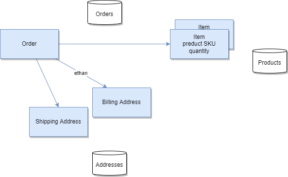
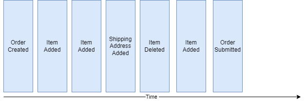
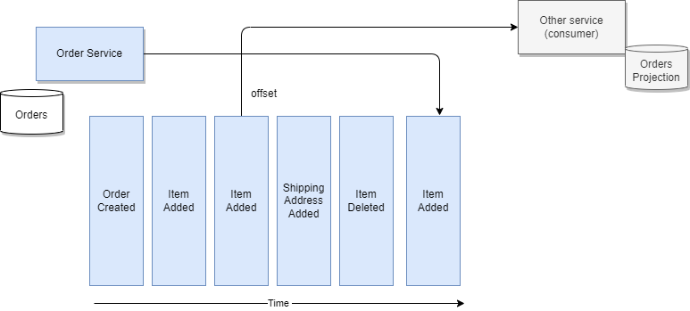
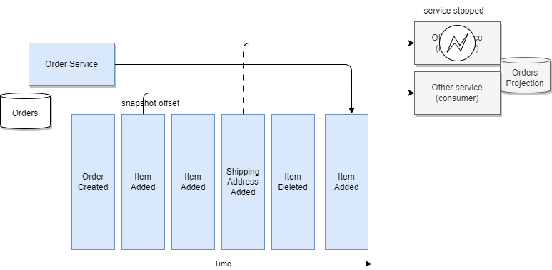

# Event Sourcing

???- Info "Updates"
    Created 2019 - Updated 03/2024

## Problems and Constraints

Most business applications rely on a state-based persistence model. This means changes to an entity (like an order) update its existing record in the database, overwriting the previous state. While this approach is simple, it becomes cumbersome when you need to:

* **Understand history**: Explain how an entity reached its current state. Traditional models lack historical context, making it difficult to track changes and analyze trends.
* **Audit trails**: Maintain a record of all actions for legal or compliance reasons. Deleting data is often not an option, requiring complex "log tables" to capture historical changes.

???+ Example "Order Management with Event Sourcing"
    Consider the traditional Order model with separate tables for orders, addresses and product items. 
    
    { width=700}
    
    If we need to implement a query that looks at what happened to the order over a time period, we need to change the model and add historical records, basically building a append log table. Event sourcing would replace this with a stream of events capturing each action on the order:

    * OrderPlaced(orderId, customerId, address)
    * ItemAdded(orderId, itemId, quantity)
    * AddressUpdated(orderId, newAddress)
    
    By replaying these events, we can reconstruct the current state of the order at any point in time, including historical details.

    Designing a service to manage the life cycle of this **OrderEntity** will, most of the time, add a "delete operation" to remove data.  For legal reason, most businesses do not remove data. As an example, a business ledger has to include new record(s) to compensate a previous transaction. There is no erasing of previously logged transactions. It is always possible to understand what was done in the past. Most business application needs to keep this capability.

## Solution and Pattern

**Event sourcing** offers an alternative approach. Instead of storing the "current state" of an entity, it focuses on a sequence of immutable events that represent all the actions performed on that entity. Here's how it works:

1. **Events Capture Changes**: Each change to an entity (e.g., order placed, item added, address updated) is captured as an event with relevant details (timestamp, data, etc.).
1. **Event Stream Persistence**: These events are stored in an append-only log, creating a complete historical record.
1. **Rebuilding State**: To retrieve the current state of an entity, we replay the entire event stream and apply each event sequentially. 

Event sourcing has its roots in the domain-driven design community. Below is an example of an Order Entity state change events as a sequence of immutable "facts", ordered over time. 

{ width=700 }

When the state of a system changes, an application issues a notification event of the state change. Any interested parties can become consumers of the event and take required actions.  The state-change event is immutable stored in an event log or event store in time order.  The event log becomes the principal source of truth. The system state can be recreated from a point in time by reprocessing the events. The history of state changes becomes an audit record for the business and is often a useful source of data for business analysts to gain insights into the business.

We can see the "removing an item" event in the log is a new event. With this capability, we can count how often a specific product is removed for the shopping cart.

In some cases, the event sourcing pattern is implemented completely within the event backbone middleware. Apache Kafka is a popular platform for implementing event sourcing. It uses topics and partitions to manage event streams. Producers publish events to topics, while consumers subscribe and process them. 

However, we can also consider implementing the pattern with an external event store, which provides optimizations for how the data may be accessed and used. 

An event store needs to store only three pieces of information:

* The type of event or aggregate.
* The sequence number of the event, can be a ZT timestamp.
* The data as a serialized entity.

More data can be added to help with diagnosis and audit, but the core functionality only requires a narrow set of fields. This gives rise to a very simple data design which may be heavily optimized for appending and retrieving sequences of records.

With a central event logs, as provides by Kafka, producers append events to the log, and consumers read them from an **offset** (a sequence number).

To get the final state of an entity, the consumer needs to replay all the events, which means replaying the changes to the state from the last committed offset or from the last snapshot or the origin of "time".

### Benefits of Event Sourcing

* **Enhanced Auditability**: Provides a complete, tamper-proof record of all actions performed on an entity.
* **Improved Analytics**: Enables historical analysis and trend identification by replaying the event stream for specific time frames. As events are ordered with time, we can apply complex event processing with temporal queries, time window operations, and looking at non-event occurrence.
* **Scalability**: Easier to scale horizontally as event streams are naturally append-only and can be distributed efficiently.
* **Resilience**: Event streams are immutable, making them inherently resistant to accidental data modifications. It is possible to reverse the state and correct data with new events.

### Considerations

When replaying events to reconstruct an entity's state, it's crucial to avoid unintended side effects. A common example is sending notifications – this action should be a separate process triggered by the event, not part of the replay itself.

Event consumers should be designed to handle different scenarios: 

* **The Queries**: Consumers focused on answering questions like "what happened to order ID #75 over time?" don't generate side effects. They simply process events to generate a report.
* **Business Logic**: Other consumers might trigger actions based on events, but these actions should be separate steps outside the replay process.

Replaying hundreds of events can be time-consuming. To address this, event sourcing can leverage snapshots: Periodically, or at key points in time, a snapshot capturing the current state of an entity is created.
When reconstructing an entity's state, the system can start from the most recent snapshot and then replays only the events that occurred after that point.

Snapshots are optimization techniques, not a requirement for all event sourcing implementations. They are particularly beneficial when dealing with high volumes of state change events.

Kafka is supporting the event sourcing pattern with [the topic and partition](../../techno/kafka/index.md#topics): the partition key needs to be mapped to the business entity key, so that the partition is a unique append log where each events related to the same entity are in the same log. Repartitioning will loose the reordering.  

The event sourcing pattern is well described in [this article on microservices.io](https://microservices.io/patterns/data/event-sourcing.html). It is a very important pattern to support eventual data consistency between microservices and for data synchronization between system as the event store becomes the source of truth.

See also this [event sourcing article](https://martinfowler.com/eaaDev/EventSourcing.html) from Martin Fowler, where he is also using ship movement examples. 

Another common use case, where event sourcing helps, is when developers push a new code version that corrupts the data: being able to see what was done on the data, and being able to reload from a previous state helps fixing problems.

### Command sourcing

Command sourcing shares similarities with event sourcing, but with a key twist. Instead of persisting the events that modify an entity's state, it persists the actual commands themselves. This enables asynchronous processing, which is beneficial for commands that take a long time to execute.

However, command sourcing introduces its own challenges:

* **Immutable**: Command persisted needs to be immutable to keep process flow integrity.
* **Idempotency**: Commands need to be designed to produce the same outcome even if executed multiple times (especially in case of failures). This ensures data integrity.
* **Command Validation**: Validating commands before persisting them helps prevent storing invalid commands in the queue. For example, an `AddItem` command might be validated as `AddItemValidated` before being persisted. Once successfully stored, it could then trigger an `ItemAdded` event. Combining commands with event sourcing is a common approach.

#### Understanding Transactional Consistency in Microservices:

Unlike traditional database transactions (ACID), business transactions involving multiple microservices are more like a series of steps. Each step is handled by a dedicated microservice responsible for updating its owned entity. This results in "eventual data consistency," where data consistency across the system is eventually achieved, but not necessarily guaranteed immediately.

The event backbone (messaging system) needs to ensure events are delivered to microservices at least once. It's the responsibility of individual microservices to manage their position within the event stream and handle inconsistencies, such as detecting and processing duplicate events.

Maintaining Consistency Within Microservices: To prevent data inconsistencies in case of crashes, updating data and emitting events within a microservice should be an atomic operation. This can be achieved in a few ways:

* **Event Table**: Add an eventTable to the microservice database. An event publisher reads this table regularly and marks events as published after successfully sending them.

* **Database Transaction Log**: Implement a reader or "miner" for the database transaction log, responsible for publishing events whenever a new row is added to the log.

## Some technologies to consider

* Any database that can scale to millions of records may be used as event store for most business application. When scaling requirements are higher that one a single database can support, you need to look at other solutions.
* Change data capture is often used to a mechanism to propagate events from an event store to messaging middleware.
* [IBM Db2 Event store](https://www.ibm.com/products/db2-event-store) can provide the handlers and event store connected to the backbone and can provide optimization for down stream analytical processing of the data. 
* [AWS Dynamodb time series](https://docs.aws.amazon.com/amazondynamodb/latest/developerguide/bp-time-series.html) can be used as persistence layer to keep events for long period of time with high scaling characteristics.

## More Readings

* [Martin Fowler - event sourcing pattern](https://martinfowler.com/eaaDev/EventSourcing.html)
* [Microservice design pattern from Chris Richardson](https://microservices.io/patterns/data/event-sourcing.html)
* Greg Young video on event sourcing at the GOTO 2014 conference:

[>>> Next: Command-Query Responsibility Segregation (CQRS)](../cqrs/index.md)