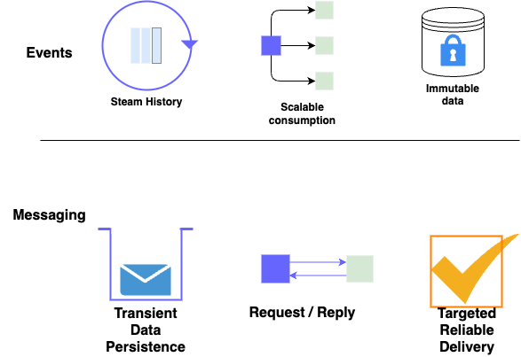

# Event Streaming versus Queuing

!!! info
    Updated 11/21/2023

Consider queue system for:

* Exactly once delivery, and to participate into two-phase commit XA transaction.
* Asynchronous request / reply communication: the semantic of the communication is for one component to ask a second component to do something on its data. This is a **command pattern** with delay on the response.
* Recall messages in queue are kept until consumer(s) got them, which fits well in a command pattern as we do not want to get the command done twice.

Consider streaming system, like Kafka, as pub/sub and persistence system for:

* Publish events as immutable facts, with a timestamp, of what happened in an application.
* Get continuous visibility of the data Streams.
* Keep data a longer time in the persistence layer, once consumed, so future consumers can consume those messages, or for replay-ability.
* Scale the message consumption horizontally.

## Events and Messages

There is a long history for *messaging* in IT systems.  We can easily see an event-driven solution and events in the context of messaging systems and messages. However, there are different characteristics that are worth considering:

* **Messaging:** Messages transport a payload and messages are persisted until consumed. Message consumers are typically directly targeted and related to the producer who cares that the message has been delivered and processed.
* **Events:** Events are persisted as a replayable stream history. Event consumers are not tied to the producer. An event is a record of something that has happened and so can't be changed. (We can't change history.)

## Messaging versus event streaming

We recommend reading [this article](https://developer.ibm.com/messaging/2018/05/18/comparing-messaging-event-streaming-use-cases/) and [this one](https://developer.ibm.com/messaging/2019/02/05/comparing-messaging-pub-sub-and-event-streams/), to get insight on messaging (focusing on operations / actions to be performed by a system or service) versus events (focusing on the state / facts of a system with no knowledge of the downstream processing).

To summarize messaging is to support:

* **Transient Data:** data is only stored until a consumer has processed the message, or it expires.
* **Request / reply** most of the time.
* **Targeted reliable delivery:** targeted to the entity that will process the request or receive the response. Reliable with transaction support.
* **Time Coupled** producers and consumers: consumers can subscribe to queue, but message can be remove after a certain time or when all subscribers got the message. The coupling is still loose at the data model level, and at interface definition level.

For events:

* **Stream History:** consumers are interested in historic events, not just the most recent ones.
* **Scalable Consumption:** A single event is consumed by many consumers with limited impact as the number of consumers grow.
* **Immutable Data**
* **Loosely coupled / decoupled** producers and consumers: strong time decoupling as consumer may come at anytime. Some coupling at the message definition level, but schema management best practices and schema registry reduce frictions.

See also the [MQ in an event-driven solution context article](../../techno/ibm-mq/index.md)

See [the code of a Store sale simulator](https://github.com/jbcodeforce/refarch-eda-store-simulator) to produce messages to different middleware: RabbitMQ, IBM MQ or Kafka.