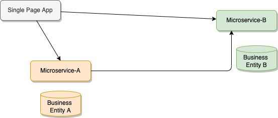
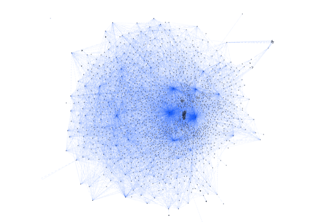
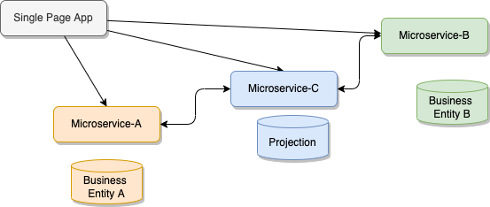
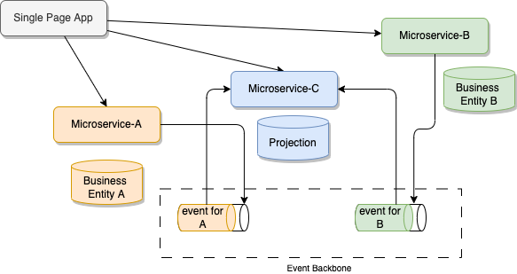
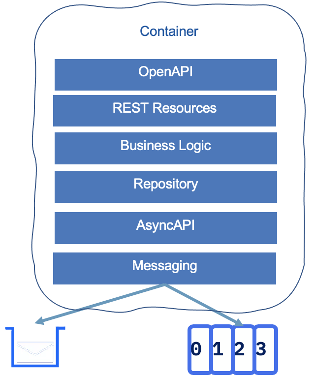
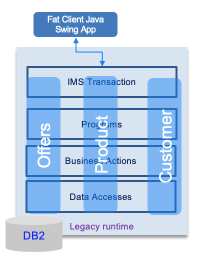
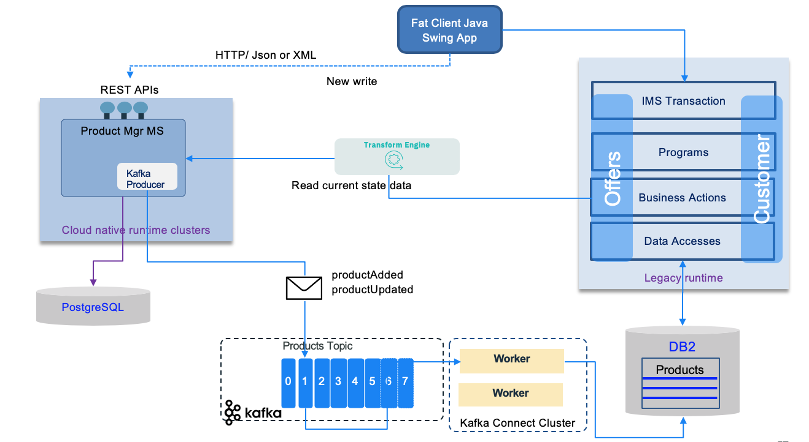
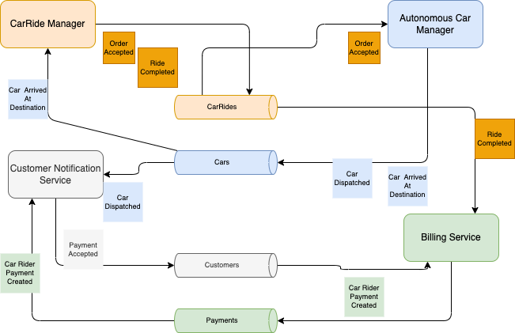
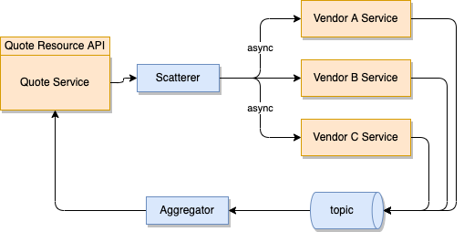
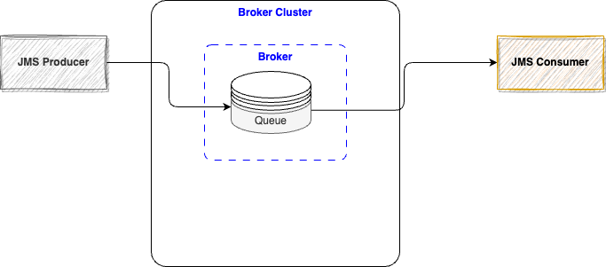

# Distributed systems common design patterns

In this set of articles, we will detail some of the most important event-driven design patterns that can be used during an event-driven microservice implementation.

## Microservice challenges

As we have seen in the [introduction](../eda.md), modern business application needs to responds to events in real time, as the events happen, so it can deliver better user experiences and apply business logic on those events. The key is to be able to act quickly on those facts. Acting may involve computing real-time analytics or use predictive scoring with machine trained models. 

On top of that, a modern cloud native application needs to be reactive, responsive by adopting the [reactive manifesto](./reactive/index.md). 

When adopting microservice implementation, the bounded context is defined with events and main business entity. 
Each microservice is responsible to manage the operations of creating, updating and reading the data from a 
main business entity. This clear separation, leads to exchange data between services, where they used to be
integrated in the same monolytic application before.

A web application, single page app (SPA), accesses the different microservices using RESTful APIs, 
to get the different data views, or create new data elements within one of the service.The following diagram illustrates a simple view of the microservice challenges:

 

When the user interface exposes entry form to create new data for one of the business entity, 
it calls a REST end point with a HTTP POST operation, then data are saved to data store: document oriented database or SQL based RDBMS.

When a microservice (1) needs to access data from another service, it calls another service end point via an HTTP GET. Coupling still exists, via the protocol and the data schema definition level: 
a change to the data model, from the source microservice, impacts the service contract and so all the API consumers. This may be acceptable when there is few microservices, but could become a real pain when the number increase.

When the microservice dependencies grows in size and complexity, as illustrated by the following figure from [Jack Kleeman's Monzo study](https://monzo.com/blog/we-built-network-isolation-for-1-500-services), 
we can see any change to the API from adding a new function will impact all the related services, and will increase cost to maintain such complexity:

 

Finally, imagine we need to join data coming from two different services to address an urgent business request.
Who will implement the join, service A or B? May be the simplest is to add a service C and 
implement a join: it will call two API end points, and try to reconcile data using primary keys 
on both business entities. With this clear separation we can scale service C, but we still add coupling:

 

With event-driven microservices, the communication point becomes the Pub/Sub layer of 
the event backbone. Adopting an event-based implementation, enhances the loose coupling nature of microservices because it decouples producers and consumers at the protocol level. The figure below illustrates, that microservices A and B produces facts about their business entities to topic in the pub/sub event backbone:

 

The microservice C consumes those facts to build, its own projections to support the join query.

When adopting technology like Kafka as messaging backbone, the data sharing is done via an event log, which can be kept for a very long time period, and is replayable to improve resilience. 

These event-driven characteristic is an important decision we need to take when starting developing microservices. Microservice applications are a combination of synchronous API, and asynchronous, event-driven, communication. 

There is something important to add to the discussion, is the fact that there is a coupling by the data.  Messaging structures are defined with JSON schema or Avro schema and managed inside a Schema registry, so messaging applications can still manage the data contract.  

The following figure presents a potential structure for event-driven microservice: 

In Java, APIs are defined using microprofile OpenAPI annotations in one or more JAXRS resource 
classes. Those APIs can then be managed within an API management product:

{ width=300}

The rest of the application structure reflects the DDD approach of onion architecture. 
The business logic is in its own layer with DDD aggregate, ubiquitous language, services,
business rules, etc…
The repository layer supports persisting those aggregates to an external document-oriented 
or SQL-based database.
As most of the new microservices are message-driven, we are adding a messaging layer 
that may use queues or topics. Use queue for request/response exactly once delivery 
and topic for sharing facts in append log.
In Java, the Microprofile Reactive Messaging is used to define the different publishing 
channels, being queue, topic, or both.
From the JSON or Avro schema defining the messages or events structure, 
developers can build an AsyncAPI specification which may also be managed by an API product.

## Common Patterns

Adopting messaging (Pub/Sub or queueing) as a microservice communication approach involves using, at least, the following patterns:

* [Decompose by subdomain](https://microservices.io/patterns/decomposition/decompose-by-subdomain.html): The domain-driven design approach is useful to identify and classify business
functions and the corresponding microservices that would be associated with them. With the event storming method, aggregates help to find those subdomains of responsibility. (Source Chris Richardson - Microservices Patterns)
* [Database per service](https://microservices.io/patterns/data/database-per-service.html): Each service persists data privately and is accessible only via its API.
Services are loosely coupled limiting impact to other services when schema changes occur in the database. The chosen database technology is driven by business requirements. (Source Chris Richardson - Microservices Patterns)
The implementation of transactions that span multiple services is complex and enforces using the Saga pattern. Queries that span multiple entities are a challenge and CQRS represents an interesting solution.
* [Strangler pattern](#strangler-pattern): Used to incrementally migrate an existing, monolithic, application by replacing a set of features to a microservice but keep both running in parallel.
Applying a domain driven design approach, you may strangle the application using bounded context. But then as soon as this pattern is applied, you need to assess the co-existence between
existing bounded contexts and the new microservices. One of the challenges will be to define where the write and read operations occurs, and how data should be replicated between the contexts.
This is where event driven architecture helps.
* [Scatter-gather](#scatter-gather) to dispatch work among microservice and gather their results to build an aggregated answer.
* [Event sourcing](./event-sourcing/index.md): persists, to an append log, the states of a business entity, such as an Order, as a sequence of immutable state-changing events.
* [Choreography](#choreography) to do decentralized coordination between services.
* [Orchestration](#orchestration) to centralize the coordination between distributed systems with compensation flow.
* [Command Query Responsibility Segregation](./cqrs/index.md): helps to separate queries from commands and help to address queries with cross-microservice boundary.
* [Saga pattern:](./saga/index.md) Microservices publish events when something happens in the scope of their control like an update in the business entities they are responsible for. A microservice, interested in other business entities, subscribes to those events and it can update its own state and business entities on receipt of these events. Business entity keys need to be unique and immutable.
* [Event reprocessing with dead letter](./dlq/index.md): event driven microservices may have to call external services via a synchronous call. We need to process failure in order to get response from those services using event backbone.
* [Transactional outbox](#transactional-outbox): A service command typically needs to update the database and send messages/events.
The approach is to use an outbox table to keep the message to sent and a message relay process to publish events inserted into database to the event backbone. (Source Chris Richardson - Microservices Patterns)

## Strangler pattern

### Problem

How to migrate a monolithic application to a microservice based architecture without doing the huge effort of redeveloping the application from a blank slate. Replacing and rewriting an existing application can be a huge investment. Rewriting a subset of business functions while running current application in parallel may be relevant and reduce risk and velocity of changes.

The figure below illustrates a typical mainframe application, with external Java based user interface connected to the mainframe via iop/corba and with three different applications to manage product, order and customer.

{ width=500 }

### Solution

The approach is to use a "strangler" interface to dispatch a request to new or old features. Existing features to migrate are selected by trying to isolate sub components.

One of main challenges is to isolate the data store and disover how the new microservices and the legacy application are accessing the shared data. Continuous data replication can be a solution to propagate write model to read model. Write model will most likely stays on the monolitic application, change data capture can be used, with event backbone to propagate change to read model.

The facade needs to be scalable and not a single point of failure. It needs to support new APIs (RESTful) and old API (most likely SOAP).

The following figure illustrates an implementation using an event driven solution with data replication to synchronize the write model to the read model on the mainframe.

{ width=1000 }

## Choreography

Service choreography and service orchestration are two different approaches to coordinating the interactions and behaviors of distributed services. 

Service choreography refers to a decentralized coordination approach where each participating service in a system collaborates autonomously, following predefined rules or processes. Services interact directly with each other, exchanging messages and performing actions based on the received messages.There is no central coordinator. It emphasizes the autonomy and independence of each service, allowing for more flexibility and scalability. Service choreography can be compared to a dance, where each participant knows their steps and responds to the cues from others.

It is more complex to implement to manage the exception and error recovery. The process model on top of this choreography is more difficult to understand and model. Reverse engineering the service traces to build the story of what happened to a given business transaction.

With event routing based middlewares, the event pushes to services participing to the choreography is done via routing rules. So the business process flow is controlled by the routing policies.

Here is an example of choreography with squares representing events from the different services, and topics to keep events related to the same entity: CarRideOrders, AutonomousCar, Customers, Payments

{ width=700 }

The detail of the flow is described in [this design note](../solutions/autonomous-car/index.md#adopting-an-event-driven-approach-to-the-implementation)

## Orchestration

Service orchestration, is a centralized coordination approach where a central entity, known as an orchestrator or process engine, controls and coordinates the interactions between the participating services. The orchestrator defines the flow of activities, sequences, and conditions that govern the execution of the services. It actively manages the interactions, determining the order of service invocations, handling exception and compensation scenarios, and ensuring the overall process logic is followed. Service orchestration provides a higher level of control and visibility over the execution flow but may introduce a single point of failure or performance bottleneck. In the world of SOA, BPEL engines were used for orchestration, with long running transactions. Java supports 

## Scatter-gather

This is a common pattern to facilitate parallel processing and aggregation of results from multiple sources. 
It was created with the adoption of distributed systems, and is well adapted for microservice solutions. The data to process is scattered across different nodes or microservices, processed independently, and then gathered or collected back together for further processing or presentation.

The pattern consists of two main phases: the scatter phase and the gather phase.

* **Scatter Phase**: In this phase, a central entity (often referred to as the scatterer) divides the incoming data into smaller chunks and distributes them across multiple processing units or nodes. When using event the data is the event payload. Each processing unit is responsible for handling a portion of the data independently, without requiring coordination with the others. This enables parallel processing and helps in optimizing performance.

* **Gather Phase:** Once the scatter phase completes, the processing units return their results to the central entity or a designated gathering component. The gatherer collects the intermediate results and combines them to produce the final result or output. The combination can involve simple aggregation, such as summing up values, or more complex operations like merging and sorting.

{ width=700 }

## Transactional outbox

When distributed transaction is not supported by the messaging middleware (like current Kafka version), it is important to ensure consistency between the records in the database and the events published. In the reference implementation we used the approach to publish to the topic as soon as an order is received via the API and then the same code, is consuming this events to persist to the database. With this approach if write to the topic operation fails, the application can return an error to the user, if the write operation to the database fails, the code can reload from the non-committed record. 

But there is another solution presented by the transactional outbox. For detailed information about this pattern see the documentation of the pattern in Chris Richardson's site: [Transactional outbox](https://microservices.io/patterns/data/transactional-outbox.html).

To summarize this pattern, the approach is to use an `outbox` table to keep the messages to sent and a message relay process to publish events inserted into database to the event backbone. In modern solution this relay is a change data capture agent. The following schema illustrates the approach:

{ width=700 }

## Integration patterns

### One-way asynchronous

The sender does not expect a response, and share its information to a message channel

