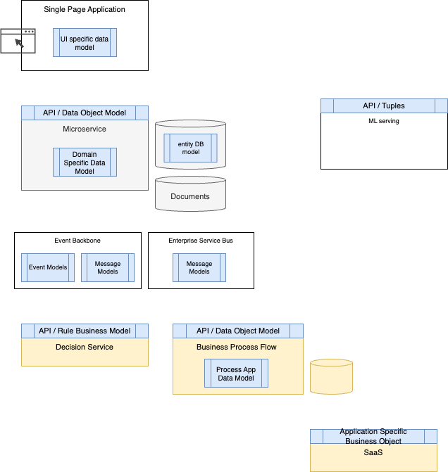

# Different Data Models

The advent of modern business applications such as cloud-native microservices, long-running business processes, decision services, and AI, among others, has led to an increased complexity in data modeling, data transformation, and data view. While adopting a canonical model presents certain advantages, it also entails counterproductive effects.

Microservice adoption and the application of domain driven design make defining a bounded context for microservices easier, but as soon as we begin coding, we encounter immediate questions about the information model's shape, and the appropriate canonical model to use, which is typically maintained at the messaging or integration layer to facilitate one-to-one mappings between models.

The goal of this document is to apply the architecture principal of clear separation of concern, focusing on data needed to implement the business logic, and adapt interface definition for effortless consumption and reuse.

The following figure illustrates a potential business solution using different components, supported on top of different software products.

 

* **Single Page applications** are running in Web Browser and use different javascript library to support HTML rendering, business logic implementation and data model as JSON documents. The model view is focusing to expose data to users and to support form entry. The app interacts with one Backend For Frontend app's REST API or other services with CORS support. The model and API are designed for this user centric application.
* Microservices are exposing model via their APIs, in Java EE, it used to be named **Data Transfer Object**, and it is still used and named this way in microservice. The focus on this model is to enforce reusability, and expose APIs about the main business entity or aggregate (Domain Driven Design - Aggregate). This **entity** is persisted in different formats, and when using traditional SQL based technology, Object Relational Mapping is needed. In Java, [hibernate ORM](https://hibernate.org/orm/) is used with JPA and JTA to support transaction and entity annotation. [Quarkus Panache](https://quarkus.io/guides/hibernate-orm-panache) is a nice way to map business entity transparently to DB. But still we need to design those models. Within the microservice, we will also find specific implementation model used to support the business logic the service implements.
* The adoption of JSON document to get a more flexible, schemaless model, helps at the technology selection to be more agile as the model can evolve easily, but still we need to think and design such models.
* Modern business applications are using Artificial Intelligence model. To make it more generic, we defined a **ML model service** which computes a score between 0 to 1, given a feature set represented as tuples. The model is exposed with an API with a flat data model.

In the middle of the figure, we have an integration layer:

* The modern **event backbone** supports event streaming and message queueing. The event model is defined with schemas, and any applications producing such events, needs to have a specific model to represent fact, of what happens in their boundary.
* **Enterprise service buses** are still used in IT architecture, as service gateway, doing interface mapping, and heteregeonous integrations. The model definition will better fit to the adoption of canonical model to facilitate the one to one mapping between source and destination models.  
* Those integrations can do data mapping with Software as a Service applications like a CRM, ERP systems. The name **ASBO**, for Application Specific Business Object, was used in the past, and it still applies in modern solutions. We need to consider them when doing model mapping.
* Some business applications need to get human involved, in the form of workflow, where process application implements the workflow and define process variables to keep data between process tasks. Those data are persisted with process instances within the Business Process Management datasource. The business process can be triggered by user interface (claiming to start a process), by exposing a service, in this case we are back to the DTO definition. When the business process is triggered asynchronously via messages we can use a message model.
* Externalizing business rules, is still a relevant pattern, and in the case of decision modeling, a specific data model to support the rules inference and simplify the rule processing is needed. This is what we called **RBO: Rule Business Object** in the [Agile Business Rule Development methodology](https://jbcodeforce.github.io/methodology/abrd/).

The persisted information model (in system of records or DB) is different than the process variable model in BPM, which is different than the rule business object model used to make decisions.

A good architecture leverages different information model views to carry the data to the different layers of the business application: the user interface, the database, the service contract, the business process data, the messaging structure, the events, the business rules, the raw document, the AI scoring input data.... There is nothing new in this, but better to keep that in mind anyway when developing new solutions.

The information model for such service has to be designed so there is minimum dependency between consumers and providers. The approach of trying to develop a unique rich information model to support all the different consumers, may lead having the consumers dealing with complex data structure sparsely populated, and will increase coupling between components.

When defining service specifications it is important to assess if each business entities supported by the service operations is going to have different definitions or if the same definition applies to the whole service portfolio?

The scope of reuse of data types is an important architecture decision; there is no one-size-fits-all solution. However, a few different patterns are emerging:

* **One object model per interface**: Using an independent data model for every service interface assures the highest level of decoupling between services. As negative, the consumers have to understand different representations of the same business entities across multiple services and have to cope with all the relative data transformations. This strategy can be very effective for coarse-grained service operations that do not exchange large amount of data with consumers.
* **One object model per business domain**: the service information models are organized in domains, every domain sharing the same data model. The downside of this approach, is once domains are defined, changing their boundaries can be costly.
* **A single object model for the whole enterprise**: the approach is to define a single common set of data structures shared across all the enterprise service interfaces. The amount of model customization is kept to a minimum and its management is centralized. The negatives are having overly complicated model the consumers need to process. As of now it becomes a bad practices to adopt such canonical model at the API, persistence and eventing level. 