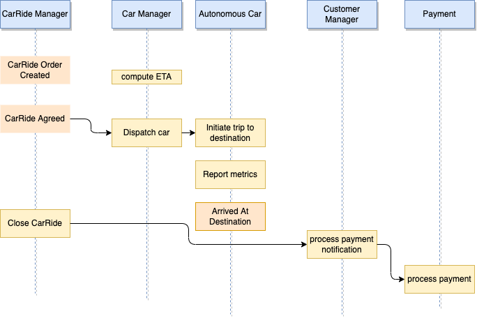
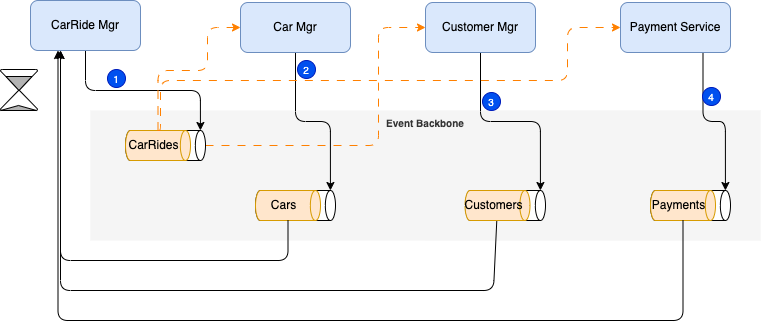
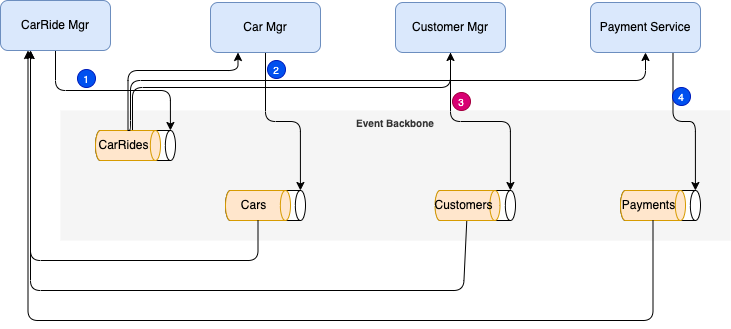
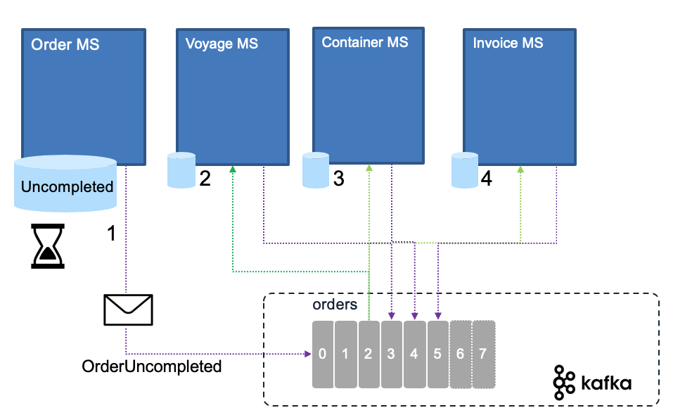

# Saga: long running transaction for distributed systems

## Problems and Constraints

With the adoption of one data source per microservice, there is an interesting challenge on how to support long running transaction cross microservices, which are per nature, distributed. With event backbone technology two-phase commit is not an option.

## Solution and Pattern

Introduced in 1987 [by Hector Garcaa-Molrna Kenneth Salem paper](https://www.cs.cornell.edu/andru/cs711/2002fa/reading/sagas.pdf) the Saga pattern helps to support a long running transaction that can be broken up to a collection of sub transactions that can be interleaved any way with other transactions.

With microservice each transaction updates data within a single service, each subsequent steps may be triggered by previous completion. The following figure illustrates the happy path for a CarRide order transaction where each services are participant of the transaction:

{ width=800 }

When the car ride order is created, the business process says, we need to compute an ETA for arrival at destination, when the closest autonomous car may arrive at pickup location, allocate a "autonomous car". The process continue when the traveler(s) reaches destination, where payment is initiated, car goes back to the pool and ride raiting is initiated. 

Those actions / commands are chained. The final state (in this schema, not in the reality, as the process may have more steps) is the CarRide is in completed state in the CarRide Manager microservice.

With a monolytic application, the consistency integrity between CarRide, Car, Customer and Payment tables will be done via transactions. But with distributed systems we could not easily apply strong two-phase commit transaction, but the Saga pattern  helps to keep context to the conversation and be able to compensate in case of failure.

SAGA pattern supports two types of implementation: Choreography and Orchestration.

## Services choreography

With Choreography each service produces and listens to other service’s events and decides, from the event content, if an action should be taken or not. As we talked about events, we will use an event bus to asynchronously exchange messages between the distributed components:

The first service executes a transaction to its own data store and then publishes an event ( CarRideOrderCreated event (1)) as a fact about its business entity update. 
It maintains the business entity status, (CarRide.status) to the `Pending` state until the saga is completed. This event is listened by one or more services which execute local transactions and publish new events (CarDispatched (2), CustomerNotified (3), PaymentProcessed (4)).
The distributed transaction ends when the last service executes its local transaction and publish a confirmation event. The main entity interested by the Saga manages its state accordingly. Here the CarRide is this entity.  When one of the service does not publish any event within an expected time, or publish a negative state (PaymentNotCompleted) the Saga should trigger a compensation. 

In case of failure, the source microservice is keeping state and timer to monitor for the expected completion events. Supposes the customer never acts when he/she receives the notification of payment, the car dispatching is already done so it is not idempotent, a compensation logic may be to route the transaction to a call center so they can reach by sms and phone call the customer. May be the contract stipulates that there will be a charge done anyway as credit card information exist. Now if the failure comes from the payment processing, again a specific compensation process will trigger to get the payment completed. 

When a message from any service is missing, the source service, needs to trigger a compensation process:

Rolling back a distributed transaction does not come for free. Normally you have to implement another operation/transaction to compensate for what has been done before. This will be a new event sent by the service responsible of the transaction integrity. In the CarRide example, in the rare case where one of the service is not able to provide a positive response, then the CarRide needs to change to 'Uncompleted' status, and an event to the CarRides topic will claim the orderID is now uncompleted (OrderUncompleted event Step 1 above). 
Another classical business flow is the order, payment and fullfilment flow, where failure to pay impact fullfilment step. 
Any service that has something allocated for this orderId will 'unroll' their changes in their own data source (Steps 2,3,4 above).

Also it is important to note, that if one of the service is taking time to answer this may not be a problem as the CarRideOrder is in pending state. If the business requirement stipulates to address an order within a small time period then the compensation process may start. Uncompleted orders can be reviewed by a business user for manual handling. Email can be automatically sent to the customer about issue related to his order. There are a lot of different ways to handle order issue at the business level.

## Services orchestration

With orchestration, one service is responsible to drive each participant on what to do and when. This orchestration can be done with different tools and protocols. Workflow engine with synchronous call is a classical implementation in the SOA world. With EDA we do not want to loose any message as part of this orchestration, the technology of choice, to support stronger consistency and exactly once delivery, is to use queueing system with persistence, as illustrated by the following figure:

An example of Saga implementation using MQ is described in [this repository](https://github.com/ibm-cloud-architecture/eda-kc-gitops) and the orchestration implemenation with MQ is in the [eda-kc-order-cmd-mq repo](https://github.com/ibm-cloud-architecture/eda-kc-order-cmd-mq).

An alternate approach is to use [Kafka with producer](https://ibm-cloud-architecture.github.io/eda-saga-orchestration/) using full acknowledge, idempotence, and a batch size of 1, and different topics
mostly configured as queue: one consumer in each consumer group, manual commit, poll one message at a time.

It uses the different topics to control the saga by issuing event commands to the different service. It uses the event backbone as a queue processing to 
support the asynchronous invocations. In this case the event should be exactly once delivered and idempotent. Each participant produces response in their 
context and to the order topic. The orchestration layer needs to keep a state machine and acts once all the expected responses are received.

If anything fails, the orchestrator is also responsible for coordinating the compensation process by sending rollback events with orderID and their respective impacted entity key (voyageID, reeferID, transactionID). Each  participant will undo its previous operations.
Orchestrator is a State Machine where each transformation corresponds to a command or message.

See also [this article](https://microservices.io/patterns/data/saga.html) from Chris Richardson on the Saga pattern.

## Repositories to demonstrate the Saga patterns

