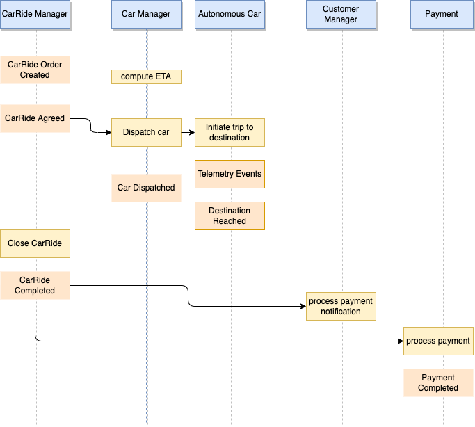
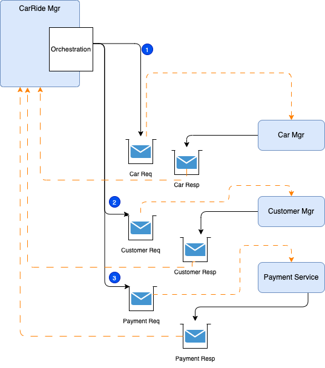

# Saga: long running transaction for distributed systems

## Problems and Constraints

With the adoption of one data source per microservice, there is an interesting challenge on how to support long running transaction cross microservices, which are per nature, distributed. With event backbone technology two-phase commit is not an option.

## Solution and Pattern

Introduced in 1987 [by Hector Garcaa-Molrna Kenneth Salem paper](https://www.cs.cornell.edu/andru/cs711/2002fa/reading/sagas.pdf) the Saga pattern helps to support a long running transaction that can be broken up to a collection of sub transactions that can be interleaved any way with other transactions.

With microservice each transaction updates data within a single service, each subsequent steps may be triggered by previous completion. The following figure illustrates the happy path for a CarRide order transaction where each services are participant of the transaction:

{ width=800 }

When the car ride order is created, the business process says, we need to compute an ETA for arrival at destination. ETA is computed by looking at the closest autonomous car from the pickup location. We suppose the customer accept the ETA notification, and `CarManager` allocates one "autonomous car". The process continues when the traveler(s) reaches destination,the CarRideManager complete the `CarRide`, and the event is processed by the PaymentService to  initiated the payment, the car goes back to the pool and ride rating is initiated (not illustrated in the flow). 

Those actions / commands are chained. The final state (in this schema, not in the reality, as the process may have more steps) is the `CarRide` is in completed state in the `CarRide` Manager microservice.

With a monolytic application, the consistency integrity between CarRide, Car, Customer and Payment tables will be done via transactions. But with distributed systems we could not easily apply strong two-phase commit transactions, this is where the Saga pattern helps to keep context to the conversation and be able to compensate in case of failure.

SAGA pattern supports two types of implementation: Choreography and Orchestration.

## Services choreography

With Choreography each service produces and listens to other service’s events and decides, from the event content, if an action should be taken or not. As we talked about events, we will use an event bus to asynchronously exchange messages between the distributed components. From the previous example we do not need the autonomous car events as they most likely being aggregated by the CarManager service:

The traveler is using a mobile application, and defines where he wants the pickup, at what time, and for which destination. In the diagram above events are in orange, commands are in yellow.

The first service, `CarRideManager`, executes a transaction to its own data store and then publishes an event ( `CarRideOrderCreated` event (1)) as a fact about its business entity (CarRide) update. 
It maintains the business entity status, (CarRide.status) to the `Pending` state until the saga is completed. This event is listened by one or more services which execute local transaction and publish new events (CarDispatched (2), CarInMotion, CustomerNotified (3), PaymentProcessed (4)).

The distributed transaction ends when the last service executes its local transaction and publishes a confirmation event. The main entity interested by the Saga manages its state accordingly. Here the CarRide is this entity.  When one of the service does not publish any event within an expected time, or publish a negative state (PaymentNotCompleted, CarNoMoreDispatched) the Saga should trigger a compensation. 

In case of failure, the source microservice is keeping state and timer to monitor for the expected completion events. Supposes the customer never acts when he/she receives the notification for payment, the car dispatching is already done so it is not idempotent, a compensation logic may be to route the transaction to a call center so they can reach by sms and phone call the customer. May be the contract stipulates that there will be a charge done anyway as credit card information exists on the account. Now if the failure comes from the payment processing, again a specific compensation process will trigger to get the payment completed. 

In the diagram above we suppose When a message from any service is missing, the source service, needs to trigger a compensation process:

Rolling back a distributed transaction does not come for free. Normally you have to implement another operation/transaction to compensate for what has been done before. This will be a new event sent by the service responsible of the transaction integrity. In the CarRide example, in the rare case where one of the service is not able to provide a positive response, then the CarRide needs to change to 'Uncompleted' status, and an event to the CarRides topic will claim the orderID is now uncompleted (OrderUncompleted event Step 1 above). 
Another classical business flow is the order, payment and fullfilment flow, where failure to pay impact fullfilment step. 
Any service that has something allocated for this orderId will 'unroll' their changes in their own data source (Steps 2,3,4 above).

Also it is important to note, that if one of the service is taking time to answer this may not be a problem as the CarRideOrder is in pending state. If the business requirement stipulates to address an order within a small time period then the compensation process may start. Uncompleted orders can be reviewed by a business user for manual handling. Email can be automatically sent to the customer about issue related to his order. There are a lot of different ways to handle order issue at the business level.

## Services orchestration

With orchestration, one service is responsible to drive each participant on what to do and when. This orchestration can be done with different tools and protocols. Workflow engine with synchronous calls, is a classical implementation in the SOA world. There are library supporting long running transaction like the Java  
With EDA, we do not want to loose any message as part of this orchestration, the technology of choice, to support stronger consistency and exactly once delivery, is to use queueing system with persistence, as illustrated by the following figure:

The pattern uses the req/res queues for each service participating into the Saga. The message may be typed and structured to map different commands. 

For that purpose we are no more in the Event world, but more on the commands supported by asynchronous messaging system.

In the Kafka world, we can use topic configuration to represent the queue semantic: Kafka producer uses full acknowledge to be sure no message lost, idempotency to avoid duplicate at the broker level, and a batch size of 1. For the topic configuration, use one partition, one consumer in each consumer group, manual commit, poll one message at a time. The pattern implementation uses the different topics to control the Saga by issuing command messages to the different service. It uses the event backbone as a queue processing to support the asynchronous invocations. Each participant produces response in their context and to the order topic. The orchestration layer needs to keep a state machine and acts once all the expected responses are received.

If anything fails, the orchestrator is also responsible for coordinating the compensation process by sending rollback events with orderID and their respective impacted entity key. Each  participant will undo its previous operations.
Orchestrator is a State Machine where each transformation corresponds to a command or message.

See also [this article](https://microservices.io/patterns/data/saga.html) from Chris Richardson on the Saga pattern.

## Repositories to demonstrate the Saga patterns

* [Saga choerography implementation with Kafka](https://github.com/jbcodeforce/saga-choreography-kafka)
* [Saga orchestration on top of queueing]()