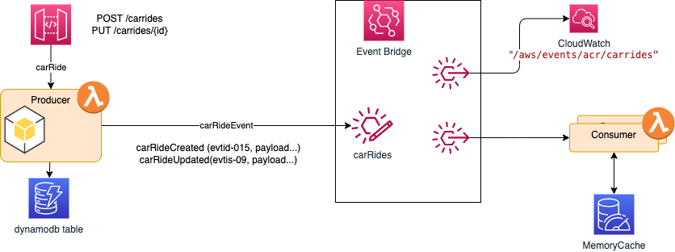

# Handle duplicate delivery with AWS EventBridge

**Problem statement**: how to handle duplicate records when using AWS EventBridge as event backbone?. 

This is a common problem in many messaging systems, where producer retries can generates the same message multiple times or consumer retries on the subscribed topic, may generate duplicate processing of the received message. 

Producer retries because it did not received an acknowledge message from the receiver (which in our case is EventBridge), may be due to network failure.   

The following diagram presents the potential problem. The left lambda function exposes an API to create "CarRide" entity and then to send message to Event Bus that the CarRide was created. The same applies if the CarRide is updated, like for example, the customer accepts the proposed deal so a autonomous car can be dispatched:

{ width=900}

EventBridge is not a technology where the broker supports a protocol to avoid duplication, like Kafka does with the idempotence configuration for producer. So producer may generate duplicates. As we will see in producer section below, we can add event id specific to the application to trace duplicate records end to end (we use idempotencyID which has no business meaning, in real life it may be relevant to do a combined key with busines transaction ID). If the producer timeout after not receiving the acknowledge, it will send the message again. If the returned answer from EventBridge includes errors, the only things that can be done in producer code is to send messages not processed by the Event Bus to a Dead Letter Queue. 

As duplicates will exist, we need to have consumers supporting idempotency. As Woolf and Hohpe wrote in their "Enterprise Integration Patterns book" , supporting **idempotency** is to be able to process a message with the same effect, whether it is received once or multiple times.

Also remember that in a pure EDA point of view, consumer can be added, as subscribers, over time to address new use cases. Producers should not be aware of those consumers, they just publish events as their internal business entity state changes. 

Amazon [EventBridge](https://docs.aws.amazon.com/eventbridge/latest/userguid) has the following important characteristics that we can leverage to address de-duplication:

* Routing rules to filter or fan-out to a limited set of targets.
* Message Persistence with possible replays.
* Event replications to event bus in another region.
* Pipes to do point to point integration between source and destination.

## Focus on producer processing

Producer to EventBridge may generate duplicate messages while retrying to send a message because of communication issue or not receiving an acknowledgement response. The producer code needs to take into account connection failure, and manage retries.

The SDK for EventBridge includes a method called [put_events](https://docs.aws.amazon.com/eventbridge/latest/APIReference/API_PutEvents.html) to send 1 to 10 events to a given Event Bus URL. Each record sent includes an envelop with the following structure:

```json
"Entries": [
    { 
    "Source": "reference of the producer",
    "Resources": "aws ARN of the producer app"
    "DetailType": "CarRideEventType",
    "Time": datetime.today().strftime('%Y-%m-%d'),
    "Detail": data,
    "EventBusName": targetBus
    }
]
```

The message is, in fact, including more parameters as a set of [common parameters](https://docs.aws.amazon.com/eventbridge/latest/APIReference/CommonParameters.html) are defined for each different EventBridge API mostly for versioning and security token. 

A EventBridge's response Entries array can include both successful and unsuccessful entries.

The returned response includes an event `Id` (created by EventBridge) for each entry sent processed successfully, or an error object with code and message: 

```json
[
    { 
         "ErrorCode": "string",
         "ErrorMessage": "string",
    },
    {  "EventId": "string" }
]
```

As for each record, the index of the response element is the same as the index in the Entries array, it is then possible to identify the message in error and to resend it or to move it to a Dead Letter Queue. 

There are some errors reported that are due to the EventBridge service, like a `ThrottlingException` or `InternalFailure` that may be retried. Other errors should never be retried but message sent to a DLD queue or saved in a temporary storage for future processing. 

To better support an EDA approach, we need to assign a unique idempotency identifier to each message, with a sequencer and track the processed messages using this identifier and the current count. We should not leverage the eventID created by the event bus, as it is local to this bus, and we may need to go over other components or even another event bus in another region. Also this eventId is not idempotent.

Here is an example of payload creation in python, with the idempotencyId (the one from the producer point of view and not the EventBridge created one) as part of the `attributes` element (the metadata part of [CloudEvents.io](https://cloudevents.io)): 

```python
def defineCloudEvent(data):
    attributes = {
        "type": "acme.acr.CarRiderCreatedEvent",
        "source": "acr.com.car-ride-simulator",
        "idempotencyId": str(uuid.uuid1()),
        "eventTime": datetime.today().strftime('%Y-%m-%d %H:%M:%S.%f'),
        "eventCount": 1
    }
    cloudEventToSend = { "attributes": attributes, "data": data}
    entries = [
                { "Source": attributes["source"],
                "DetailType": "CarRideEvent",
                "Time": datetime.today().strftime('%Y-%m-%d'),
                "Detail": json.dumps(cloudEventToSend),
                "EventBusName": targetBus,
                "TraceHeader": "carRideProcessing"
                },
            ]
    return entries

```

This approach supports the event replication used when deploying in two regions, and uses EventBridge Global Endpoint capability:


If a failover is triggered by Route 53 health check error on the primary event bus, then messages are sent to secondary region, and duplicates can be managed the same way as in a mono-region. Except if dynamoDB is not accessible by itself from the first region. In this case Global Table may be used. 

For EventBridge configuration here is an example of producer configuration in a SAM template:

```yaml
Resources:
  CarRideEventBus:
    Type: AWS::Events::EventBus
    Properties:
      Name: !Ref EventBusName
 CarRideSimulatorFunction:
    Type: AWS::Serverless::Function 
    Properties:
      Environment:
        Variables:
          EventBus: !Ref EventBusName 
    Policies:
      - Statement:
        - Sid: SendEvents
          Effect: Allow
          Action:
          - events:PutEvents
          Resource:
            - !GetAtt CarRideEventBus.Arn
```

## The Consumer part

Only the consumer of the message can identify duplicate records. If the consumer is not using an idempotent backend for persistence, then it needs to track the messages that it has processed in order to detect and discard duplicates. 

We assume the consumer is looking at the events, from another bounded context, and it is interested to subscribe to the event bus to support its own joining queries or to participate in a long-running transaction. 

Below is the SAM template illustrating to the CarRides EventBus rule to push to a lambda consumer, using a DLQ in case of issue.

```yaml
CarRidesToConsumerRule:
    Type: AWS::Events::Rule
    Properties:
      Description: "EventRule to move CarRides transactions to Lambda Consumer"
      EventBusName: !Ref CarRideEventBus
      EventPattern:
        source:
          - acr.com.car-ride-simulator
        detail-type:
          - CarRideEvent 
      State: "ENABLED"
      Targets:
        - Arn: !GetAtt CarRidesConsumerFunction.Arn
          Id: "CarRidesLambdaConsumer"
          DeadLetterConfig:
            Arn:  !GetAtt CarRidesDLQQueue.Arn
```

### DynamoDB backend

If the consumer uses DynamoDB as persistence layer then it can use the [updateItem](https://docs.aws.amazon.com/amazondynamodb/latest/APIReference/API_UpdateItem.html) API to edit the existing event's attributes, or use the [get_items](https://docs.aws.amazon.com/amazondynamodb/latest/APIReference/API_GetItem.html) to validate presence of the event and then adds a new event to the table if the event does not already exist. 

{ width=600 }

The approach is to declare a table using the idempotencyId as a key:

```yaml
  CarRideEventsTable:
    Type: AWS::Serverless::SimpleTable
    Properties:
      TableName: !Ref TableName
      PrimaryKey: 
        Name: idempotencyId
        Type: String
```

The code then uses something like the following snippet, doing nothing in case of exception

```python
  existingEvent = None
  try:
      response = eventsProcessed.get_item(Key= {"idempotencyId": idempotencyId})
      existingEvent = response["Item"]
  except ClientError as err:
      logger.info("Could not find events %s",idempotencyId)
    
  if existingEvent is None:
      # call process the new event only if there is no duplicate
      processEvent(event)
      eventsProcessed.put_item(
          Item={
              "idempotencyId" : idempotencyId,
              "payload": payload
          })
```

The DynamoDB configuration is mono-region multi AZ for high availability. 

### Demonstrate with a simulator

The [code repository](https://gitlab.aws.dev/boyerje/autonomous-car-solution/-/tree/main/CarRideSimulator), supports the following deployment and instructions to deploy it using [AWS Serverless Application Management]()


Here is an example of record persisted in the DynamoDB CarRideEvents table, illustrating that `eventCount` is always 1.


### Single application instance:

The simplest in memory solution uses  a simple HashMap as cache. It may work for an application running continuously, with a single instance. The basic code may look like: 

```python

def lambda_handler(event, context):
    idempotencyId = event["detail"]["attributes"]["idempotencyId"]
    payload = event["detail"]
    existingEvent = eventsProcessed.get(idempotencyId)
    if existingEvent is None:
        processEvent(event)
        eventsProcessed[idempotencyId] = payload
    else:
        logger.info("%s most likely duplicate ", idempotencyId)
        logger.info(event)
```

[See the code here.](https://gitlab.aws.dev/boyerje/autonomous-car-solution/-/blob/main/CarRideSimulator/consumers/app.py) and how to run it. 

### Using Caching with Redis

When we define multiple concurrent instances of the application, like lambda function, we need to use a distributed, clustered data cache like AWS MemoryDB for Redis.

At the consumer side before processing a new message, the code checks if the `idempotencyId` already exists in the cache. If it does, consider it a duplicate and discard it. 

```python

```


The problem is how to evict older events from the cache. A scheduled processing may be used to remove any messages older than to current timestamp - n minutes. The n can be computed by assessing the risk to get a duplicate messages within this time window, and any resource constraints like memory usage.


--- 

## Alternates

Another may be more elegant implementation is to use the outbox pattern, and write the events to a table in DynamoDB, do change data capture on this outbox table, using DynamoDB Streams, use EventBridge pipe to process the streaming data and the send to targets, which could be a SNS.

{ width=1000 }

Other considerations:

Message Time-To-Live (TTL): Set a Time-To-Live (TTL) value for messages in the queue. If a message remains in the queue beyond its TTL, consider it expired and discard it. This helps prevent the processing of stale or duplicate messages that might have been delayed or requeued due to failures.