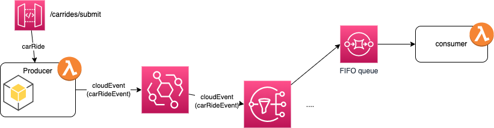

# Handle duplicate delivery with AWS EventBridge

The problem we are trying to demonstrate is how to handle duplicate records?. 

This is a common pattern in any messaging system, where producer or consumer retries can generate the same message multiple times.

The following diagram presents the potential problem:


Producer to EventBridge may generate duplicate messages while retrying to send a message because of communication issue or not receiving acknowledgement response. The producer code needs to take into account connection failure, and manage retries.

The SDK for EventBridge includes a method called [put_events](https://docs.aws.amazon.com/eventbridge/latest/APIReference/API_PutEvents.html) to send 1 to many events to a given EventBus URL. The records sent are encapsulated with an envelop with, at the high level, has the following structure:

```json
{ "Source": "reference of the producer",
  "Resources": "aws ARN"
  "DetailType": "CarRideEventType",
  "Time": datetime.today().strftime('%Y-%m-%d'),
  "Detail": data,
  "EventBusName": targetBus
}
```

The returned response includes the event Id for each entry sent, so it may be possible that some of the event failed processing, and in this case there will be an error code.

Only the consumer of the message can identify duplicate record. EventBridge is not a technology where the broker support a protocol to avoid duplication, as Kafka does. 

So with EventBridge we need to assign a unique identifier to each message, and a counter and track the processed messages using this identifier and the current count. 

Here is an example of payload creation in python:

```python
def defineEvent(data):
    attributes = {
        "type": "acme.acr.CarRiderCreatedEvent",
        "source": "acr.com.car-ride-simulator",
        "eventId": str(uuid.uuid1()),
        "eventTime": datetime.today().strftime('%Y-%m-%d %H:%M:%S.%f'),
        "eventCount": 1
    }
    eventToSend = { "attributes": attributes, "data": data}
    print(eventToSend)
    entries = [
                { "Source": attributes["source"],
                "DetailType": "CarRideEvent",
                "Time": datetime.today().strftime('%Y-%m-%d'),
                "Detail": json.dumps(eventToSend),
                "EventBusName": targetBus,
                "TraceHeader": "carRideProcessing"
                },
            ]
    return entries

```

At the consumer side before processing a new message, check if its identifier already exists in the system. If it does, consider it a duplicate and discard it. Consider the attributes:

```json
    "source": "acr.com.car-ride-simulator",
    "eventId": str(uuid.uuid1()),
    "eventCount": 1
```

We can use a time window horizon to keep the last n seconds messages to limit the search. 

This is important when the semantic of the event is about creating data. If the producer generates a OrderCreated event, then de-duplication may be important. As an alternate processing is to support idempotency: in dual CreatedEvent, if the count > 1 then and the record with the same identifier is already in the backend, discard any new record, but if the message is UpdateEvent then update existing record (like a database will do).


The implementation of this solution leverages, [CloudEvents](https://cloudevents.io), a well not established event structure to share metadata among technology agnostic component. 

A EventBridge'sresponse Entries array can include both successful and unsuccessful entries. As for each record, the index of the response element is the same as the index in the request array, it is possible to identify the message in error. 

There are some error due to the EventBridge service, like a ThrottlingException or InternalFailure that may be retried. Some should never be retried but sent to a DLD queue or saved in a temporary storage for future automatic processing or for manual processing. 

Example of code to handle errors:

```
git clone https://github.com/aws-samples/serverless-patterns/ 
cd serverless-patterns/lambda-eventbridge-sns-sam
```

To simplest minimum demonstration the solution, we may use the following components:

{ width=1000 }

A producer is exposing and API to support POST on CarRides resources to request for a new car ride. The application persists the data in a backend like DynamoDB and sends an event like `CarRideCreated` or `CarRideUpdated` event to an customer event bus for downstream distribution. In EDA the very important element is the fact that an event can be valuable to any consumer, so adding a SNS Topic to implement a fan-out distribution will make sense.
Finally ordering of events is very important to build an accurate view of the data, so the consumer should be getting messages from a Fifo Queue to keep order.


Another may be more elegant implementation is to use the outbox pattern, and write the events to a table in DynamoDB, do change data capture on this outbox table, using DynamoDB Streams, use EventBridge pipe to process the streaming data and the send to targets, which could be a SNS.

{ width=1000 }

Other considerations:

Message Time-To-Live (TTL): Set a Time-To-Live (TTL) value for messages in the queue. If a message remains in the queue beyond its TTL, consider it expired and discard it. This helps prevent the processing of stale or duplicate messages that might have been delayed or requeued due to failures.