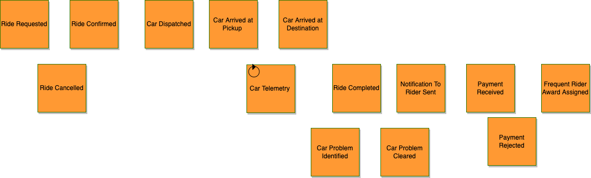
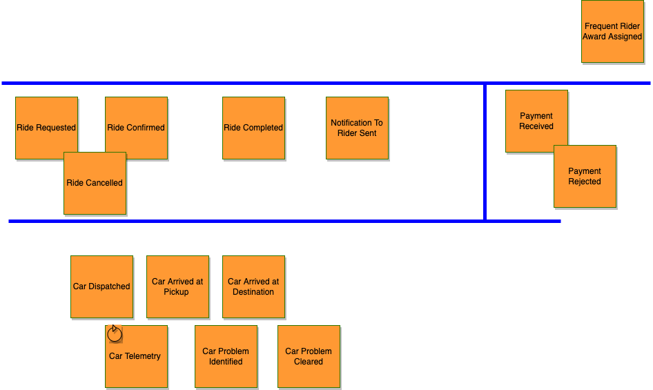
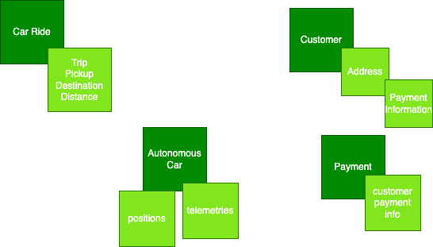
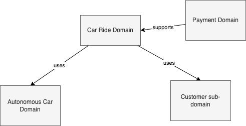
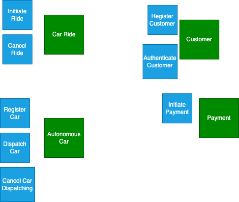
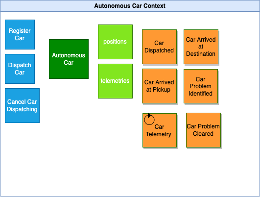

# A event-driven sample solution around autonomous car ride

??? info "Updated"
    06/09/2023

The customer wants to go from one address or geographic location to another one, within a big city, using the Acme Autonomous Car Ride mobile app.

The high-level component architecture may look like in the following figure:

{ width=800 }

This architecture is interesting, it embraces microservices architecture, mostly synchronous HTTP based traffic. 

## Requirements

* Demonstrate an end to end solution with Domain Driven Design elements, focusing on an Event-Driven Architecture implementation (top down with techno mapping)
* Handle duplicate delivery from AWS EventBridge
* A Command Query Responsibiltiy Segregation example
* An event-driven Saga chorerography
* A multi clusters deployment for AWS EventBridge with independant governance.

### Handle duplicate delivery with AWS EventBridge

## Domain-driven design applied

### Event Storming

We will mock an event storming exercise which generates the following elements:

* Discovered Events from a process point of view. Mostly happy path

    

* Event Reorganized by concerns: Rides, Autonomous Car, Payment, Award

    

### DDD

* Aggregates: represent the main business entity within the domain and sub-domain

    

* Domain/Sub-domains

    

* Commands

    

* Bounded Contexts 

    * Autonomous Car

    

    * Ride Context

    

## Component description

From the Domain-driven design bounded context we can build a set of microservices. 

* The **traveller** user is using a mobile app, connected to the classical **Backend For Frontend** service, which exposes RESTful API, with may be also a websocket connection to push notifications back to the mobile app to support traffic from backend to user.
* The major component is the **Car Ride manager** service which exposes API for the user to initiate a ride to go from a geolocation A to geolocation B, and may be an API for historical rides query.
* The **address finder**, geolocation mapper, is an utility service to map address to geo-location and any other metadata to facilitate the search for the optimal itinerary and nearest available car. It is a very important service, and may be complex to implement. It exposes HTTP APIs and must respond in sub millisecond.
* The Car Ride service needs to integrate with other services, like the Payment service once the ride is terminated, and car dispatcher to get an autonomous car.
* A car dispatcher needs to find the closest car to support the pickup within the shortest time. The computation may take sometime, but the response to the end user will be something like: "your car will arrive in 3 minutes and the target arrival time will be 15 minutes, do you want to proceed?". Once commited the car will move to pickup address and sends car telemetries. 
* The metrics are processed by the route monitoring service, which computes ETA, and other interesting real-time, time-windowing logic.
* When the travel is completed, the payment service needs to trigger the payment and the reward program service may update the number of travel, and may be also rate the consumer. As there is no driver, there is no more driver rating. 