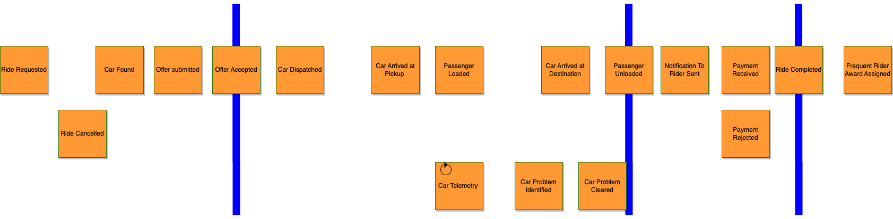
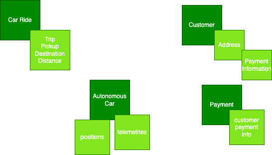
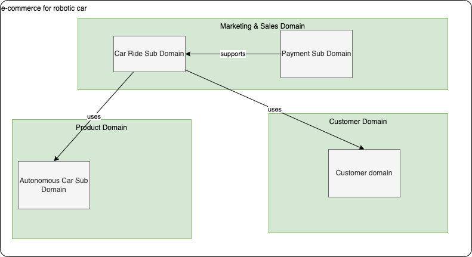
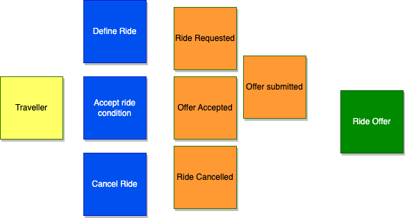
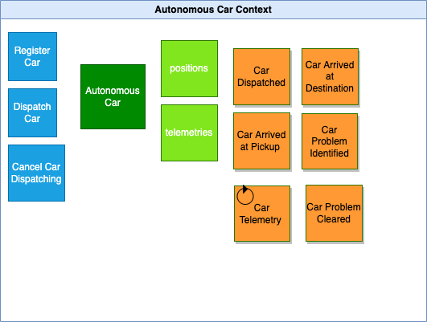
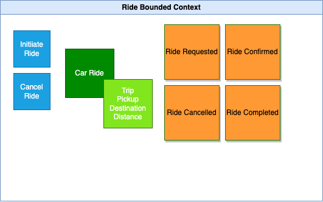
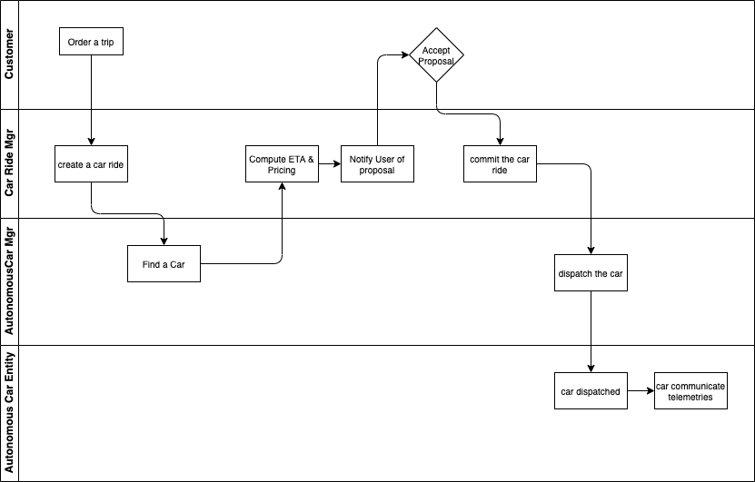
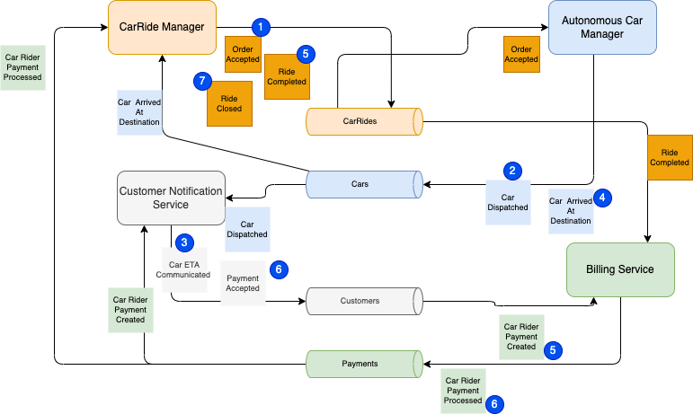
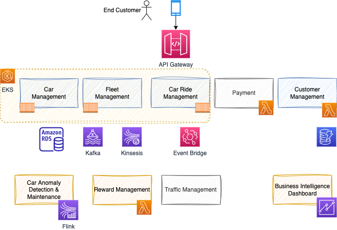
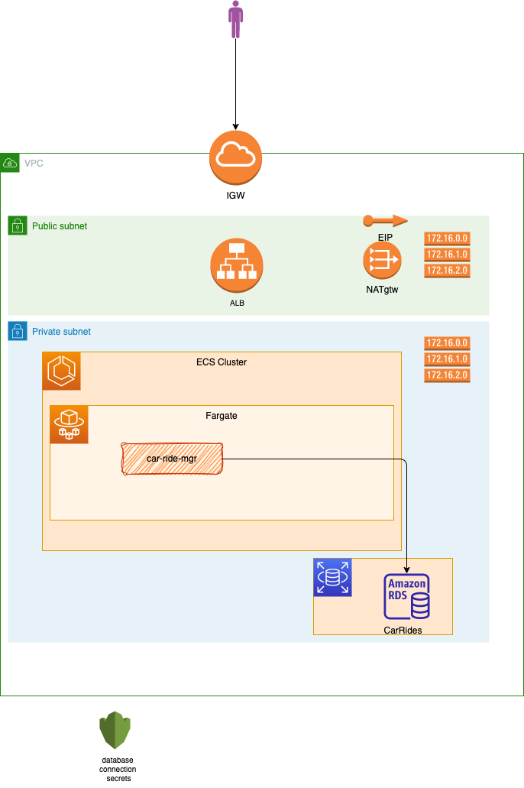

# A event-driven sample solution around autonomous car ride

???+ info "Updated"
    Created 07/06/2023 - Updated 12/05/23

This article illustrates how to apply domain-driven design, and event storming to implement and event-driven solution to deploy on AWS services. It is a source for demonstrating different EDA patterns like SAGA, CQRS, event sourcing in a Serverless deployment.

## Context

The customer wants to go from one address or geographic location to another one, within a big city, using the Acme Autonomous Car Ride mobile app. The cars are autonomous cars with no pilot.

The application context looks like in the following diagram:

{ width=800 }

Travellers use mobile application to book a ride between two locations within the same city, the Car Ride Solution dispatches an autonomous vehicle, uses traffic report to compute ETA and pricing. The application is also monitoring existing rides via car telemetries. The Marketing analysis is an example of external system interrested by the solution generated data. 

## Requirements

* Demonstrate an end-to-end solution with Domain Driven Design elements, focusing on an Event-Driven Architecture implementation (top down with techno mapping)
* Handle duplicate delivery from AWS EventBridge. [See proposed solution](./es-duplicate-evt.md).
* A Command Query Responsibility Segregation example
* An event-driven Saga chorerography
* A multi clusters deployment for AWS EventBridge with independant governance.

### Handle duplicate delivery with AWS EventBridge

[See proposed solution in different note.](./es-duplicate-evt.md)

### Command Query Responsibility Segregation 

CQRS is used in a lot of distributed solution, to be able to scale the read model. DynamoDB is supporting CQRS with read replicas. For more details see the [CQRS pattern explanation](../../patterns/cqrs/index.md).

### Saga pattern

The classical implementation of Saga is to use an orchestrator to manage the state of the Saga and being able to rollback the transaction with compensation API. For more details see the [Saga pattern explanation](../../patterns/saga/index.md).

An alternate is to use Choroegraphy. 

## Domain-driven design applied

### Event Storming

We will mock an event storming exercise which generates the following elements:

* Discovered Events from a process point of view. Mostly happy path

    { width=1000 }

* Event Reorganized by concerns: Rides, Autonomous Car, Payment, Award

    { width=1000 }

### Domain-Driven Design Elements

* Aggregates: represent the main business entity within the domain and sub-domain

    { width=800 }

* Domain/Sub-domains

    { width=800 }

* Commands

    { width=800 }

    { width=800 }

* **Bounded Contexts:**

    * Autonomous Car bounded context:

    { width=800 }

    * Car Ride bounded context:

    { width=800 }

    * Customer and payment bounded contexts are not represented as we will mock them up.

* Business service map

    

## Component description

From the Domain-driven design bounded contexts, we may derive a set of microservices as illustrated in the following figure:

{ width=800 }

This architecture is interesting, it embraces microservices architecture, mostly synchronous HTTP based traffic. 

* The **traveller** user is using a mobile app, connected to the classical **Backend For Frontend** service, which exposes RESTful API, with may be also a websocket connection to push notifications back to the mobile app to support traffic from backend to user.
* The major component is the **Car Ride manager** service which exposes API for the user to initiate a ride to go from a geolocation A to geolocation B, and may be an API for historical rides query.
* The **address finder**, geolocation mapper, is an utility service to map address to geo-location and any other metadata to facilitate the search for the optimal itinerary and nearest available car. It is a very important service, and may be complex to implement. It exposes HTTP APIs and must respond in sub millisecond.
* The **Car Ride** service needs to integrate with other services, like the **Payment** service once the ride is terminated, and the **Car dispatcher** to get an autonomous car.
* A **car dispatcher** needs to find the closest car to support the pickup within the shortest time. The computation may take sometime, but the response to the end user will be something like: "your car will arrive in 3 minutes and the target arrival time will be 15 minutes, do you want to proceed?". Once commited the car will move to pickup address and sends car telemetries. 
* The metrics are processed by the **route monitoring** service, which computes ETA, and other interesting real-time, time-windowing logic.
* When the travel is completed, the **payment** service needs to trigger the payment and the reward program service may update the number of travel, and may be also rate the consumer. As there is no driver, there is no more driver rating. 

## Adopting an event-driven approach to the implementation

The fact that we discovered event during the DDD phase does not mean we adopt EDA. Other non functional requirements need to be considered, like scalability, contract decoupling, reactive system needs, streaming data, complex event processing to integrate derived business events inside the business process. As introduced in the SOA to EDA section, a business process model can be used to understand the flow of commands / data and events. 

Let revisit the business process flow in more detail using the commands, aggregates and events we discovered during DDD: 

{ width=1000 }

Commands are visible as APIs for each task in the flow: CarRideManager swimlane will have at least one service responsible to manage the CarRide, and the activities in the process flow will be exposed as APIs (`createCarRide`, `updateCarRide`). 

Now by looking at this same swin lane, we may want to clearly separate the computation of next available car, and the estimated  time of arrival to a service which manage car information: a CarManager service. The same notifying a customer, may be in a CustomerManager. 

So swim lane to service mapping may be a wrong way  to think about decomposition into service. This is why bounded context is a better approach to discover microservices. 

Now the communication between those services could be synchronous, HTTP based, and using RESTful architecture... or asynchronous using one or more messaging systems. Between the mobile and the API to create a CarRideOrder, we could design it, with RESTful API, stateless. Now once the CarRideOrder is persisted to find an autonomous car could be make asynchronously with event propagation. A subdecomposition by applying clear separation of concern could lead to the following components:

* The CarRideManagerService uses a Database to persist the CarRide business entity, and generates an event CarRideCreated

* The event can be sent to a queue for exactly once processing, and ordered as we do not want to see an `CarRideUpdated` event before a `CarRideCreated` event for the same `CarRideEntity`. 
* The search for an autonomous car and the computation of the ETA and pricing could be done in the `CarDispatching` service. The command is not exposed as an API but triggered by the consumption of the `CarRidCreated` Event. This is a EDA approach with choreography. The following figure 

{ width=800}

## Physical Deployment

### CarRideManager

The component is a Java Quarkus Application running as container inside a ECS cluster with Fargate runtime. The following figure illustrates the main components defined in the [cdk definition]().

The RDS Postgresql database is in the private subnet. Database admin user is created in AWS Secret Manager.