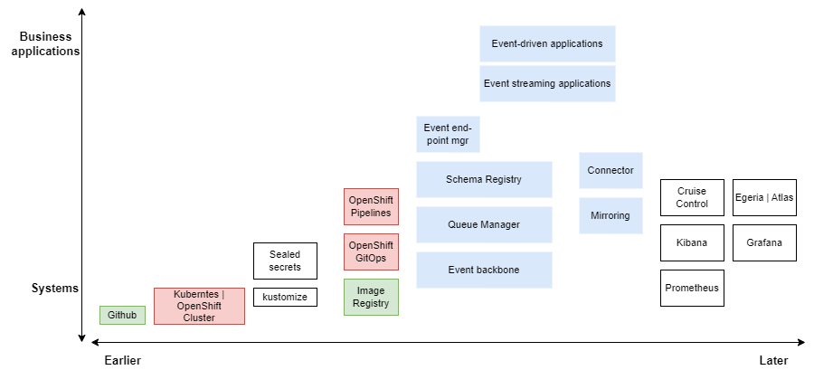

# Kafka and Event-Driven deployment with GitOps and Infrastructure as Code 

The goal of this chapter is to go over the deployment considerations for a cloud-native event-driven application using GitOps / Infrastructure as Code practices.

GitOps is a declarative way to implement continuous deployment for cloud-native applications.

## Context

We want to demonstrate the following components deployment: 


1. Kafka cluster
1. Schema registry
1. Topic definitions
1. Producer and Consumer Apps
1. Avro schema deployment

Which is an instantiation of the broader EDA blueprint as illustrated in the following diagram:


To better improve DevOps automation and the overall solution governance, **GitOps** and **Intrastructure as Code** practices should help deploying all those components as source code.

--- 

## Components for GitOps

The following diagram illustrates the technical components involved in a typical production deployment of an event-driven solution.

{ width="1000" }

The diagram organizes the components based on when they are introduced during system development (earlier or later) and whether they are high-level application-oriented components or low-level system-oriented components. For instance, GitHub is a system component that is fundamental to structuring the event-driven solution deployment. In contrast, streaming or event-driven applications are higher-level components that require other components to be deployed first.

The color coding indicates that blue components are part of the solution, red components are associated with GitOps on Kubernetes or RedHat OpenShift, and green components are external to the Kubernetes cluster, even if they could potentially be integrated. [Kustomize.io](https://kustomize.io/) represents a way to define deployments, while Sealed Secrets is a service for managing secrets.

Among the later components to deploy, we have included everything necessary to monitor both the solution and the infrastructure.

### Event-driven applications

Event-driven applications support business logic, are microservice-based, and utilize reactive messaging, MQ, or Kafka APIs. These applications provide OpenAPIs for mobile and web applications, as well as AsyncAPI specifications when producing events to Kafka or messages to MQ. OpenAPI and AsyncAPI definitions are managed by the API manager and the event endpoint manager.

Schema definitions are managed by a **Schema Registry**.

### Event-streaming applications

Event-streaming applications support stateful processing using [Kafka Stream](../../techno/kstreams/) APIs or [Apache Flink](https://jbcodeforce.github.io/flink-studies/).

### Kafka Cluster

When using Cloud provider, managed service for Kafka, the cluster can be defined using infrastructure as code. When deploying Kafka onto Kubernetes platform [Strimzi](https://strimzi.io/) defines customer resources with operator to declare any Kafka components as Yaml manifests. See the [Strimzi getting started](https://strimzi.io/quickstarts/) to install the Strimzi Operator on a local kubernetes. Once the operator is running it will watch for new custom resources and create the Kafka cluster, topics or users that correspond to those custom resources.

### Queue manager

A queue manager provides queuing services through various MQ APIs. It hosts the queues that store messages produced and consumed by connected applications and systems. Queue managers can be interconnected via network channels, enabling messages to flow between disparate systems and applications across different platforms, including both on-premises and cloud environments.


---

some note on labs. See deployment under eda-rt-inventory solution

```sh
kubectl get pod -n kafka --watch
kubectl logs deployment/strimzi-cluster-operator -n kafka -f
```