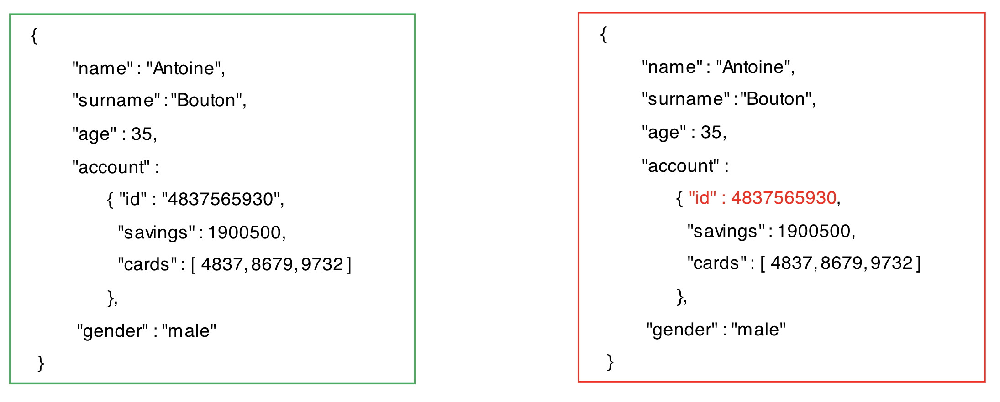

# Apache Avro, Data Schemas and Schema Registry

???+ Info "Updates"
    Created 01/2019  Last update 9/05/2024

This chapter describes what and why Avro and Schema registry are important elements of any event-driven solutions.

## Why this is important

Loosely coupling and asynchronous communication between applications does not negate the need for a contract that enforces certain constraints between producers and consumers.


When we refer to a contract, schemas often come to mind, similar to how we used XSD. In the context of JSON, both JSON Schema and Avro schemas can be employed to define the data structure of messages. Given the importance of metadata in messaging, [CloudEvents](https://cloudevents.io) has become widely accepted as a specification for describing event data. Additionally, [AsyncAPI](../../patterns/api-mgt/index.md#support-for-async-api) establishes standards for events and messaging within the asynchronous landscape from an API perspective. It integrates message schemas, channels, and binding definitions, providing consumers with the critical information needed to access a data stream or queue.

The contract is defined by a schema. From an event-driven architecture (EDA) design perspective, the producer is responsible for defining this schema, as it manages the life cycle of the main business entities from which business events are generated. The producer ensures that messages comply with the schema for serialization. While when using the command pattern, most likely with Queue, the consumer is the owner of the schema definition.

In addition to these specifications, various technologies support contract management, including schema registries and API managers. The following figure illustrates the foundations for integration between producers, schema registries, and consumers.


The Schema Registry provides producer and consumer APIs that enable them to determine whether the event they intend to produce or consume is compatible with previous versions or aligns with the expected version. For this process, both producers and consumers must access the schema definition during serialization and deserialization.

These can be done either by:

1. **Reading the schema** from a local resource in the producer application such as a file, variable, property, or a Kubernetes construct like a ConfigMap or Secret.
1. **Retrieving the schema** definition from the Schema Registry using a name or ID.

When a producer wants to send an event to a Kafka topic, two actions occur:

1. The producer checks that the event complies with the schema. If it does not, an error is raised.
1. The producer verifies whether the event is compatible with previous versions or aligns with the expected version.

For the first action, the producer has what it needs: the schema definition and the event that must comply with it, enabling the compliance check. For the second action, where the producer must ensure that the event's schema definition is compatible with any existing schema for the relevant topic (if one exists), it may need to consult the Schema Registry.

Producers (and consumers) maintain a local cache of schema definitions and their versions, along with unique global IDs, all retrieved from the Schema Registry for the topics they wish to produce or consume events from. If the producer has a schema definition in its local cache that matches the required schema for the event's serialization, it can send the event without issue.

However, if the producer does not have a matching schema definition in its local cache—either due to version differences or a lack of definition—it will contact the Schema Registry.

If a matching schema definition for the relevant topic exists in the Schema Registry, the producer can retrieve the global unique ID for that schema definition and locally cache both the schema and its ID for future events. This avoids the need to contact the Schema Registry again.

If no matching schema definition exists in the Schema Registry, the producer must register the schema definition it has for that topic. This ensures that the schema is available for any consumer wishing to consume events that comply with it.

To achieve this, the producer must be configured for auto-registration of schemas and provided with the appropriate credentials, especially if the Schema Registry implements role-based access control (RBAC).

If the producer is not configured for auto-registration or lacks the necessary credentials, the send event action will fail until a compatible schema definition for the relevant topic is registered in the Schema Registry.

If the producer is configured for auto-registration and has the required credentials, the Schema Registry will validate the compatibility of the current schema definition with any existing definitions for the relevant topic. This ensures that if the schema being registered is a newer version, it remains compatible, preventing any negative impact on consumers.

Once the schema definition or a new version of an existing schema is successfully registered in the Schema Registry, the producer retrieves its global unique ID to keep its local cache up to date.


!!! Warning
    We strongly recommend that producers be restricted from registering schema definitions in the Schema Registry to ensure better governance and management. It is advisable that schema definition registration be handled by a designated individual with the appropriate role, such as an administrator, API manager, asynchronous API manager, development manager, or operator.


Once the producer has a schema definition in its local cache, along with its global unique ID, that matches the schema required for the serialization of the event, it produces the event to the Kafka topic using the appropriate `AvroKafkaSerializer` class. The global unique ID of the schema definition is serialized alongside the event, eliminating the need for the event to carry its schema definition, as was the case in older messaging or eventing technologies and systems.

By default, when a consumer reads an event, the schema definition for that event is retrieved from the Schema Registry by the deserializer using the global unique ID specified in the consumed event. The schema definition is retrieved from the Schema Registry only once, when an event contains a global unique ID that is not found in the consumer's local schema definition cache.

The global unique ID can be located either in the event headers or within the event payload, depending on the producer application's configuration. When the global unique ID is located in the event payload, the data format begins with a magic byte, which serves as a signal to consumers, followed by the global unique ID and the message data as usual. For example:

```
# ...
[MAGIC_BYTE]
[GLOBAL_UNIQUE_ID]
[MESSAGE DATA]
```

Be aware that non-Java consumers may use a C library that also requires the schema definition for the deserializer, as opposed to allowing the deserializer to retrieve the schema definition from the Schema Registry, as explained above. The strategy should involve loading the schema from the Schema Registry via an API. See [Kafka python reported issue](https://github.com/confluentinc/confluent-kafka-python/issues/834)

## Schema Registry

### Apicurio

[Apicur.io](https://www.apicur.io) includes a [schema registry](https://www.apicur.io/registry/docs/apicurio-registry/2.6.x/index.html) to store schema definitions. It supports Avro, Json, protobuf schemas, and an API registry to manage OpenApi and AsynchAPI.

Apicur.io is a Cloud-native Quarkus Java runtime with low memory footprint and fast deployment times. It supports [different persistences](hhttps://www.apicur.io/registry/docs/apicurio-registry/2.6.x/getting-started/assembly-installing-registry-docker.html)
like Kafka, Postgresql, Infinispan and supports different deployment models.

#### Registry Characteristics

* The registry supports adding, removing, and updating the following types of artifacts: OpenAPI, AsyncAPI, GraphQL, Apache Avro, Google protocol buffers, JSON Schema, Kafka Connect schema, WSDL, XML Schema (XSD).
* Schema can be created via Web Console, core REST API or Maven plugin.
* It includes configurable rules to control the validity and compatibility.
* Client applications can dynamically push or pull the latest schema updates to or from Apicurio Registry at runtime.

Apicurio is compatible with existing Confluent schema registry client applications.

* It includes client serializers/deserializers (Serdes) to validate Kafka and other message types at runtime.
* Operator-based installation of Apicurio Registry on Kubernetes and OpenShift
* Use the concept of artifact group to collect schema and APIs logically related.
* Support search for artifacts by label, name, group, and description

When using Kafka as persistence, special Kafka topic `<kafkastore.topic>` (default `_schemas`), with a single partition, is used as a highly available write ahead log. 

All schemas, subject/version and ID metadata, and compatibility settings are appended as messages to this log. 

A Schema Registry instance both produces and consumes messages under the `_schemas` topic. 
It produces messages to the log when, for instance, new schemas are registered under a subject, or when updates to 
compatibility settings are made. The Schema Registry consumes from the `_schemas` log in a background thread, updating its local 
caches with each new message to reflect the added schema or compatibility setting.

This approach to updating local state from the Kafka log ensures durability, ordering, and easy recoverability.


Apicur.io handles schema association to topics by schema name. For example, if we have a topic called orders, the schemas that apply to it would be avros-key (when using a composite key) and orders-value (which is likely based on CloudEvents and includes a custom payload).

## Apache Avro

Avro is an open source data serialization system that helps with data exchange between systems, programming languages, and processing frameworks. Avro helps define a binary format for your data, as well as map it to the programming language of your choice.

### Why Apache Avro

Here’s a concise overview of the benefits of Apache Avro based on the [Confluent blog post](https://www.confluent.io/blog/avro-kafka-data/):

* **Direct Mapping to JSON:** Avro supports seamless conversion between its binary format and JSON, making it versatile for various applications.
* **Compact Format:** Unlike JSON, which repeats field names for every record, Avro’s compact format minimizes data size, enhancing efficiency for high-volume usage.
* **Speed:** Avro is designed for fast serialization and deserialization, improving performance in data processing.
* **Language Bindings:** It offers extensive bindings for multiple programming languages, allowing developers to generate Java objects easily. Moreover, it enables generic tools for any data stream without needing code generation.
* **Rich Schema Language:** Avro features a robust, extensible schema language defined in pure JSON, facilitating clear data definitions.
* **Compatibility:** Avro provides an effective mechanism for managing schema evolution, ensuring that data formats can adapt over time without breaking existing consumers.

## Data Schemas

Avro relies on schemas. When Avro data is produced or read, the Avro schema for such piece of data is always present. This permits each datum to be written with no per-value overheads, making serialization both fast and small. An Avro schema defines the structure of the Avro data format.

### How does a data schema look like?

Let's see how a data schema to define a person's profile:

```json
{
  "namespace": "banking.schemas.demo",
  "name": "profile",
  "type": "record",
  "doc": "Data schema to represent a person profile for a banking domain",
  "fields ": [
    {
      "name": "name",
      "type": "string"
    },
    {
      "name": "surname",
      "type": "string"
    },
    {
      "name": "age",
      "type": "int"
    },
    {
      "name": "account",
      "type": "banking.schemas.demo.account"
    },
    {
      "name": "gender",
      "type": {
        "type": "enum",
        "name": "genderEnum",
        "symbols": [
          "male",
          "female",
          "Other"
        ]
      }
    }
  ]
}
```

???- "Notice:"
    1. There are primitive data types like `string` and `int` but also complex types like `record` or `enum`.
    2. Complex type `record` requires a `name` attribute but it also can go along with a `namespace` attribute which is a JSON string that qualifies the name.
    3. Data schemas can be **nested** as you can see for the `account` data attribute. See below.

```json
{
  "namespace": "banking.schemas.demo",
  "name": "account",
  "type": "record",
  "doc": "Data schema to represent a customer account with the credit cards associated to it",
  "fields": [
    {
      "name": "id",
      "type": "string"
    },
    {
      "name": "savings",
      "type": "long"
    },
    {
      "name": "cards",
      "type": {
        "type": "array",
        "items": "int"
      }
    }
  ]
}
```

In the picture below we see two messages, one complies with the above Apache Avro data schema and the other does not:



You may begin to recognize the advantages of validating data flowing into your Apache Kafka event backbone against a schema. This validation not only ensures data quality but also enhances consistency and interoperability across different systems.

For more information on the Apache Avro Data Schema specification see <https://avro.apache.org/docs/current/spec.html>

### Benefits of using Data Schemas

- **Clarity and Semantics**: They document the usage of the event and the meaning of each field in the "doc" fields.
- **Robustness**: They protect downstream data consumers from malformed  data, as only valid data will be permitted in the topic. They let the producers or consumers of data streams know the right fields are need in an event and what type each field is (contract for microservices).
- **Compatibility**: model and handle change in data format.


## More reading

### Articles and product documentation

* [Apicur.io schema registry documentation](https://www.apicur.io/registry/docs/apicurio-registry/2.1.x/index.html)
* [Confluent schema registry overview](https://docs.confluent.io/platform/current/schema-registry/index.html)
* [Producer code with reactive messaging and apicurio schema registry](https://github.com/jbcodeforce/eda-quickstarts/tree/main/quarkus-reactive-kafka-producer)
* [Consumer code with reactive messaging and apicurio schema registry](https://github.com/jbcodeforce/eda-quickstarts/tree/main/quarkus-reactive-kafka-consumer)

