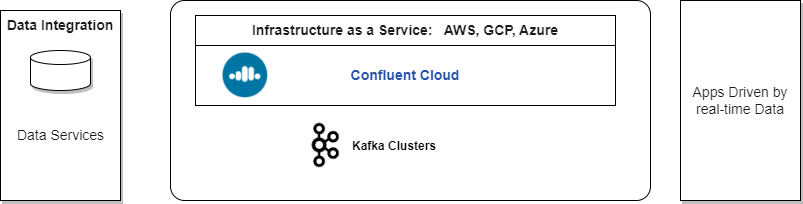
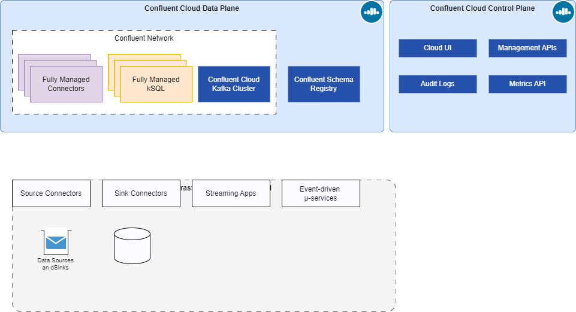
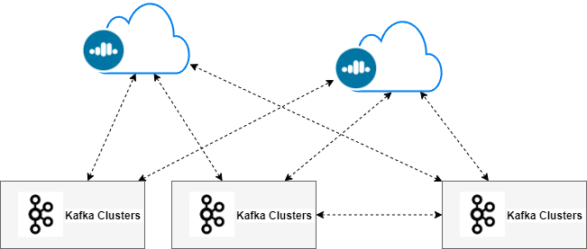
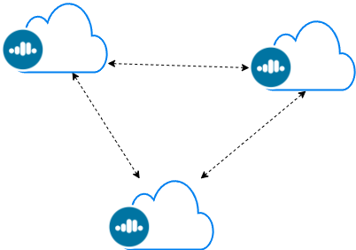
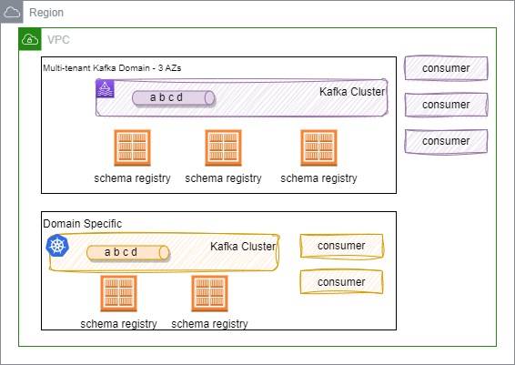
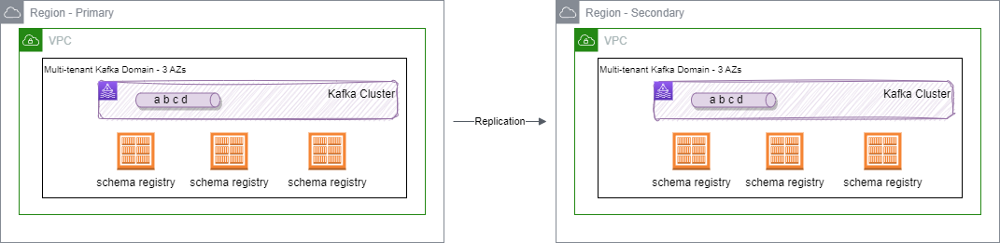
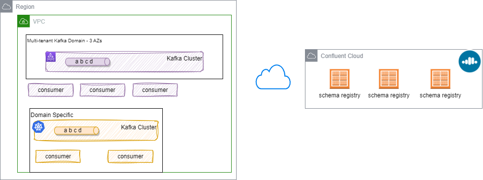

# Confluent Cloud

SaaS offering for the Confluent platform on one of AWS, Azure or GCP cloud. It runs on its own private network that can be integrated with client virtual private network and on-premises network. 

When creating a cluster, developers are connected to the Confluent control plane and can select a cloud provider, then one of the possible regions (not all cloud provider regions are availble).

Below is a set of important information, facts, links on the Confluent offering.

## Kakfa cluster

* One environment can have multiple clusters
* To access one API key/secret pair for each Kafka cluster
* The potential deployment topology pattern for hybrid cloud:

    * One time migration from on-premises Kafka cluster to a Confluent Cloud cluster - In fact in can also being steady state for data propagation to the cloud and may be datalake.

        
    
    * The second topology, is when both clusters are exchanging data over private link:

        

    * The 3nd topology addresses the need to deploy at a global scale, with local market with data sovereignty constraint. Cloud clusters are used to agregate the data for global use, or for read access.

        

    * The last topology pattern is a pure cloud play, with different cloud providers, or different regions of the cloud provider, for disaster recovery.

        

## Networking

Remember that:

* Kafka uses TCP protocol, and get cluster metadata during the bootstrap connection. The broker endpoints is used to send or get data from the brokers. TLS. mTLS, SASL-SSL can be used to secure the connectin and authentication. Confluent Cloud uses SASL-SSL.
* The traffic between client and broker could not go over a load balancer. The load balancing is done via the list of DNS names and ports of the brokers. To get this list, cliet connect to the advertise listener. 
* Client apps can connect with TLS v1.2 over public endpoints.
* Client apps running in VPC connect to Confluent VPC via VPC peering.
* Client apps running on-premises may connect with Transit Gateway or Private Link.
* When using public endpoint, Clients need access to internet without proxy. 
* When using Kafka Connector source and sink connectors, running on Confluent Cloud, those connectors need to be able to accessible the sources over the internet from Confluent Cloud.

## [Schema Registry](https://docs.confluent.io/platform/current/schema-registry/index.html)

* One registry per environment, created in the same region as the first kafka cluster is created, but can manage future clusters in other regions. A schema registry is local to a kafka cluster as it persists state in topic.
* The schema registry is stateless and keep state in Kafka. Multiple instance of the Schema registry can run in parallel, they will be a node supporting the write operation, and any node can serve a READ. All nodes know how to forward requests to the primary for WRITEs.
* If one Schema Registry node goes down, another node is elected leader and the cluster auto-recovers.
* In multi-tenant deployments, one physical Schema Registry cluster per cloud and geographic region, hosts many logical schema registries.
* At the environment level, developers may view and search schemas, monitor usage, and set a compatibility mode for schemas. 

{ align=center}

* Possible to deploy into two regions with replicator and so one data center is the primary, with manual promotion for a secondary to become a primary. 

* Spanning multiple datacenters (DCs) with your Confluent Schema Registry synchronizes data across sites, 

* The Schema Registry nodes in both datacenters link to the primary Kafka cluster in DC A, and the secondary datacenter (DC B) forwards Schema Registry writes to the primary (DC A). Schema Registry instances in DC B have `leader.eligibility` set to false, meaning that none can be elected leader during steady state operation with both datacenters online.
* Replication replicates also topic for the schema persistence.
* Producers write data to just the active cluster. 
* Consumers can read from both regions.
* Access Control List needs to be replicated too

* Confluent Cloud uses API keys that are resource scoped for Schema Registry clusters to store schemas and route requests to the appropriate logical clusters.

* This is a different API key than the one to access the kafka cluster
* When apps are in VPC, the VPC needs to be able to communicate with  Confluent Cloud public end point on port 443

### Schema management 

* Still compatibility mode can be overrided at the topic/schema level. The default is backward compatibility: consumer can consume older messages, as default values are added to new attributes.
* *Foward* compatibility means that data produced with a new schema can be read by consumers using the last schema, or the schema before. [See details in compatibility note](https://docs.confluent.io/cloud/current/sr/fundamentals/schema-evolution.html#summary). With *Foward* compatibility mode, consumers aren’t guaranteed to be able to read old messages.

* Stream governance feature helps addressing data governance
* Schema can be created via CLI, REST API, Console or Maven plugin to be used during CI/CD
* Schema is associated to topic, with mechanism to support backward compatibility
* Avro was developed with schema evolution in mind, and its specification clearly states the rules for backward compatibility, not the case for Json or Protobuf.
* Transitive compatibility means checking a new schema against all previously registered schemas.
