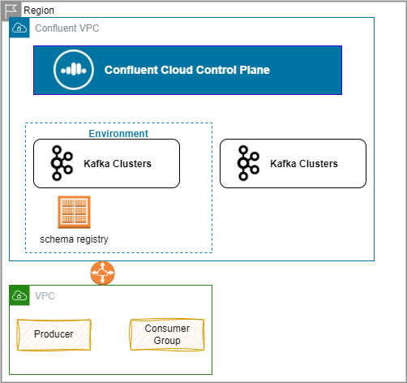

# Confluent as Kafka provider

## Confluent Cloud

???- info "Updates"
    Created 07/2024 - Update 10/2024


Managed service offering for the Confluent platform on one of the AWS, Azure or GCP cloud. It runs on its own private network that can be integrated with client virtual private network and on-premises network. 


Cluster can be shared or dedicated.

The services supported are:

* Schema governance
* OAuth support
* ksqlDB
* Managed Connectors
* Cluster linking
* Schema linking
* Logs and metrics


### Core Concepts

When creating a cluster, developers are connected to the Confluent control plane and can select a cloud provider, then one of the possible regions (not all cloud provider regions are available).


The main three concepts are:

* **Organization**: Billing, sso, user management, service accounts, has 1 to many environments
* **Environment**: delineates logical separation of env and region, includes schema registry, and one to many cluster
* **Cluster**: manages topics, consumer groups, API keys, ACLS, ksqlDB queries

Below is a set of important information, facts, links on the Confluent offering.

#### Control Plane

The control plane runs on AWS in k8s. Clusters are running on k8s too via Confluent Kubernetes Operator. A dedicated monitoring cluster runs and Kafka is used to for async messaging between those components. The satellite clusters may run independently even is there is a problem on the control plane.



Isolation is done via private network, and namespaces.

#### Kafka cluster

* One environment contains clusters, kafka connect cluster, Flink apps, ksqlDB, Schema registry.
* Confluent Cloud clusters are available in 3 types: Basic, Standard, and Dedicated.

    * Standard can be sinlge or multi zones 99.99% SLA, and offers RBAC and OAuth
    * Dedicated: 1GB/s Ingress and Egress, with private netowrking, and self cloud managed keys. Define you CIDR according to your VPC connection (Peering, transit gateway)

* Kafka API keys are required to interact with Kafka clusters in Confluent Cloud. Each Kafka API key is valid for a specific Kafka cluster. To access one API key/secret pair for each Kafka cluster. Key can be setup with global access to produce and consume from the cluster.
* The potential deployment topology pattern for hybrid cloud:

    * One time migration from on-premises Kafka cluster to a Confluent Cloud cluster - In fact in can also being steady state for data propagation to the cloud and may be datalake.

        
    
    * The second topology, is when both clusters are exchanging data over private link:

        

    * The 3nd topology addresses the need to deploy at a global scale, with local market with data sovereignty constraint. Cloud clusters are used to agregate the data for global use, or for read access.

        

    * The last topology pattern is a pure cloud play, with different cloud providers, or different regions of the cloud provider, for disaster recovery.

        


##### CKU

Measure the capacity and limits of Confluent Kafka cluster. A 1 CKU is a 4 brokers clusters. 2 CKUs are needed or HA at 6 brokers.


#### Networking

* Shared clusters have only public endpoints. Dedicated may use VPC, and VPC peering or AWS transit gateway, or private links 
* Public endpoints are protected via API keys, but connections are TLS v1.2. The connection are going to a NLB for TCP ingress.
* Public endpoints are protected with a proxy layer, NLB and other security guards to avoid  DoS, DDoS, syn flooding, and other network-level attacks.
* Kafka uses TCP protocol, and get cluster metadata during the bootstrap connection. The broker endpoints is used to send or get data from the brokers. TLS. mTLS, SASL-SSL can be used to secure the connectin and authentication. Confluent Cloud uses SASL-SSL.
* The traffic between client and broker could not go over a load balancer. The load balancing is done via the list of DNS names and ports of the brokers. To get this list, cliet connect to the advertise listener. 
* Client apps can connect with TLS v1.2 over public endpoints.

* Client apps running on-premises may connect with Transit Gateway or Private Link. Private Link has no constraint on CIDR ranges, and offers a one-way connectivity from customer's VPC to Confluent Cloud. A private link can support access to multiple Confluent Kafka clusters.
* When using public endpoint, Clients need access to internet without proxy. When the cluster has only private endpoints, then we need to setup a proxy (HAproxy, nginx..) to be able to at least see topics. The proxy runs in a Jumphost within our own VPC. The alternate solution is to use dynamic proxy.
* When using Kafka Connector source and sink connectors, running on Confluent Cloud, those connectors need to be able to accessible the sources over the internet from Confluent Cloud.

### Getting Started

There are different ways to access Confluent Cloud: via users or service accounts. SC accesses Confluent Cloud services only, but can get role assignment. Each types have API keys.

There are different quick start tutorials as:

* [Confluent Fundamentals](https://developer.confluent.io/courses/#fundamentals)
* [Hands-on on Confluent Cloud (CCloud)](https://developer.confluent.io/courses/apache-kafka/get-started-hands-on/).  [URL fo CCloud- https://confluent.cloud/](https://confluent.cloud/)

* Here are import [CLI commands](https://docs.confluent.io/confluent-cli/current/overview.html):

```sh
confluent login --save
confluent environment list
confluent environment use env-xxxxxxx
confluent kafka cluster list
confluent kafka cluster use lkc....
confluent kafka topic list
confluent kafka topic create test-topic
confluent kafka topic describe test-topic
confluent kafka topic produce test-topic --parse-key
confluent kafka topic consume --from-beginning test-topic --group <grp-name>
# use a key
confluent api-key list
confluent api-key use <API_Key>
# Generate a client config
confluent kafka client-config create <LANGUAGE> --api-key <API_KEY> --api-secret <API_SECRET>
```

CLI configuration is saved in ~/.confluent/config.json

#### API Keys

We need:

* Confluent Cloud login user and password
* Cluster API Key: `confluent api-key create --resource <cluster_id>`
* Special Key for Flink: select a service account key for long running jobs while for interactive sessions, use user account key. For the REST API use base64 to encode the key. Keys are scoped per environment.

#### Demos and quick starts

* [Quickstart with Console](https://docs.confluent.io/cloud/current/flink/get-started/quick-start-cloud-console.html)
* [Java Table API Quick Start](https://docs.confluent.io/cloud/current/flink/get-started/quick-start-java-table-api.html)
* [Different demos to use local kafka or Confluent Cloud cluster](https://github.com/jbcodeforce/eda-quickstarts) and [Flink studies](https://github.com/jbcodeforce/flink-studies)

### [Schema Registry](https://docs.confluent.io/platform/current/schema-registry/index.html)

* One registry per environment, created in the same region as the first kafka cluster is created, but can manage future clusters in other regions. A schema registry is local to one kafka cluster as it persists state in topics.
* Two "governance packages": **Essentials** (not in all region) and **Advanced**. Schema registries are accessible via public and [private]() endpoints, and uses separate Access Keys from the Kafka cluster ones.
* The schema registry is stateless and keep state in Kafka. Multiple instances of the Schema registry can run in parallel, they will be a node supporting the write operation, and any node can serve a READ. All nodes know how to forward requests to the primary for WRITEs.
* If one Schema Registry node goes down, another node is elected leader and the cluster auto-recovers.
* In multi-tenant deployments, one physical Schema Registry cluster per cloud and geographic region, hosts many logical schema registries.
* At the environment level, developers may view and search schemas, monitor usage, and set a compatibility mode for schemas. 

{ align=center}

* Possible to deploy into two regions with replicator and so one data center is the primary, with manual promotion for a secondary to become a primary. 

* Spanning multiple datacenters (DCs) with your Confluent Schema Registry synchronizes data across sites, 


* The Schema Registry nodes in both datacenters link to the primary Kafka cluster in DC A, and the secondary datacenter (DC B) forwards Schema Registry writes to the primary (DC A). Schema Registry instances in DC B have `leader.eligibility` set to false, meaning that none can be elected leader during steady state operation with both datacenters online.
* Replication replicates also topic for the schema persistence.
* Producers write data to just the active cluster. 
* Consumers can read from both regions.
* Access Control List needs to be replicated too

* Confluent Cloud uses API keys that are resource scoped for Schema Registry clusters to store schemas and route requests to the appropriate logical clusters.


* This is a different API key than the one to access the kafka cluster
* When apps are in VPC, the VPC needs to be able to communicate with  Confluent Cloud public end point on port 443

### Schema file

The development steps can be summarized as:

1. Define the record schemas in the selected target serialization, avro, json or protobuf and define files within `src/main/avro`, `src/main/json` or `src/main/proto`.
1. Use maven or graddle plugins: to create java classes from the schema definitions

#### [Protobuf](https://protobuf.dev/)

A schema needs to define the version of the syntax of the protobuf spec.
`package` is mapped to a java package name and define a namespace. Protobuf define a schema for a record as a message

```protobuf
package org.acme.payement.events;
option java_outer_classname = "PaymentEvent"

message PaymentEvent {
    string payment_id = 1;
    double amount = 2;
    string customer_id = 3; 
}
```

#### Avro 

Use [avro syntax]() to define schema. 


#### Hands-on

* See [Hands-on schema registry 101.](https://developer.confluent.io/courses/apache-kafka/schema-registry-hands-on/)
* 

### Schema management 

* Still compatibility mode can be overrided at the topic/schema level. The default is backward compatibility: consumer can consume older messages, as default values are added to new attributes.
* *Foward* compatibility means that data produced with a new schema can be read by consumers using the last schema, or the schema before. [See details in compatibility note](https://docs.confluent.io/cloud/current/sr/fundamentals/schema-evolution.html#summary). With *Foward* compatibility mode, consumers aren’t guaranteed to be able to read old messages.

* Stream governance feature helps addressing data governance
* Schema can be created via CLI, REST API, Console or Maven plugin to be used during CI/CD
* Schema is associated to topic, with mechanism to support backward compatibility
* Avro was developed with schema evolution in mind, and its specification clearly states the rules for backward compatibility, not the case for Json or Protobuf.
* Transitive compatibility means checking a new schema against all previously registered schemas.

### Kafka Connector

Managed connectors supports only, as of now, a subset of the connectors available on Connector hub. Still it is possiblle to upload our own plugins.

Connectors can access public or private (via VPC peering or transit gateways) sources and sinks.

### Security

* There are different API keys to access cluster, cloud, resources, schema registry and logs and metrics.

### Infrastructure As Code

[Terraform Confluent Provider](https://registry.terraform.io/providers/confluentinc/confluent/latest/docs) to configure any CCloud resources.

---

## Cloud Platform

This the on-premises deployment, which for development can run with docker compose or using the Confluent For Kubernetes (CFK).

### CFK

See [confluent-kubernetes-examples git repo.](https://github.com/confluentinc/confluent-kubernetes-examples) which can be summarized as

```
# define helm repo for confluent helm releases
helm repo add confluentinc https://packages.confluent.io/helm
k create ns confluent
helm upgrade --install operator confluentinc/confluent-for-kubernetes -n confluent --set kRaftEnabled=true
```