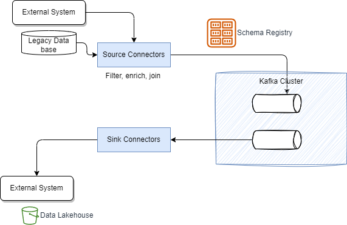
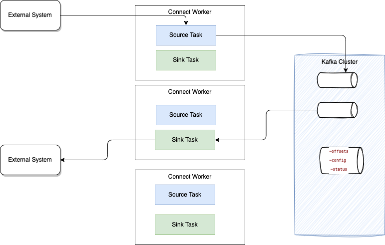
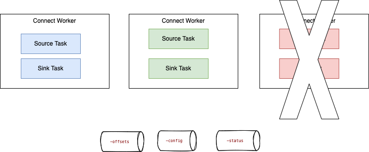
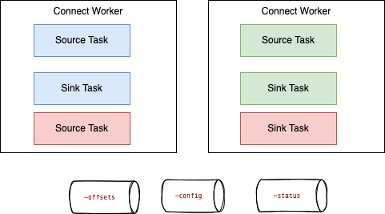

# Kafka Connect

???- Info "Version Update"
    Created 05/2019 - Updated 09/24/2024

[Kafka connect](https://kafka.apache.org/documentation/#connect) is an open-source framework designed to facilitate the integration of external systems with Kafka. It is compatible with all Kafka products and employs the concepts of source and sink connectors to ingest data into or deliver data from Kafka topics.

## Concepts and Architecture

A source connector collects data from a system. A sink connector delivers data from Kafka topics into other systems.

Here is the basic concepts of Kafka Connect integration with Kafka Cluster and external systems




The general concepts are presented in [Robin Moffatt's video](https://talks.rmoff.net/DQkDj3), which we can summarize as:

* **Connector** represents a logical job to move data from / to Kafka  to / from external systems. [Apache Camel offers open source Kafka connectors](https://camel.apache.org/camel-Kafka-connector/1.0.x/index.html), or developers can [implement their own connector](https://Kafka.apache.org/documentation/#connect_development).
* **Workers** are JVMs running the connectors. For production deployment workers run in cluster or "distributed mode", and leverage the Kafka consumer group management protocol to scale tasks horizontally.
* **Tasks**: each worker coordinates a set of tasks to move the data. In distributed mode, task states are saved in Kafka topics. They can be started, stopped at any time to support resilience, and scalable data pipeline.
* **REST API** to configure the connectors and monitors the tasks.

It supports both distributed and standalone deployment modes. Fully integrated with the Kafka cluster to maintain its state, it automatically manages offsets and handles the complex process of offset commitment.

The following figure illustrates a typical 'distributed' deployment of a Kafka Connect cluster:



Workers are the running processes (JVMs) responsible for executing connectors and tasks. They utilize the existing Kafka group management protocol to scale easily. Each connector defines and manages a set of tasks that handle the actual data movement. Tasks run as threads within a JVM.

When a connector is initially submitted to the cluster, the workers rebalance the entire set of connectors and their tasks to ensure that each worker has approximately the same workload.

Connectors and tasks are not guaranteed to run on the same instance in the cluster, especially when multiple tasks and instances are present in the Kafka Connect cluster.

The connector can be configured to include **Converters** (which translate data between Connect and the system sending or receiving the data) and **Transforms** (which apply simple logic to alter each message produced by or sent to a connector).

### Key value propositions

1. **Simplified Integration:** Kafka Connect provides a straightforward, configuration based, way to connect external systems to Kafka, enabling easy data ingestion and delivery without needing custom code. There are a lot of existing connectors, and each main source or sink technology vendors have their own connectors. [Confluent connectors.](https://www.confluent.io/lp/confluent-connectors)
1. **Scalability:** Kafka Connect supports both distributed and standalone deployment modes, allowing it to scale efficiently with the needs of the application.
1. **Fault Tolerance:** It integrates seamlessly with Kafka’s fault-tolerant architecture, ensuring that data is reliably processed even in the event of failures.
1. **Data Transformation:** With support for Converters and Transforms, Kafka Connect allows for data transformation and formatting on-the-fly, ensuring that data is in the correct format for both producers and consumers.
1. **Community and Ecosystem:** Free your teams from writing generic integration code and managing connectors to focus on building real-time apps. Being part of the Kafka ecosystem, it benefits from a large community and a wide range of existing connectors for various systems, such as databases, cloud services, and other messaging platforms.
1. **Ease of Use:** It simplifies the management of data flows, allowing users to focus on business logic rather than the intricacies of data integration.
1. **Real-Time Processing:** Kafka Connect enables real-time data streaming, making it suitable for applications that require immediate insights and actions based on incoming data.

### Characteristics

* Kafka Connect connectors can efficiently copy large volumes of data from a source to Kafka by operating at the datasource level using native protocols. For instance, when the source is a database, it utilizes the JDBC API.
* It supports both streaming and batching of data.
* It can scale from a standalone, single connector setup to running tasks in parallel on a distributed cluster.
* Kafka Connect defines three models: the data model, worker model, and connector model. The worker model enables Kafka Connect to scale the application effectively.
* A Kafka Connect cluster can support multiple applications and can be organized as a service.
* A REST API is available for submitting and managing connectors.
                                                                                                 

### Fault tolerance

For fault tolerance and offset management, Kafka Connect utilizes three Kafka topics to persist its state, which are created when the connectors start:

* **connect-configs**: This topic stores the configurations for connectors and tasks.
* **connect-offsets**: This topic retains offsets for Kafka Connect.
* **connect-status**: This topic contains status updates for connectors and tasks.

When a worker fails: 

{ width="800" }

Tasks allocated in the failed worker are reallocated to existing workers, and the task's states (read offsets, source record mapping to offset) are reloaded from the different state topics.


{ width="800" }


### Connector cluster configuration

Connectors are defined using properties files, [configuration](https://kafka.apache.org/documentation.html#connectconfigs) and Java code, package as jars and dropped into plugins folder.

The following configurations are important to review:

* `group.id`: one per connect cluster. It is used by source connectors only.
* `heartbeat.interval.ms`: The expected time between heartbeats to the group coordinator when using Kafka’s group management facilities.
* `config.storage.topic`: Topic where connector configurations are stored
* `offset.storage.topic`: Topic where source connector offsets are stored
* `status.storage.topic`: Topic where connector and task status are stored
* ` key.converster` and `value.converter`: converter classes (e.g. Avro, Json) used to convert between Kafka Connect format and the serialized form that is written to Kafka.
* `exactly.once.source.support`: For source connectors to use transactions to write source records and their source offsets, and by proactively fencing out old task generations before bringing up new ones.

## Playground

### Installation

The  Kafka connect framework fits well into a Kubernetes deployment model. Currently, there are different options for that deployment: the [Strimzi Kafka connect operator](https://strimzi.io/docs/latest/using.html#kafka-connect-str), directly install binary on VM, or use a managed service from Confluent or one of the cloud providers.

### Local demonstrations

#### File Connectors

The Kakfa Connect labs in [kafka-studies]((https://github.com/jbcodeforce/eda-quickstarts/tree/main/kafka-connect) present the simplest way to demontrate Kafka Connect using File Source and File Sink on a local computer. The approach is based on docker compose with 1 Kafka broker, 1 topic, and a container running the source and sink file connectors in [standalone mode](https://github.com/jbcodeforce/eda-quickstarts/tree/main/kafka-connect/filetofile). File lines are copied to target file after simple message transformation.

The distributed mode with [this sample](https://github.com/jbcodeforce/eda-quickstarts/tree/main/kafka-connect/distributed-filetofile).

### Strimzi

[KafkaConnector resources](https://strimzi.io/docs/operators/latest/configuring.html#assembly-kafka-connect-str) allow developers to create and manage connector instances for Kafka Connect in a Kubernetes-native way. To manage connectors, developers can use the Kafka Connect REST API, or use KafkaConnector custom Kubernetes resources. Using the GitOps methodology, devlopers will define connector cluster and connector instance as yamls.
Connector configuration is passed to Kafka Connect as part of an HTTP request and stored within Kafka itself.

### IBM MQ connector

The [source code is in this repo](https://github.com/ibm-messaging/kafka-connect-mq-source) and uses JMS as protocol to integrate with IBM MQ. When the connector encounters a message that it cannot process, it stops rather than throwing the message away. 
The MQ source connector does not currently make much use of message keys. It is possible to use CorrelationID as a key
by defining MQ source `mq.record.builder.key.header` property:

```
    key.converter: org.apache.kafka.connect.storage.StringConverter
    value.converter: org.apache.kafka.connect.converters.ByteArrayConverter
    mq.record.builder: com.ibm.eventstreams.connect.mqsource.builders.DefaultRecordBuilder
    mq.connection.mode: client
    mq.message.body.jms: true
    mq.record.builder.key.header: JMSCorrelationID
```

The record builder helps to transform the input message to a Kafka record, using or not a schema.

Always keep the coherence between body.jms, record builder and data converter. 

The MQ source task starts a unique JMS Reader that will read n messages from the queue. The `poll() function 
returns the list of MQ source records, and will commit to JMS if the number of message read match the batch size or
if there is no more records. Once the Kafka Producer gets acknowledge that records are received by Brokers then use callback on the source
task to commit MQ transaction for example. 

Any producer configuration can be modified in the source connector configuration:

```yaml
producer.override.acks: 1
```

## Example of Kafka Connect Deployments

TBD 

* [File sink and sources in distributed mode sample](https://github.com/jbcodeforce/kafka-studies/tree/master/labs/kconnect/distributed-filetofile)
* [S3 Sink connector]()
* [Kinesis data stream with source connector.](https://github.com/jbcodeforce/MSK-labs)

## Further Readings

* [Apache Kafka connect documentation](https://kafka.apache.org/documentation/#connect)

