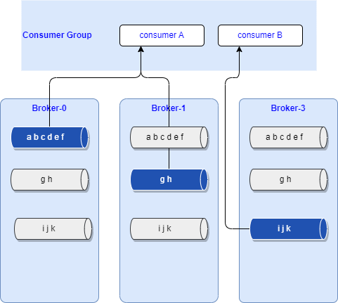
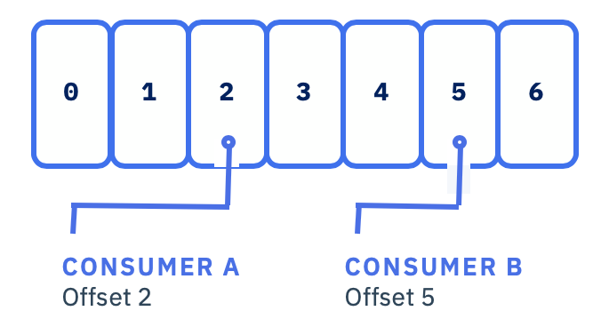
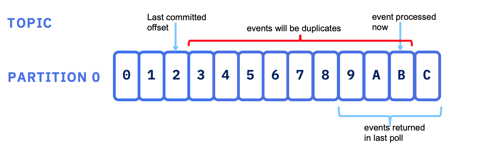
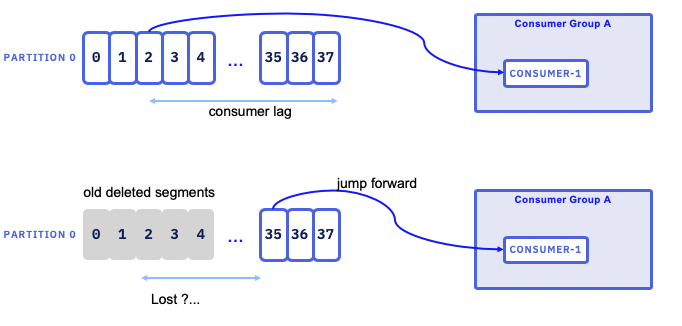

# Understanding Kafka Consumers

This chapter includes Kafka consumer technology summary and best practices. It may be useful for kafka developer beginner or for seasoned developers who 
want a refresh after some time far away from Kafka...

## Consumer group

Consumers belong to **consumer groups**. 

{ width=600 }

We specify the group name as part of the consumer connection parameters using the `group.id` configuration:

```java
  properties.put(ConsumerConfig.GROUP_ID_CONFIG,  groupid);
```

Consumer groups are grouping consumers to cooperate to consume messages from one or more topics. Consumers can run in separate hosts and separate processes. 

The figure below represents 2 consumer groups. Group 1 has more consumers than partitions, each consumer will get from one partition, and one consumer will get no record. In second group the Consumer B is getting data from 2 partitions, while consumer 1 is getting from one partition.

{ width=600 }

When a consumer is unique in a group, it will get data from all partitions. There is always at least one consumer per partition.

One broker is responsible to be the consumer group coordinator which is responsible for assigning partitions to the consumers in the group. 

The first consumer to join the group will be the group coordinator. It will get the list of consumers and it is responsible for assigning a subset of partitions to each consumer.

Membership in a consumer group is maintained dynamically. Consumers send heartbeats to the group coordinator broker (see configuration parameters  
[heartbeat.interval.ms](https://kafka.apache.org/documentation/#consumerconfigs_heartbeat.interval.ms)) and `session.timeout.ms`. 

Partition assignement is done by different strategies from range, round robin, sticky and cooperative sticky (See [partition assignement strategy documentation](https://kafka.apache.org/documentation/#consumerconfigs_partition.assignment.strategy)). 

When a consumer fails, the partitions assigned to it, will be reassigned to an other consumer in the same group. When a new consumer joins the group, partitions will be moved from existing consumers to the new one. Group rebalancing is also used when new partitions are added to one 
of the subscribed topics. The group will automatically detect the new partitions through periodic metadata refreshes and assign them to members 
of the group. During a rebalance, depending of the strategy, consumers may not consume messages (Need Kafka 2.4+ to get cooperative balancing feature). 

Kafka automatically detects failed consumers so that it can reassign partitions to working consumers. 

The consumer can take time to process records, so to avoid the consumer group controler removing consumer taking too much time, it is possible to tune the [max.poll.interval.ms](https://kafka.apache.org/documentation/#max.poll.interval.ms) consumer property. If `poll()` is not called before expiration of this timeout, then the consumer is considered failed and the group will rebalance in order to reassign the partitions to another member. 

The second mechanism is the heartbeat the consumers send to the group cordinator to show they are alive. The [session.timeout.ms](https://kafka.apache.org/documentation/#session.timeout.ms) specifies the max value to consider before removing a non responding consumer. 

Implementing a Topic consumer is using the kafka [KafkaConsumer class](https://kafka.apache.org/32/javadoc/?org/apache/kafka/clients/consumer/KafkaConsumer.html) 
which the API documentation is a must read. It is interesting to note that:

* To support the same semantic of a queue processing like other integration messaging systems, we need to have all the consumers assigned to a single consumer group, 
so that each record delivery would be balanced over the group like with a queue.
* To support pub/sub like other messaging systems, each consumer would have its own consumer group, and subscribes to all the records published to the topic/partition.
* With `client.rack` parameter, a consumer may consume from a local replica, which will improve  latency when using a stretched cluster over multiple availability zones.

For a single thread consumer, the implementation code follow the following pattern:

* prepare the consumer properties
* create an instance of KafkaConsumer to subscribe to at least one topic
* loop on polling events: the consumer ensures its liveness with the broker via the poll API. It will get `n records` per poll.
* process the ConsumerRecords and commit the offset by code or by using the autocommit attribute of the consumer.

As long as the consumer continues to call `poll()`, it will stay in the group and continues to receive messages from the partitions it was assigned to. 
When the consumer does not send heartbeats for a duration of `session.timeout.ms`, then it is considered unresponsive and its partitions will be reassigned.

Examples of Java consumers can be found in [the order management microservice project](https://github.com/ibm-cloud-architecture/refarch-kc-order-ms/blob/master/order-command-ms/src/main/java/ibm/gse/orderms/infrastructure/kafka/OrderEventAgent.java) under the order-command-ms folder.

We are proposing a deeper dive study for the manual offset commit in [this consumer code](https://github.com/ibm-cloud-architecture/eda-quickstarts/blob/main/quarkus-consumer-kafka-api).

But the complexity comes from the offset management and multithreading needs. So the following important considerations need to be addressed while implementing a consumer.

## Assess number of consumers needed

The KafkaConsumer is not thread safe, therefore it is recommended to run it in a unique thread. With a multi-threads solution, each thread will open a TCP connection to the Kafka brokers, be sure to close the connection to avoid memory leak. 
The alternate is to start n processes (JVM process) with a mono thread.

The consumer-per-partition pattern maximizes throughput. When consumers run in parallel with a multiple threads per consumer implementation, it is very important to consider the total number of threads across all consumer instances, to do not exceed the total number of partitions in the topic.

Also, a consumer can subscribe to multiple topics. 

## Offset management

Recall that offset is just a numeric identifier of a record within a partition. It is used to keep the last record read by a consumer within a partition. Consumers periodically need to 
commit the offsets they have received, to present a recovery point in case of failure. To commit offset (via API or automatically) the consumer 
sends a message to kafka broker to the special topic named `__consumer_offsets` to keep the committed offset for each partition. (When there is a committed offset, the `auto.offset.reset` property is not used)

Consumers do a read commit for the last processed record: 

{ width=500 }

When a consumer starts, it receives a partition to consume, and it starts at its group's committed offset or the latest or earliest offset
 as specified in the [auto.offset.reset](https://kafka.apache.org/documentation/#auto.offset.reset) property.

If a consumer fails after processing a message but before committing its offset, the committed offset information will not reflect the processing of the message. 

{ width=800 }

This means that the message will be processed again by the next consumer, in that group, which received the assigned partition.

In the case where consumers are set to auto commit, it means the offset is committed at the `poll()` function and if the application crashed while processing this record: 

{ width="800" }

then the record (partition 0 - offset 4) will never be processed. BThe record is still in the partition, on the broker file system, and so it is not lost.

As shown in the figure below, in case of consumer failure, it is possible to get duplicates. When the last message processed by the consumer,
 before crashing, is younger than the last committed offset, the consumer will get this record again. This case may happen when using a time based commit strategy.

{ width=800 }

*Source: Kafka definitive guide book from Todd Palino, Gwen Shapira*

In the opposite, if the last committed offset is after the last processed messages and there were multiple messages returned in the poll(), 
then those messages may be never processed by those consumers. This will happen with autocommit set up at the time 
of the read operation, and the last offset of the poll is the committed offset. See the [enable.auto.commit](https://kafka.apache.org/documentation/#consumerconfigs_enable.auto.commit) property.

{ width=800 }

Limiting to poll one message at the time, will help to avoid this problem, but will impact throughput.

It is possible to commit by calling API, so developer can control when to commit the read. For manual commit, we can use one of the two approaches:

* offsets—synchronous commit: send the offset number for the records read using `consumer.commitSync(Collections.singletonMap(partition, new OffsetAndMetadata(lastOffset + 1)))` method 
* asynchronous commit.

As soon as you are coding manual commit, it is strongly recommended to implement the ConsumerRebalanceListener interface to be able to do state 
modifications when the topic is rebalanced. The consumer is keeping state of its offset, so it becomes stateful.

Assess if it is acceptable to loose messages from topic.  If so, when a consumer restarts, it will start consuming the topic from the latest committed offset within the partition allocated to itself.

As storing a message to an external system and storing the offsets are two separate operations, and in case of failure between them, 
it is possible to have stale offsets, which will introduce duplicate messages when consumers restart to process from last known committed offset. 

In this case, consumer's idempotency is needed. Different techniques can be used to support idempotentcy, like unique identifier, timestamp and time window, ....

As presented in the producer coding practice, using transaction to support "exactly-once", also means the consumers should read committed data only. 
This can be achieved by setting the `isolation.level=read_committed` in the consumer's configuration. The last offset will be the first message 
in the partition belonging to an open not yet committed transaction. This offset is known as the 'Last Stable Offset'(LSO).

## Producer transaction

When consuming from a Kafka topic and producing to another topic, like in Kafka Streams programming approach, we can use the producer's transaction 
feature to send the committed offset message and the new records in the second topic in the same transaction.  This can be seen as a 
`consume-transform-produce` loop pattern so that every input event is processed exactly once. 

An example of such pattern in done in the [order management microservice - command part](https://github.com/ibm-cloud-architecture/refarch-kc-order-ms/tree/master/order-command-ms).

## Consumer lag

The consumer lag, within a partition, is the difference between the offset of the most recently published message and the consumer's committed offset.

If the lag starts to grow, it means the consumer is not able to keep up with the producer's pace.

The risk, is that slow consumer may fall behind, and when partition management may remove old log segments, leading the consumer to jump forward to continue on the next log segment. Consumer may have lost messages.

{ width="600" }

You can use the kafka-consumer-groups tool to see and manage the consumer lag.

## Reset a group

Sometime, it is needed to reprocess the messages. The easiest way is to change the groupid of the consumers to get an implicit offsets reset, but it is also possible to reset for some topic to the earliest offset:

```shell
kafka-consumer-groups \
                    --bootstrap-server kafkahost:9092 \
                    --group ordercmd-command-consumer-grp \
                    --reset-offsets \
                    --all-topics \
                    --to-earliest \
                    --execute
```

## Kafka useful Consumer APIs

[KafkaConsumer](https://kafka.apache.org/32/javadoc/org/apache/kafka/clients/consumer/KafkaConsumer.html) a topic consumer which support:

  * transparently handles brokers failure
  * transparently adapt to partition migration within the cluster
  * support grouping for load balancing among consumers
  * maintains TCP connections to the necessary brokers to fetch data
  * subscribe to multiple topics and being part of consumer groups
  * each partition is assigned to exactly one consumer in the group
  * if a process fails, the partitions assigned to it will be reassigned to other consumers in the same group

[ConsumerRecords](https://kafka.apache.org/32/javadoc/org/apache/kafka/clients/consumer/ConsumerRecords.html) holds the list ConsumerRecord per partition for a particular topic.

[ConsumerRecord](https://kafka.apache.org/32/javadoc/org/apache/kafka/clients/consumer/ConsumerRecord.html) A key/value pair to be received from Kafka. This also consists of a topic name and a partition number from which the record is being received, an offset that points to the record in a Kafka partition, and a timestamp

### Repositories with consumer code

* Within the Reefer ontainer shipment solution we have a order events consumer: [order event agent](https://github.com/ibm-cloud-architecture/refarch-kc-order-ms/blob/master/order-command-ms/src/main/java/ibm/gse/orderms/infrastructure/kafka/OrderEventAgent.java)
* [Quarkus app with Kafka streams](https://github.com/ibm-cloud-architecture/refarch-eda-store-inventory)
* [A lot of python consumer codes in the integration tests, with or without Avro schema](https://github.com/ibm-cloud-architecture/refarch-kc/tree/master/itg-tests/kafka)

## References

* [KafkaConsumer class](https://kafka.apache.org/32/javadoc/org/apache/kafka/clients/consumer/package-summary.html)