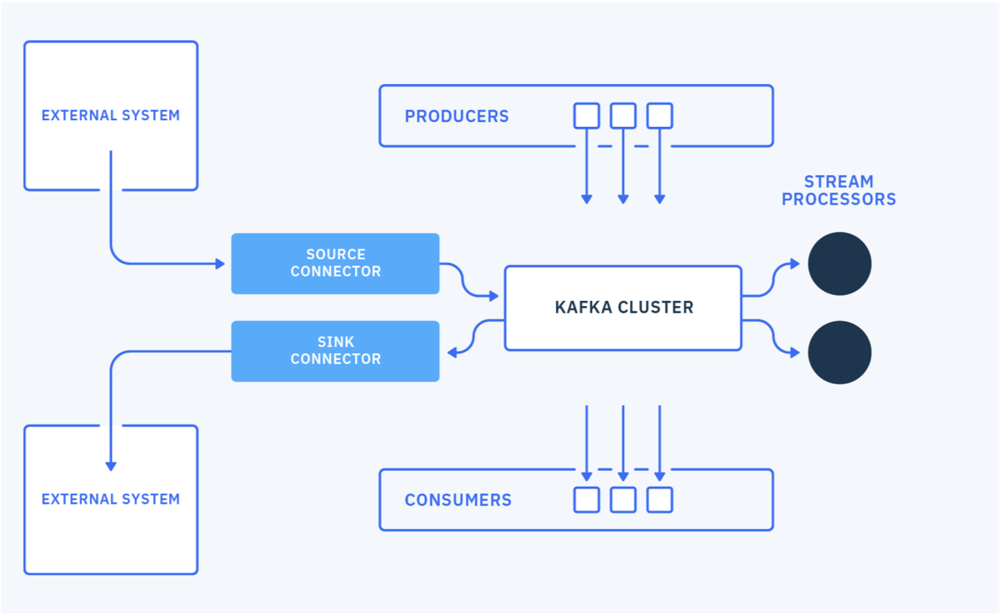

# Frequently asked questions

## Basic questions

???- question  "What is Kafka?"

	* Pub/sub middleware to share data between applications
	* Open source, started in 2011 by Linkedin
	* Based on append log to persist immutable records ordered by arrival.
	* Support data partitioning, distributed brokers, horizontal scaling, low-latency and high throughput.
	* Producer has no knowledge of consumers
	* Records stay even after being consumed
	* Durability with replication to avoid loosing data for high availability

???- question  "What are the Kafka major components?"

	* Topic, consumer, producer, brokers, cluster [see this note for deep dive](./index.md)
	* Rich API to control the producer semantic, and consumer
	* Consumer groups. [See this note for detail](./consumer.md/#consumer-group)
	* Kafka streams API to support data streaming with stateful operations and stream processing topology
	* Kafka connect for source and sink connection to external systems
	* Topic replication with Mirror Maker 2

	

???- question  "What are major use cases?"

	* Modern data pipeline with buffering to data lake
	* Data hub, to continuously expose business entities to event-driven applications and microservices
	* Real time analytics with aggregate computation, and complex event processing
	* The communication layer for Event-driven, reactive microservice.

???- question  "Why does Kafka use zookeeper?"

	Kafka as a distributed system using cluster, it needs to keep cluster states, sharing configuration like topic, assess which node is still alive within the cluster, support registering new node added to the cluster, being able to support dynamic restart. Zookeeper is an orchestrator for distributed system, it maintains Kafka cluster integrity, select broker leader... 

	Zookeeper is also used to manage offset commit, and to the leader selection process.

	Version 2.8 introduces another algorithm to define partition leadership and cluster health via one broker becoming the cluster controller. See [this note on KIP 500](https://www.confluent.io/blog/kafka-2-8-0-features-and-improvements-with-early-access-to-kip-500/)

???- question  "What is a replica?"
	Nodes responsible to participate into the data replication process for a given partition. It is a critical feature to ensure durability, be able to continue to consume records, or to ensure a certain level of data loss safety is guaranteed when producing records.

???- question  "What are a leader and follower in Kafka?"
	Topic has 1 to many partition, which are append logs. Every partition in Kafka has a server that plays the role of **leader** . Leader receives read and write operation, and ensure acknowledge management. When replication is set in a topic, follower brokers will pull data from the leader to ensure replication, up to the specified replication factor. If the leader fails, one of the followers needs to take over as the leader’s role. The leader election process involves zookeeper and assesses which follower was the most in-synch with the leader. 

	To get the list of In-synch Replication for a given topic the following tool can be used:

	```shell
	kafka-topics.sh --bootstrap-server :9092 --describe --topic <topicname>
	```

???- question  "What is Offset?"
	A unique identifier of records inside a partition. It is automatically created by the broker, and producer can get it from the broker response. Consumer uses it to commit its read. It means, in case of consumer restarts, it will read from the last committed offset.

???- question  "What is a consumer group?"
	It groups consumers of one to many topics. Each partition is consumed by exactly one consumer within each subscribing [consumer group](./consumer.md/#consumer-group).

	Consumer group is specified via the `group.id` consumer's property, and when consumers subscribe to topic(s).

	There is a protocol to manage consumers within a group so that partition can be reallocated when a consumer lefts the group. The *group leader* is responsible to do the partition assignment.

	When using the [group.instance.id](https://kafka.apache.org/documentation/#consumerconfigs_group.instance.id) properties, consumer is treated as a static member, which means there will be no partition re-balance when consumer lefts a group for a short time period. When not set, the group coordinator (a broker) will allocate `ids` to group members, and reallocation will occur. For Kafka Streams application, it is recommended to use static membership.

	Brokers keep offsets until a [retention period](https://kafka.apache.org/documentation/#brokerconfigs_offsets.retention.minutes) within which consumer group can lose all its consumers. After that period, offsets are discarded. The consumer group can be deleted manually, or automatically when the last committed offset for that group expires.

	When the group coordinator receives an OffsetCommitRequest, it appends the request to a special compacted Kafka topic named __consumer_offsets. Ack from the broker is done once all replicas on this hidden topics are successful.

	The tool `kafka-consumer-group.sh` helps getting details of consumer group:

	```shell
	# Inside a Kafka broker container
	bin/kafka-consumer-groups.sh --bootstrap-server kafka:9092 --describe --group order-group --members --verbose
	```

???- question "How to support multi-tenancy?"

	Multi-tenant means multiple different groups of application can produce and consume messages isolated from each other. So by constructs, topics and brokers are multi-tenant.
	Now the control will be at the access control level policy, the use of service account, and naming convention on the topic name.
	Consumer and producer authenticate themselves using dedicated service account users, with SCRAM user or Mutual TLS user. Each topic can have security policy to control read, write, and creation operations.

???- question "How client access Kafka cluster metadata?"
	Provide a list of Kafka brokers, minimum two, so the client API will get the metadata once connected to one of the broker.

???- question "How to get at most once delivery?"
	Set producer acknowledge level (acks) property to 0 or 1.

???- question "How to support exactly once delivery?"
	The goal is to address that, if a producer sends a message twice the system will keep only one message to the consumer, and once the consumer commits the read offset, it will not receive the message again even if it restarts.

	See the section in the producer implementation considerations [note](./producer.md/#how-to-support-exactly-once-delivery).

	The consumer needs to always read from its last committed offset.

	Also it is important to note that the Kafka Stream API supports exactly once semantics with the config: `processing.guarantee=exactly_once`. Each task within a read-process-write flow may fail so this setting is important to be sure the right answer is delivered, even in case of task failure, and the process is executed exactly once.

	Exactly-once delivery for other destination systems generally requires cooperation with such systems which may be possible by using the offset processing.


???- question "Retention time for topic what does it mean?"
	The message sent to a cluster is kept for a max period of time or until a max size is reached. Those topic properties are: `retention.ms` and `retention.bytes`. Messages stay in the log even if they are consumed. The oldest messages are marked for deletion or compaction depending of the cleanup policy (delete or compact) set to `cleanup.policy` topic's parameter. See the Kafka documentation on [topic configuration parameters](https://kafka.apache.org/documentation/#topicconfigs).

	Here is a command to create a topic with specific retention properties:

	```shell
	bin/kafka-configs --zookeeper XX.XX.XX.XX:2181 --entity-type topics --entity-name orders --alter --add-config  retention.ms=55000 --add-config  retention.byte=100000
	```

	But there is also the `offsets.retention.minutes` property, set at the cluster level to control when the offset information will be deleted. It is defaulted to 1 day, but the max possible value is 7 days. This is to avoid keeping too much information in the broker memory and avoid to miss data when consumers do not run continuously. So consumers need to commit their offset. If the consumer settings define: `auto.offset.reset=earliest`, the consumer will reprocess all the events each time it restarts, (or skips to the latest if set to `latest`). When using `latest`, if the consumers are offline for more than the offsets retention time window, they will lose events.


???- question "What are the topic characteristics I need to define during requirements?"
	This is a requirement gathering related question to understand what need to be done for topic configuration but also consumer and producer configurations, as well as retention strategy.

	* Number of brokers in the cluster.
	* Retention time and size
	* Need for HA, set replicas to number of broker or at least the value of 3, with in-synch replica to 2
	* Type of data to transport to assess message size
	* Plan to use schema management to control change to the payload definition
	* Volume per day with peak and average
	* Need to do geo replication to other Kafka cluster
	* Network filesystem used on the target Kubernetes cluster and current storage class

???- question "What are the impacts of having not enough resource for Kafka?"
	When resources start to be at stress, then Kafka communication to ZooKeeper and/or other Kafka brokers can suffer resulting in out-of-sync partitions and container restarts perpetuating the issue. Resource constraints is one of the first things to consider when diagnosing kafka broker issues.

## Security questions

For deeper dive on security administration [see Confluent article](https://docs.confluent.io/platform/current/security/general-overview.html) and [Apache Kafka product documentation](http://kafka.apache.org/documentation/#security).


???- question "What Security support in Kafka?"
	* Encrypt data in transit between producer and Kafka brokers
	* Client authentication
	* Client authorization

???- question "Explain security protocol"
	[security.protocol](http://kafka.apache.org/documentation/#adminclientconfigs_security.protocol) defines the protocol used to communicate with brokers. Verify how the listeners are configured in the Kafka cluster. The valid values are:

	```
	PLAINTEXT (using PLAINTEXT transport layer & no authentication - default value).
	SSL (using SSL transport layer & certificate-based authentication)
	SASL_PLAINTEXT (using PLAINTEXT transport layer & SASL-based authentication)
	SASL_SSL (using SSL transport layer & SASL-based authentication)
	```

	In Strimzi the following yaml defines the different listeners type and port: `tls` boolean is for the traffic encryption, while `authentication.type` defines the matching security protocol.

	```yaml
	listeners:
		- name: plain
			port: 9092
			type: internal
			tls: false
		- name: tls
			port: 9093
			type: internal
			tls: true
			authentication:
			type: tls
		- name: external
			type: route
			port: 9094
			tls: true 
			authentication:
			type: scram-sha-512
	```

???- question "What are `ssl.truststore.location` and `ssl.truststore.password`?"
	When doing TLS encryption, we need to provide the Kafka clients with the location of a trusted Certificate Authority-based certificate. This file is often provided by the Kafka administrator and is generally unique to the specific Kafka cluster deployment. The certificate is in JKS format for JVM languages and PEM/ P12 for nodejs or Python.

	To extract a PEM-based certificate from a JKS-based truststore, we can use the following command: 

	```
	keytool -exportcert -keypass {truststore-password} -keystore {provided-kafka-truststore.jks} -rfc -file {desired-kafka-cert-output.pem}
	```

???- question "What are the security configuration to consider?"
	On Kubernetes, Kafka can be configured with external and internal URLs. With Strimzi internal URLs are using TLS or Plain authentication, then TLS for encryption. If no authentication property is specified then the listener does not authenticate clients which connect through that listener. The listener will accept all connections without authentication.

	* Mutual TLS authentication for internal communication looks like:

	```yaml
	- name: tls
		port: 9093
		type: internal
		tls: true
		authentication:
		type: tls
	```

	To connect any app (producer, consumer) we need a TLS user like:

	```yaml
	piVersion: kafka.strimzi.io/v1beta2
	kind: KafkaUser
	metadata:
	name: tls-user
	labels:
		strimzi.io/cluster: vaccine-kafka
	spec:
	authentication:
		type: tls
	```

	Then the following configurations need to be done for each app. For example in Quarkus app, we need to specify where to find the client certificate (for each Kafka TLS user a secret is created with the certificate (ca.crt) and a user password)

	```shell
	oc describe secret tls-user
	Data
	====
	ca.crt:         1164 bytes
	user.crt:       1009 bytes
	user.key:       1704 bytes
	user.p12:       2374 bytes
	user.password:  12 bytes
	```

	For Java client we need the following security settings, to specify from which secret to get the keystore password and certificate. The certificate will be mounted to `/deployments/certs/user`. 

	```shell
	%prod.kafka.security.protocol=SSL
	%prod.kafka.ssl.keystore.location=/deployments/certs/user/user.p12
	%prod.kafka.ssl.keystore.type=PKCS12

	```

	For the server side certificate, it will be in a truststore, which is mounted to  `/deployments/certs/server` and from a secret (this secret is created at the cluster level).

	Also because we also use TLS for encryption we need:

	```sh
	%prod.kafka.ssl.protocol=TLSv1.2
	```

	Mutual TLS authentication is always used for the communication between Kafka brokers and ZooKeeper pods. For mutual, or two-way, authentication, both the server and the client present certificates.

	* The [sasl.mechanism](http://kafka.apache.org/documentation/#adminclientconfigs_sasl.mechanism) property is for defining the authentication protocol used. Possible values are:

	```
	PLAIN (cleartext passwords, although they will be encrypted across the wire per security.protocol settings above)
	SCRAM-SHA-512 (modern Salted Challenge Response Authentication Mechanism)
	GSSAPI (Kerberos-supported authentication and the default if not specified otherwise)
	```


	* SCRAM: (Salted Challenge Response Authentication Mechanism) is an authentication protocol that can establish mutual authentication using passwords. Strimzi can configure Kafka to use SASL (Simple Authentication and Security Layer) SCRAM-SHA-512 to provide authentication on both unencrypted and encrypted client connections.

		* The listener declaration:
		
		```yaml
		- name: external
		port: 9094
		type: route
		tls: true
		authentication:
		type: scram-sha-512
		```

		* Need a scram-user:

		```yaml
		apiVersion: kafka.strimzi.io/v1beta2
		kind: KafkaUser
		metadata:
		name: scram-user
		labels:
			strimzi.io/cluster: vaccine-kafka
		spec:
		authentication:
			type: scram-sha-512
		```

	Then the app properties need to have:

	```shell
	security.protocol=SASL_SSL
	%prod.quarkus.openshift.env.mapping.KAFKA_SSL_TRUSTSTORE_PASSWORD.from-secret=${KAFKA_CA_CERT_NAME:kafka-cluster-ca-cert}
	%prod.quarkus.openshift.env.mapping.KAFKA_SSL_TRUSTSTORE_PASSWORD.with-key=ca.password
	%prod.quarkus.openshift.env.mapping.KAFKA_SCRAM_PWD.from-secret=${KAFKA_USER:scram-user}
	%prod.quarkus.openshift.env.mapping.KAFKA_SCRAM_PWD.with-key=password
	%prod.quarkus.openshift.mounts.kafka-cert.path=/deployments/certs/server
	%prod.quarkus.openshift.secret-volumes.kafka-cert.secret-name=${KAFKA_CA_CERT_NAME:kafka-cluster-ca-cert}
	```

???- question "What are the setting for `sasl.jaas.config`?"

	```
	sasl.jaas.config = org.apache.kafka.common.security.plain.PlainLoginModule required username="{USERNAME}" password="{PASSWORD}";
	sasl.jaas.config = org.apache.kafka.common.security.scram.ScramLoginModule required username="{USERNAME}" password="{PASSWORD}";
	```


???- question "How internal and external broker listener work?"

	See [this article](https://rmoff.net/2018/08/02/kafka-listeners-explained/) to understand the listener configuration. Here is a config to be used in docker container:

	```
	KAFKA_ADVERTISED_LISTENERS: INTERNAL://kafka:29092,EXTERNAL://localhost:9092
	KAFKA_LISTENER_SECURITY_PROTOCOL_MAP: INTERNAL:PLAINTEXT,EXTERNAL:PLAINTEXT
	KAFKA_LISTENERS: EXTERNAL://0.0.0.0:9092,INTERNAL://kafka:29092
	KAFKA_ZOOKEEPER_CONNECT: zookeeper:2181
	KAFKA_INTER_BROKER_LISTENER_NAME: INTERNAL
	```

	For **external connection** to Strimzi cluster use the following, where USERNAME is a scram-user

	```sh
	bootstrap.servers={kafka-cluster-name}-kafka-bootstrap-{namespace}.{kubernetes-cluster-fully-qualified-domain-name}:443
	security.protocol=SASL_SSL
	sasl.mechanism=SCRAM-SHA-512
	sasl.jaas.config=org.apache.kafka.common.security.scram.ScramLoginModule required username="{USERNAME}" password="{PASSWORD}";
	ssl.truststore.location={/provided/to/you/by/the/kafka/administrator}
	ssl.truststore.password={__provided_to_you_by_the_kafka_administrator__}
	```

	To get the user password get the user secret (oc or kubectl CLIs):

	```shell
	oc get secret scram-user -o jsonpath='{.data.admin_password}' | base64 --decode && echo ""
	```

	To get the Bootstrap URL use: 

	```
	expost K_CLUSTER_NAME=mycluster
	export BOOTSTRAP="$(oc get route ${K_CLUSTER_NAME}-kafka-bootstrap -o jsonpath='{.spec.host}'):443"
	```


	The `sasl.jaas.config` can come from an environment variable inside of a secret, but in fact it is already predefined in the scram user in Strimzi:

	```sh
	oc get secret my-user -o json | jq -r '.data["sasl.jaas.config"]' | base64 -d -
	```

	* For **internal communication**, with PLAIN the setting is:

	```sh
	bootstrap.servers={kafka-cluster-name}-kafka-bootstrap.{namespace}.svc.cluster.local:9093
	security.protocol = SASL_PLAINTEXT (these clients do not require SSL-based encryption as they are local to the cluster)
	sasl.mechanism = PLAIN
	sasl.jaas.config = org.apache.kafka.common.security.plain.PlainLoginModule required username="{USERNAME}" password="{PASSWORD}";
	```

	* For internal authentication with mutual TLS the settings:

	```
	security.protocol=SSL 
	```

???- question "App running not in same namespace as Kafka"
	Remember that if the application does not run in the same namespace as the kafka cluster then copy the secrets to the namespace with something like:

	```sh
	if [[ -z $(oc get secret ${TLS_USER} 2> /dev/null) ]]
	then
	# As the project is personal to the user, we can keep a generic name for the secret
	oc get secret ${TLS_USER} -n ${KAFKA_NS} -o json | jq -r '.metadata.name="tls-user"' | jq -r '.metadata.namespace="'${YOUR_PROJECT_NAME}'"' | oc apply -f -
	fi

	if [[ -z $(oc get secret ${SCRAM_USER} 2> /dev/null) ]]
	then
		# As the project is personal to the user, we can keep a generic name for the secret
		oc get secret ${SCRAM_USER} -n ${KAFKA_NS} -o json |  jq -r '.metadata.name="scram-user"' | jq -r '.metadata.namespace="'${YOUR_PROJECT_NAME}'"' | oc apply -f -
	fi
	```

???- question "How to protect data at rest?"
	* Use encrypted file system for each brokers
	* Encrypt data at the producer level, using some API, and then decode at the consumer level. The data in the append log will be encrypted.


## More advanced concepts

???- question "What is range partition assignment strategy?"
	There are multiple partition assignment strategies for a consumer, part of a consumer group, to get its partition to fetch data from. Members of the consumer group subscribe to the topics they are interested in and forward their subscriptions to a Kafka broker serving as the group coordinator. The coordinator selects one member to perform the group assignment and propagates the subscriptions of all members to it. Then assign(Cluster, GroupSubscription) is called to perform the assignment and the results are forwarded back to each respective members.

	Range assignor works on a per-topic basis: it lays out the available partitions in numeric order and the consumers in lexicographic order, and assign partition to each consumer so partition with the same id will be in the same consumer: topic-1-part-0 and topic-2-part-0 will be processed by consumer-0

???- question "What is sticky assignor?"
	The CooperativeStickyAssignor helps supporting incremental cooperative re-balancing to the clients' group protocol, which allows consumers to keep all of their assigned partitions during a re-balance, and at the end, revoke only those which must be migrated to another consumer for overall cluster balance.

	The goal is to reduce unnecessary downtime due to unnecessary partition migration, by leveraging the sticky assignor which link consumer to partition id. See [KIP 429 for details.](https://cwiki.apache.org/confluence/display/KAFKA/KIP-429%3A+Kafka+Consumer+Incremental+Rebalance+Protocol) 

???- question "How to get an homogeneous distribution of message to partitions?"
	Design the message key and hash coding for even distributed. Or implement a customer 'partitioner' by implementing the [Partitioner](https://kafka.apache.org/24/javadoc/?org/apache/kafka/clients/producer/Partitioner.html) interface. 

???- question "How to ensure efficient join between two topics?"
	Need to use co-partitioning, which means having the same key in both topic, the same number of partitions and the same producer partitioner, which most likely should be the default one that uses the following formula: **partition = hash(key) % numPartitions**.

???- question "What is transaction in Kafka?"
	Producer can use transaction begin, commit and rollback APIs while publishing events to a multi-partition topic. This is done by setting a unique transactionId as part of its configuration (with idempotence and min inflight record set to 1).  Either all messages are successfully written or none of them are. There are some producer exception to consider to abort the transaction: any KafkaException for sure, but also OutOfSequenceTx which may happen when the PID is greater than the last one seen by the producer.

	See explanations [here](./producer.md/#how-to-support-exactly-once-delivery).

	And the [KIP 98](https://cwiki.apache.org/confluence/display/KAFKA/KIP-98+-+Exactly+Once+Delivery+and+Transactional+Messaging)

???- question "What is the high watermark?"
	The high watermark offset is the offset of the last message that was successfully copied to all of the log’s replicas. A consumer can only read up to the high watermark offset to prevent reading un-replicated messages.


???- question "What should we do for full queue exception or timeout exception on the producer side?"
	The brokers are running behind, so we need to add more brokers and redistribute partitions.

???- question "How to send large messages?"
	We can set some properties at the broker, topic, consumer and producer level:

	* Broker: consider the [message.max.bytes](https://kafka.apache.org/documentation/#brokerconfigs_message.max.bytes) and [replica.fetch.max.bytes](https://kafka.apache.org/documentation/#brokerconfigs_replica.fetch.max.bytes)
	* Consumer: [max.partition.fetch.bytes](https://kafka.apache.org/documentation/#consumerconfigs_max.partition.fetch.bytes). Records are fetched in batches by the consumer, so this properties gives the max amount of data per partition the server will return. Default 1 Megabyte
	
	Always considering the claim-check pattern, by writing the big file in a cloud object storage and then keep the unique URI in the event payload.

???- question "How to maximize throughput?"
	For producer if you want to maximize throughput over low latency, set [batch.size](https://kafka.apache.org/documentation/#producerconfigs_batch.size) and [linger.ms](https://kafka.apache.org/documentation/#producerconfigs_linger.ms) to higher value. Linger delay producer, it will wait for up to the given delay to allow other records to be sent so that the sends can be batched together.

???- question "Why Kafka Stream applications may impact cluster performance?"
	* They may use internal hidden topics to persist their states for Ktable and GlobalKTable.
	* Process input and output topics

???- question "How message schema version is propagated?"
	The record includes a byte with the version number from the schema registry.

???- question "Consumers do not see message in topic, what happens?"
	The brokers may have an issue on this partition. If a broker, part of the ISR list fails, then new leader election may delay the broker commit operation initiated by a producer. 
	
	The consumer has a communication issue, or fails, so the consumer group re-balance is underway.

???- question "How, the compression schema used, is known by the consumer?"
	The record header includes such metadata. So it is possible to have different compression schema per record.

???- question "What does out-of-synch partition mean and when it occurs?"
	With partition leader and replication to the followers, the number of in-synch replicas is at least the number of expected replicas. For example for a replicas = 3 the in-synch is set to 2, and it represents the minimum number of replicas that must acknowledge a write for the write operation to be considered successful. The record is considered “committed” when all ISRs for a partition wrote to their log. Only committed records are readable from consumer.

	Therefore `out-of-synch` will happen if the followers are not able to send their acknowledge to the replica leader as quickly as expected.

## Kafka Connect

???- question "How to remove personal identifying information?"
	From the source connector in Kafka Connect, it is possible to add processing class to process the records before publishing them to Kafka topic, so that any Kafka Streams apps will not see PII.

???- question "How to handle variable workload with Kafka Connector source connector?"
	Increase and decrease the number of Kafka connect workers based upon current application load.


## Derived products related questions

???- question "What are the competitors to Kafka?"
	* [NATS](https://nats.io/)
	* [Redpanda](https://vectorized.io/) a Modern streaming platform for mission critical workloads, and is compatible with Kafka API. It is a cluster of brokers without any zookeepers. It also leverage the SSD technology to improve I/O operations.
	* [AWS Kinesis](https://jbcodeforce.github.io/architecture/aws/#kinesis)

		* Cloud service, managed by AWS staff, paid as you go, proportional to the shard (like partition) used.
		* 24h to 7 days persistence
		* Number of shards are adaptable with throughput.
		* Uses the concept of Kinesis data streams, which uses shards: data records are composed of a sequence number, a partition key and a data blob.
		* restrictions on message size (1 MB) and consumption rate of messages (5 reads /s, < 2MB per shard, 1000 write /s)
		* Server side encryption using master key managed by AWS KMS
	* GCP Pub/sub
	* Solace
	* Active MQ:

		* Java based messaging server to be the JMS reference implementation, so it supports transactional messaging. 
		* various messaging protocols including AMQP, STOMP, and MQTT
		* It maintains the delivery state of every message resulting in lower throughput.
		* Can apply JMS message selector to consumer specific message
		* Point to point or pub/sub, but servers push messages to consumer/subscribers
		* Performance of both queue and topic degrades as the number of consumers rises

	* Rabbit MQ:
		* Support queues, with messages removed once consumed
		* Add the concept of Exchange to route message to queues
		* Limited throughput, but can send large message
		* Support JMS, AMQP protocols, and participation to transaction
		* Smart broker / dumb consumer model that focuses on consistently delivering messages to consumers.


???- question "Differences between AMQ Streams and Confluent"
	[AMQ Streams](https://access.redhat.com/documentation/en-us/red_hat_amq/2021.q2/html/amq_streams_on_openshift_overview/index)
	and Confluent are based on the open source Kafka, but Confluent as the main contributor to Kafka, is adding proprietary features to make the product more market-able, 
	so we will not do a pure features comparison but a generic features comparison:

	| Feature | Confluent | AMQ Streams | 
	| --- | --- | --- |
	| Kafka open source| Aligned within a month to the Kafka release | Within 2 months after Kafka release |
	| Kafka API | Same | Same |
	| k8s / OpenShift deployment | Helm "operator" | Real Kubernetes Operator based on open source Strimzi |
	| Kafka Connectors | Connectors hub to reference any connectors on the market, with some certified for Confluent. | Open source connectors supported. Apache Camel offers a set of connectors not directly supported by Red Hat but useful in a BYO connectors. Fuse and Debezium can be used. |
	| Schema registry | Proprietary API and schema |Solution may leverage open source [Apicur.io](https://apicur.io) schema registry which is compatible with Confluent API.| 
	| Cruise control for auto cluster balancing| Adds on | Available via Operator |
	| Mirroring between clusters | Replicator tool | Mirror Maker 2 deployable and managed by Strimzi operator |
	| Multi region cluster | Supported | Supported |
	| Role Based access control | Supported | Supported with explicit user manifest, integrated with Red Hat SSO and OPA. |
	| ksql | Open sourced licensed by Confluent | Customer can use open source version of kSQL but meed to verify licensing for cloud deployment. SQL processing on Kafka Records may also being done with Apache Flink |
	| Kafka Streams | Supported from Kafka Open Source |  Supported from Kafka Open Source. Also moving CEP and Streams processing to an external tool makes a lot more sense. Apache Flink should be considered. Not directly supported by Red Hat |
	| Storage | NFS and tiered storage | Block storage with replication to s3 buckets for long persisence using Kafka connector. S3 Connector is not supported by Red Hat. |
	| As a managed service | Proprietary solution | Same with: IBM Event Streams and Red Hat AMQ streams as a service |
	| Integration with IBM mainframe | Not strategic - Weak | Strong with IBM connector and deployment on Z and P |
	| Admin User Interface | Control center | Operator in OpenShift and 3nd party open-source user interface like Kafdrop, Kowl, work with AMQ Streams but without direct support from Red Hat|

	As Kafka adoption is a strategic investment, it is important to grow the competency and skill set to manage kafka clusters. 
	Zookeeper was an important element to complexify the cluster management, as 2.8 it is removed, so it should be simpler to manage cluster.

	With customers can influence the product roadmap, but it will kill the open source approach if only Confluent committers prioritize the feature requets. 
	It is important to keep competitions and multi committers.


???- question "Differences between Akka and Kafka?"
	[Akka](https://akka.io/) is an open source toolkit for Scala or Java to simplify multithreading programming and makes application more reactive by adopting an asynchronous mechanism for I/O operations: database or HTTP request. To support asynchronous communication between 'actors', it uses messaging, internal to the JVM. 
	Kafka is part of the architecture, while Akka is an implementation choice for one of the component of the business application deployed inside the architecture.

	[vert.x](https://vertx.io/) is another open source implementation of such internal messaging mechanism but supporting more languages like, Java, Groovy, Ruby, JavaScript, Ceylon, Scala, and Kotlin.

???- question "Is is possible to stream video to kafka?"
	Yes it is possible, but developers need to do that with care and real justification, and verify if video processing can be done from files at rest. If the goal is to classify streamed images in real-time then it may be possible.

	The [following article, from Neeraj Krishna](https://towardsdatascience.com/kafka-in-action-building-a-distributed-multi-video-processing-pipeline-with-python-and-confluent-9f133858f5a0) illustrates a python implementation to send video frame every 3 images, do image classification using `ResNet50` model trained on ImageNet, embedded in python consumer. The results are saved in mongodb with the metadata needed to query after processing.

## Other FAQs

* [IBM Event streams on Cloud FAQ](https://cloud.ibm.com/docs/services/EventStreams?topic=eventstreams-faqs) 
* [FAQ from Confluent](https://cwiki.apache.org/confluence/display/KAFKA/FAQ#FAQ-HowareKafkabrokersdependonZookeeper?)