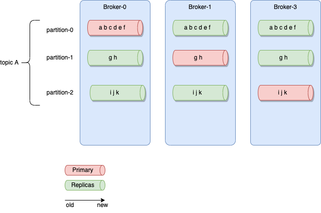
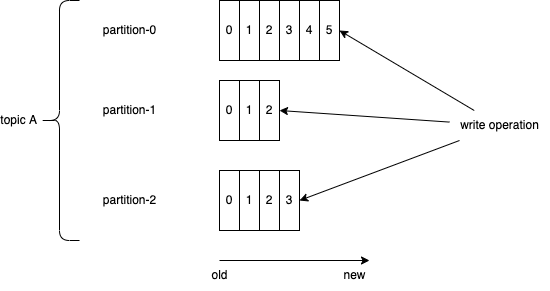
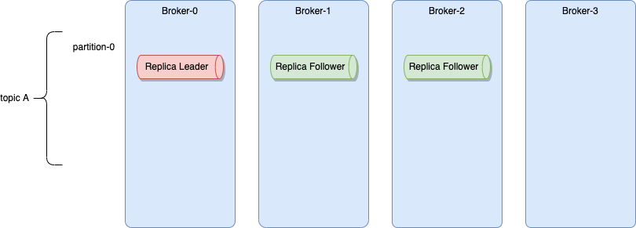
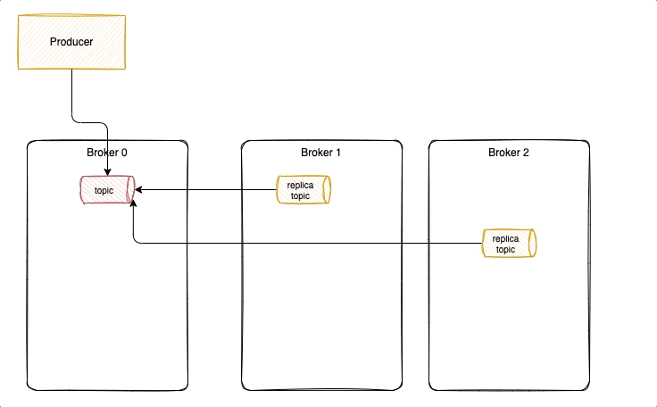
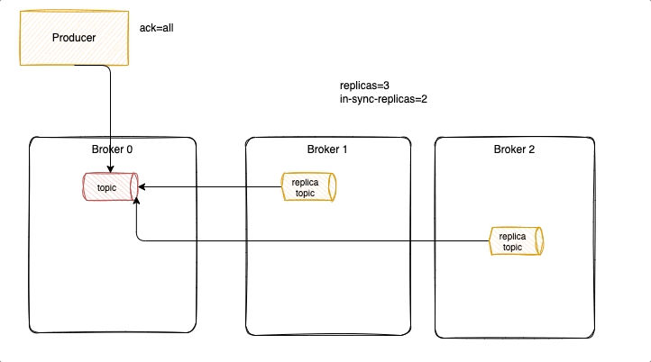
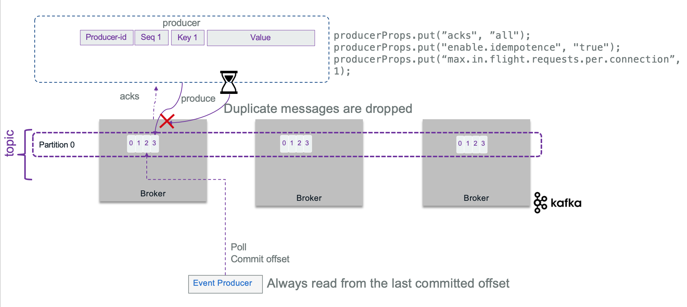

# Apache Kafka need to know

!!! Info "Update"
    Created 07/01/2023 - Updated 07/01/2024

This content is a summary of the Apache Kafka open-source project, one of the most important event backbone to support EDA. This content does not replace [the excellent introduction](https://kafka.apache.org/intro) every developer using Kafka should read, but provides support for analysis, design and implementation discussions.

## Introduction

[Kafka](https://kafka.apache.org) is a distributed real-time event streaming platform with the following key capabilities:

* Publish and subscribe streams of records. Data are stored on disks with the kafka replication protocol. Consumer applications can pull the information when they need, and keep track of what they have seen so far.
* It can handle hundreds of read and write operations per second from many producers and consumers.
* Supports Atomic broadcast, sends a record once, and every subscriber gets it once.
* Replicate stream of data within the distributed cluster for fault-tolerance. Persist data during a given time period before deleting records.
* Elastic horizontal scaling and transparently for the client applications with no downtime.
* Until version 3, it is built on top of the ZooKeeper synchronization service to keep topic, partitions and metadata highly available. After version 3 it uses the Kraft  protocol, which integrates metadata management into Kafka itself.

Here is the standard architecture view:

{ width=900 }

* **Kafka** runs as a cluster of **broker** servers that can, in theory, span multiple availability zones. Each broker manages data replication, topic/partition management, and offset management.
To cover multiple availability zones within the same cluster, the network latency needs to be very low, at the 15ms or less, as there is a lot of communication between kafka brokers and between kafka brokers and zookeeper servers. With Kraft the latency still needs to be very low.
* The **Kafka** cluster stores streams of records in **topics**. Topic is referenced by producer application to send data to, and subscribed by consumers to get data from. Data in topic is persisted to file systems for a retention time period (Defined at the topic level). The file system can be a network based (SAN).

In the figure above, the **Kafka** brokers are allocated on three servers, with data within the topic are replicated two times. In production, it is recommended to use at least five nodes to authorize planned failure and un-planned failure, and when doing replicas, use a replica factor at least equals to three.

## Zookeeper

Zookeeper is used to persist the component and the platform states. It runs in cluster of at least three nodes to ensure high availability. One zookeeper server is the leader and other are used in backup.

* Kafka does not keep state regarding consumers and producers.
* Depending of the kafka version, offsets are maintained in Zookeeper or in **Kafka**: newer versions use an internal Kafka topic called `__consumer_offsets`. In any case, consumers can read next messages (or from a specific offset) correctly even during broker server outrages.
* Access Controls are saved in Zookeeper.

As of Kafka 2.8+ Zookeeper is becoming optional and the Kraft protocol is used to exchange cluster management metadata.

## Topics

Topics represent end-points to publish and consume records.

* Each record consists of a key, a value (the data payload as byte array), a timestamp and some metadata.
* Producers publish data records to topic and consumers subscribe to topics. When a record is produced without specifying a partition, a partition will be chosen using a hash of the key. If the record did not provide a timestamp, the producer will stamp the record with its current time (creation time or log append time). Producers hold a pool of buffers to keep records not yet transmitted to the server.
* Kafka stores log data in its `log.dir` and topics map to subdirectories in this log directory.
* **Kafka** uses topics with a pub/sub combined with queue model: it uses the concept of consumer group to divide the processing over a collection of consumer processes, running in parallel, and messages can be broadcasted to multiple groups.
* Consumer performs asynchronous pull to the connected brokers via the subscription to a topic.

The figure below illustrates one topic having multiple partitions, replicated within the broker cluster:

{ width=900 }

## Partitions

Partitions are basically used to parallelize the event processing when a single server would not be able to process all events, using the broker clustering. So to manage increase in the load of messages, Kafka uses partitions.

{ width=700 }

* Each broker may have zero or more partitions per topic. When creating topic, users specify the number of partition to use.
* Kafka tolerates up to N-1 server failures without losing any messages. N is the replication factor for a given partition.
* Each partition is a time ordered immutable sequence of records, that are persisted for a long time period. Topic is a labelled log.
* Consumers see messages in the order they are stored in the log.
* Each partition is replicated across a configurable number of servers for fault tolerance. The number of partition will depend on characteristics like the number of consumers, the traffic pattern, etc... You can have 2000 partitions per broker.
* Each partitioned message has a unique sequence id called **offset** ("a,b,c,d,e, .." in the figure above are offsets). Those offset ids are defined when events arrived at the broker level, and are local to the partition. They are immutable.
* When a consumer reads a topic, it actually reads data from all the partitions. As a consumer reads data from a partition, it advances its offset. To read an event the consumer needs to use the topic name, the partition number and the last offset to read from.
* Brokers keep offset information in an hidden topic.
* Partitions guarantee that data with the same keys will be sent to the same consumer and in order.
* The older records are deleted after a given time period or if the size of log goes over a limit.
It is possible to compact the log. The log compaction means, the last known value for each message key is kept. Compacted Topics
are used in Streams processing for stateful operator to keep aggregate or grouping by key. You can read more about [log compaction from the kafka doc](https://kafka.apache.org/documentation/#design_compactionbasics).

## Replication

Each partition can be replicated across a number of servers. The replication factor is captured by the number of brokers to be used for replication. To ensure high availability it should be set to at least a value of three.
Partitions have one leader and zero or more followers.



The leader manages all the read and write requests for the partition. The followers replicate the leader content. 

It is not recommended to get the same number of replicas as the number of brokers. 

There is a consumer capability, that can be enabled, to consume from a replica, to optimize read latency when consumers are closer to the broker server. Without this configuration, the consumer reads from the partition leader.

## Producer applications

A producer is a thread safe kafka client API that publishes records to the cluster. It uses buffers, thread pool, and serializers to send data. They are stateless: the consumers is responsible to manage the offsets of the message they read. When the producer connects via the initial bootstrap connection, it gets the metadata about the topic - partition and the leader broker to connect to. 

The assignment of messages to partition is done following different algorithms: 1/ round-robin if there is no key specified, 2/ using the hash code of the key, or 3/ custom defined.

### Design considerations

When developing a record producer, we need to assess the following needs:

* What is the event payload to send? Is is a root aggregate, as defined in domain-driven design, with value objects?  Does it need to be kept in sequence to be used as event sourcing? or order does not matter? Remember that when order is important, messages need to go to the same topic/partition. When multiple partitions are used, the messages with the same key will go to the same partition to guaranty the order. See related discussions [from Martin Kleppmann on confluent web site](https://www.confluent.io/blog/put-several-event-types-kafka-topic/). Also to be exhaustive, it is possible to get a producer doing retries that could generate duplicate records as acknowledges may take time to come: within a batch of n records, if the producer did not get all the n acknowledges on time, it may resend the batch. This is where 'idempotence' becomes important (see later section).
* Is there a strong requirement to manage the schema definition? When using one topic to manage all events about a unique business entity, then be sure to support a flexible, polymorphic [avro schema](https://avro.apache.org/docs/1.8.1/spec.html).
* What is the expected throughput to send events? Event size * average throughput combined with the expected latency help to compute buffer size. By default, the buffer size is set at 37Mb, but can be configured with `buffer.memory` property. (See [producer configuration API](https://kafka.apache.org/37/javadoc/org/apache/kafka/clients/producer/ProducerConfig.html))
* Can the producer batches events together to send them in batch over one send operation? By design kafka producers batch events.
* Is there a risk for loosing communication? Tune the RETRIES_CONFIG and buffer size, and ensure to have at least 3 or even better 5, brokers within the cluster to maintain quorum in case of one failure. The client API is implemented to support reconnection.
* When deploying kafka on Kubernetes, it is important to proxy the broker URLs with a proxy server outside of kubernetes. The HAProxy needs to scale, and as the kafka traffic may become important, it may make sense to have a dedicated HAProxy for clients to brokers traffic.

* Assess *exactly once* delivery requirement. Look at idempotent producer to support deduplication of retries (see [section](#how-to-support-exactly-once-delivery) below).
* Partitions help to scale the consumer processing of messages, but it also helps the producer to be more efficient as it can send messages in parallel to different partition.
* Where the event timestamp comes from? Should the producer send() operation set it or is it loaded from external data? Remember that `LogAppendTime` is considered to be processing time, and `CreateTime` is considered to be event time.

### Typical producer code structure

The producer code, using java or python API, does the following steps:

* define producer properties
* create a producer instance
* connect to the bootstrap URL, get a broker leader
* send event records and get resulting metadata.

Producers are thread safe. The `send()` operation is asynchronous and returns immediately once record has been stored in the buffer of records, and it is strongly recommended to add a callback function to process the broker acknowledgements.

[Here is an example of producer code from the quick start.](https://github.com/jbcodeforce/eda-quickstarts/tree/main/quarkus-kafka-producer)

### Kafka Producer APIs

Here is a list of common API to use in producer app:

* [KafkaProducer](https://kafka.apache.org/37/javadoc/org/apache/kafka/clients/producer/KafkaProducer.html) A Kafka client that publishes records to the Kafka cluster.  The send method is asynchronous. A producer is thread safe so we can have a per topic thread.
* [ProducerRecord](https://kafka.apache.org/37/javadoc/org/apache/kafka/clients/producer/ProducerRecord.html) to be published to a topic
* [RecordMetadata](https://kafka.apache.org/37/javadoc/org/apache/kafka/clients/producer/RecordMetadata.html) metadata for a record that has been acknowledged by the server.

### Properties to consider

The following properties are helpful to tune at each topic and producer level and will vary depending on the requirements:  

 | Properties | Description |
 | --- | --- |
 | BOOTSTRAP_SERVERS_CONFIG |  A comma-separated list of host:port values for all the brokers deployed. So producer may use any brokers |
 | KEY_SERIALIZER_CLASS_CONFIG and VALUE_SERIALIZER_CLASS_CONFIG |convert the keys and values into byte arrays. Using default String serializer should be a good solution for Json payload. For streaming app, use customer serializer.|
 | ACKS_CONFIG | specifies the minimum number of acknowledgments from a broker that the producer will wait for, before considering a record send completed. Values = all, 0, and 1. 0 is for fire and forget. |
 | RETRIES_CONFIG | specifies the number of times to attempt to resend a batch of events. |
 | ENABLE_IDEMPOTENCE_CONFIG | Set to true, the number of retries may be maximized, and the acks will be set to `All`.|  
 | TRANSACTION_ID | A unique identifier for a producer. In case of multiple producer instances, a same ID will mean a second producers can commit the transaction. Epoch number, linked to the process ID, avoid having two producers doing this commit. If no transaction ID is specified, the transaction will be valid within a single session.|

### Advanced producer guidances

#### How to support exactly once delivery

Knowing that exactly once delivery is one of the hardest problems to solve in distributed systems, how kafka does it?. Broker can fail or a network may respond slowly while a producer is trying to send events.

Producer can set acknowledge level to control the delivery semantic to ensure not losing data. The following semantic is supported:

* **At least once**: means the producer set  `ACKS=1` and get an acknowledgement message when the message sent, has been written to a disk at least one time in the cluster (assume replicas = 3).  If the ack is not received, the producer may retry, which may generate duplicate records in case the broker stops after saving to the topic and before sending back the acknowledgement message.
* **At most semantic**: means the producer will not do retry in case of no acknowledge received. It may create log and compensation, but the message may be lost.
* **Exactly once** means, even if the producer sends the message twice the system will send only one message to the consumer. Once the consumer commits the read offset, it will not receive the message again, even if it restarts. Consumer offset needs to be in sync with produced event.

With `acks = 1` it is possible to lose messages, as illustrated in the following diagram, where new messages were not replicated yet, and ack was already sent back to the producer. Losing messages will depend if a replica is taking the leader position or not, or if the failed broker goes back online before replicas election but has no `fsynch` to the disk before the crash. 

{ width=900 }

To avoid that we need to have full acknowledge (`ack=-1`), configure three replicas and in-sync-replica=2 (send ack if 2 over 3 replicas are successful). When broker fails, a new leader is selected with the replicated messages, it becomes the partition leader and others start to replicate from it. Producer reconnects to the partition leader.

{ width=900 }

Here is an example of cluster replication configuration set for all topics:

```yaml
spec:
    strimziOverrides:
        kafka:
            config:
                default.replication.factor: 3
                min.insync.replicas: 2
```

But it can be specified at the topic level:

```yaml
kind: KafkaTopic
metadata:
  name: rt-store.inventory
  namespace: rt-inventory-dev
  labels:
    eventstreams.ibm.com/cluster: dev
spec:
  partitions: 1
  replicas: 3
  config:
    min.insync.replicas: 1
```

At the best case scenario, with a replica factor set to 3, a broker responding on time to the producer, and with a consumer reading from the last committed offset, then committing its offset by code, it is then possible to get only one message end to end.

{ width=900 }

Sometime the brokers will not send acknowledge in expected time, and the producer may decide to send the records again, generating duplicate records...

{ width=900 }

To avoid duplicate messages at the broker level, when acknowledge is set to ALL, the producer can also set idempotence flag: `ENABLE_IDEMPOTENCE_CONFIG = true`. With the idempotence property, the record sent, has a sequence number and a producer id, so that the broker keeps the last sequence number per producer and per partition. If a message is received with a lower sequence number, it means a producer is doing some retries on record already processed, so the broker will drop it. If the id is greater than current id known by the broker, the broker will create an OutOfSequence exception, which may be fatal as records may have been lost.

{ width=900 }

The sequence number is persisted in a log so even in case of broker leader failure, the new leader will have a good view of the states of the system.

> The replication mechanism guarantees that, when a message is written to the leader replica, it will be replicated to all available replicas.
> As soon as we want to get acknowledge of all replicates, it is obvious to set idempotence to true. It does not impact performance.

To add to this discussion, as topic may have multiple partitions, idempotent producers do not provide guarantees for writes across multiple Topic-Partition. For that Kafka supports atomic writes to all partitions, so that all records are saved or none of them are visible to consumers. This transaction control is done by using the producer transactional API, and a transacitional protocol with coordinator and control message. Here is an example of such configuration that can be done in a producer constructor method:

```java
producerProps.put("enable.idempotence", "true");
producerProps.put("transactional.id", "prod-1");
kafkaProducer.initTransactions()
```

`initTransactions()` registers the producer with the broker as one that can use transaction, identifying it by its `transactional.id` and a sequence number, or epoch. Epoch is used to avoid an old producer to commit a transaction while a new producer instance was created for that and continues its work.

Kafka streams with a consume-process-produce loop requires transaction and exactly once delivery. Even commiting its read offset is part of the transaction. So Producer API has a [sendOffsetsToTransaction method](https://kafka.apache.org/37/javadoc/org/apache/kafka/clients/producer/KafkaProducer.html#sendOffsetsToTransaction-java.util.Map-org.apache.kafka.clients.consumer.ConsumerGroupMetadata-).

See the [KIP 98 for details.](https://cwiki.apache.org/confluence/display/KAFKA/KIP-98+-+Exactly+Once+Delivery+and+Transactional+Messaging)

In case of multiple partitions, the broker will store a list of all updated partitions for a given transaction.

To support transaction, a transaction coordinator keeps its states into an internal topic (TransactionLog). Control messages are added to the main topic but never exposed to the 'user-app', so that consumers have the knowledge if a transaction is committed or not. 

See the [code in order command](https://github.com/jbcodeforce/refarch-kc-order-ms/blob/53bbb8cdeac413883ca2ccf521eb0797a43f45a3/order-command-ms/src/main/java/ibm/gse/orderms/infrastructure/kafka/OrderCommandProducer.java#L46) microservice.

The consumer is also interested to configure the reading of the transactional messages by defining the isolation level. Consumer waits to read transactional messages until the associated transaction has been committed. Here is an example of consumer code and configuration

```java
consumerProps.put("enable.auto.commit", "false");
consumerProps.put("isolation.level", "read_committed");
```

With `read_committed`, no message that was written to the input topic in the same transaction will be read by this consumer until message replicas are all written.

In consume-process-produce loop, producer commits its offset with code, and specifies the last offset to read.

```java
offsetsToCommit.put(partition, new OffsetAndMetadata(offset + 1))
producer.sendOffsetsToTransaction(offsetsToCommit, "consumer-group-id");
```

The producer then commits the transaction.

```java
try {
    kafkaProducer.beginTransaction();
    ProducerRecord<String, String> record = new ProducerRecord<>(ApplicationConfig.ORDER_COMMAND_TOPIC, key, value);
    Future<RecordMetadata> send = kafkaProducer.send(record, callBackFunction);

    kafkaProducer.commitTransaction();
} catch (KafkaException e){
    kafkaProducer.abortTransaction();
}
```

There is an interesting [article](https://www.baeldung.com/kafka-exactly-once) from the Baeldung team about exactly once processing in kafka with code example which we have re-used to implement the order processing in our [Reefer Container Shipment reference application](https://jbcodeforce.github.io/refarch-kc/) and explained [here](https://jbcodeforce.github.io/refarch-kc/orders/order/)

### More readings

* [Creating advanced kafka producer in java - Cloudurable](http://cloudurable.com/blog/kafka-tutorial-kafka-producer-advanced-java-examples/index.html)
* [Confluent blog: Exactly-once Semantics are Possible: Here’s How Kafka Does it](https://www.confluent.io/blog/exactly-once-semantics-are-possible-heres-how-apache-kafka-does-it/)
* [Order management with CQRS in Java](https://github.com/jbcodeforce/refarch-kc-order-ms)
* [EDA quickstart Quarkus Producer API](https://github.com/jbcodeforce/eda-quickstart)
* [Event driven microservice template](https://github.com/jbcodeforce/microprofile-event-driven-microservice-template/)


## Consumer App

See [dedicated chapter](./consumer.md).

### Consumer group

This is the way to group consumers so the processing of event is parallelized. 
The number of consumers in a group is the same as the number of partition defined in a topic. 
We are detailing consumer group implementation in [this note](./consumer.md#consumer-group).

## Kafka Streams

An api to develop streaming processing application. See [deeper dive, demos and labs in the kafka-studies repository](https://github.com/jbcodeforce/kafka-studies)


## Additional readings

### Microservices and event-driven patterns

* [API for declaring messaging handlers using Reactive Streams](https://github.com/eclipse/microprofile-reactive-messaging/blob/master/spec/src/main/asciidoc/architecture.asciidoc)
* [Microservice patterns - Chris Richardson](https://www.manning.com/books/microservices-patterns)
* [Develop Stream Application using Kafka](https://Kafka.apache.org/37/documentation/streams/)

### Kafka

* [Start by reading Kafka introduction - a must read!](https://kafka.apache.org/intro)
* [Another introduction from Confluent, one of the main contributors of the open source.](http://www.confluent.io/blog/introducing-Kafka-streams-stream-processing-made-simple)
* [Using Kafka Connect to connect to enterprise MQ systems - Andrew Schofield](https://medium.com/@andrew_schofield/using-kafka-connect-to-connect-to-enterprise-mq-systems-5674d53fe55e)
* [Does Apache Kafka do ACID transactions? - Andrew Schofield](https://medium.com/@andrew_schofield/does-apache-kafka-do-acid-transactions-647b207f3d0e)
* [Spark and Kafka with direct stream, and persistence considerations and best practices](http://aseigneurin.github.io/2016/05/07/spark-kafka-achieving-zero-data-loss.html)
* [Example in scala for processing Tweets with Kafka Streams](https://www.madewithtea.com/processing-tweets-with-kafka-streams.html)

### Conferences, Talks, and Sessions

* [Kafka Summit 2016 - San Francisco](https://www.confluent.io/resources/kafka-summit-san-francisco-2016/)
* [Kafka Summit 2017 - New York](https://www.confluent.io/resources/kafka-summit-new-york-2017/)
* [Kafka Summit 2017 - San Francisco](https://www.confluent.io/resources/kafka-summit-san-francisco-2017/)
* [Kafka Summit 2018 - San Francisco](https://www.confluent.io/resources/kafka-summit-san-francisco-2018/)
* [Kafka Summit 2019 - San Francisco](https://www.confluent.io/resources/kafka-summit-san-francisco-2019/)
* [Kafka Summit 2019 - London](https://www.confluent.io/resources/kafka-summit-london-2019/)
* [Kafka Summit 2020 - Virtual](https://www.confluent.io/resources/kafka-summit-2020/)
* [Kafka Summit 2022 - Recap](https://www.confluent.io/en-gb/blog/kafka-summit-london-2022-recap/)