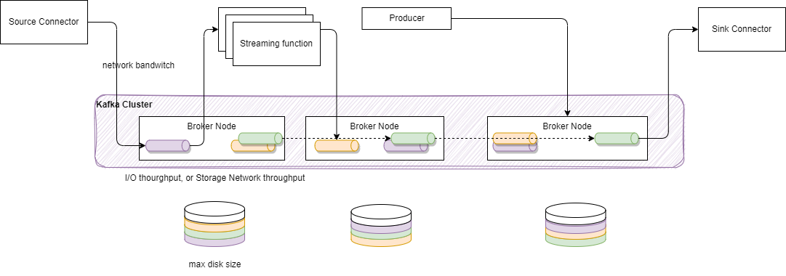
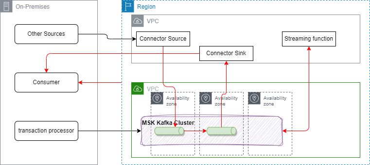

# Apache Kafka need to know

!!! Info "Update"
    Created 07/01/2023 - Updated 07/01/2024

This content is a summary of the Apache Kafka open-source project, one of the most important event backbone to support EDA. This content does not replace [the excellent introduction](https://kafka.apache.org/intro) every developer using Kafka should read, but provides support for analysis, design and implementation discussions.

## Introduction

[Kafka](https://kafka.apache.org) is a distributed real-time event streaming platform with the following key capabilities:

* Publish and subscribe streams of records. Data are stored on disks with the kafka replication protocol. Consumer applications can pull the information when they need, and keep track of what they have seen so far.
* It can handle hundreds of read and write operations per second from many producers and consumers.
* Supports Atomic broadcast, sends a record once, and every subscriber gets it once.
* Replicate stream of data within the distributed cluster for fault-tolerance. Persist data during a given time period before deleting records.
* Elastic horizontal scaling and transparently for the client applications with no downtime.
* Until version 3, it is built on top of the ZooKeeper synchronization service to keep topic, partitions and metadata highly available. After version 3 it uses the Kraft  protocol, which integrates metadata management into Kafka itself.

Here is the standard architecture view:

{ width=900 }

* **Kafka** runs as a cluster of **broker** servers that can, in theory, span multiple availability zones. Each broker manages data replication, topic/partition management, and offset management.
To cover multiple availability zones within the same cluster, the network latency needs to be very low, at the 15ms or less, as there is a lot of communication between kafka brokers and between kafka brokers and zookeeper servers. With Kraft the latency still needs to be very low.
* The **Kafka** cluster stores streams of records in **topics**. Topic is referenced by producer application to send data to, and subscribed by consumers to get data from. Data in topic is persisted to file systems for a retention time period (Defined at the topic level). The file system can be a network based (SAN).

In the figure above, the **Kafka** brokers are allocated on three servers, with data within the topic are replicated two times. In production, it is recommended to use at least five nodes to authorize planned failure and un-planned failure, and when doing replicas, use a replica factor at least equals to three.

## Zookeeper

Zookeeper is used to persist the component and the platform states. It runs in cluster of at least three nodes to ensure high availability. One zookeeper server is the leader and other are used in backup.

* Kafka does not keep state regarding consumers and producers.
* Depending of the kafka version, offsets are maintained in Zookeeper or in **Kafka**: newer versions use an internal Kafka topic called `__consumer_offsets`. In any case, consumers can read next messages (or from a specific offset) correctly even during broker server outrages.
* Access Controls are saved in Zookeeper.

As of Kafka 2.8+ Zookeeper is becoming optional and the Kraft protocol is used to exchange cluster management metadata.

## Topics

Topics represent end-points to publish and consume records.

* Each record consists of a key, a value (the data payload as byte array), a timestamp and some metadata.
* Producers publish data records to topic and consumers subscribe to topics. When a record is produced without specifying a partition, a partition will be chosen using a hash of the key. If the record did not provide a timestamp, the producer will stamp the record with its current time (creation time or log append time). Producers hold a pool of buffers to keep records not yet transmitted to the server.
* Kafka stores log data in its `log.dir` and topics map to subdirectories in this log directory.
* **Kafka** uses topics with a pub/sub combined with queue model: it uses the concept of consumer group to divide the processing over a collection of consumer processes, running in parallel, and messages can be broadcasted to multiple groups.
* Consumer performs asynchronous pull to the connected brokers via the subscription to a topic.

The figure below illustrates one topic having multiple partitions, replicated within the broker cluster:

{ width=900 }

## Partitions

Partitions are basically used to parallelize the event processing when a single server would not be able to process all events, using the broker clustering. So to manage increase in the load of messages, Kafka uses partitions.

{ width=700 }

* Each broker may have zero or more partitions per topic. When creating topic, users specify the number of partition to use.
* Kafka tolerates up to N-1 server failures without losing any messages. N is the replication factor for a given partition.
* Each partition is a time ordered immutable sequence of records, that are persisted for a long time period. Topic is a labelled log.
* Consumers see messages in the order they are stored in the log.
* Each partition is replicated across a configurable number of servers for fault tolerance. The number of partition will depend on characteristics like the number of consumers, the traffic pattern, etc... You can have 2000 partitions per broker.
* Each partitioned message has a unique sequence id called **offset** ("a,b,c,d,e, .." in the figure above are offsets). Those offset ids are defined when events arrived at the broker level, and are local to the partition. They are immutable.
* When a consumer reads a topic, it actually reads data from all the partitions. As a consumer reads data from a partition, it advances its offset. To read an event the consumer needs to use the topic name, the partition number and the last offset to read from.
* Brokers keep offset information in an hidden topic.
* Partitions guarantee that data with the same keys will be sent to the same consumer and in order.
* The older records are deleted after a given time period or if the size of log goes over a limit.
It is possible to compact the log. The log compaction means, the last known value for each message key is kept. Compacted Topics
are used in Streams processing for stateful operator to keep aggregate or grouping by key. You can read more about [log compaction from the kafka doc](https://kafka.apache.org/documentation/#design_compactionbasics).

## Replication

Each partition can be replicated across a number of servers. The replication factor is captured by the number of brokers to be used for replication. To ensure high availability it should be set to at least a value of three.
Partitions have one leader and zero or more followers.

The leader manages all the read and write requests for the partition. The followers replicate the leader content. 

It is not recommended to get the same number of replicas as the number of brokers. 

There is a consumer capability, that can be enabled, to consume from a replica, to optimize read latency when consumers are closer to the broker server. Without this configuration, the consumer reads from the partition leader.

## Consumer App

See [dedicated chapter](./consumer.md).

### Consumer group

This is the way to group consumers so the processing of event is parallelized. 
The number of consumers in a group is the same as the number of partition defined in a topic. 
We are detailing consumer group implementation in [this note](./consumer.md#consumer-group).

## Kafka Streams

An api to develop streaming processing application. See [deeper dive, demos and labs in the kafka-studies repository](https://github.com/jbcodeforce/kafka-studies)

## Cost dimensions

Sizing a Kafka cluster can be complex, but it’s not always necessary to determine the exact specifications upfront. Adding nodes to the cluster is straightforward, and a single Kafka cluster can scale to hundreds of nodes. However, it’s important to conduct a budget assessment to evaluate the potential costs of transitioning to an event backbone like Kafka. Abaccus used in sizing may be tuned and adapted by your own performance tests.

The ingestion rate and data size are the primary factors to consider, but they are not the only ones. Let’s begin by defining the key dimensions. Using the diagram below, architects should evaluate the number of potential event sources that will be ingested through source connectors. For each major inbound flow, we need to assess the number of messages per second and their average size. It may also be helpful to analyze average, 90th percentile (p90), and peak values. 

Each message in Kafka is replicated, which means that the disk size on each broker must account for the ingestion rate, the replication factor, and the **retention time**. With three nodes and a replication factor of three, each node needs sufficient disk space to maintain a steady state for the ingestion rate. All traffic that arrives in each broker from producers and replication traffic from other brokers is eventually persisted to storage volumes attached to the broker.

The most common resource bottlenecks for clusters, from an infrastructure perspective, are network throughput, storage throughput, and the network throughput between brokers and the storage backend, particularly for brokers utilizing network-attached storage. Consider increasing the volume throughput if possible or adding more volumes to the cluster.

Next, the estimations should consider the number of streaming functions that will consume events from topics and generate new messages for other topics. These new messages will contribute to the inbound metrics. On average, the number of messages processed by these functions may approach the input message count. For example, if there are 1,000 messages per second on the left side of the diagram, each function may read and produce approximately 1,000 messages. Thus, multiplying the input rate by the number of functions provides a good estimate.

However, it's important to note that some functions will compute aggregates over time windows, resulting in fewer output messages compared to the input messages. Additionally, modern event-driven microservices may also generate their own events that adds to the ingestion global throughput.

Finally some topics will be consumed to send messages to sink, so leaving the universe of Kafka, with one important dimension being the **number of consumers** to get those messages to.

The most common resource bottlenecks for clusters, from an infrastructure perspective, are network throughput, storage throughput, and the network throughput between brokers and the storage backend, particularly for brokers utilizing network-attached storage. Having more brokers is helping to support more throughput. The max throughput of a cluster is represented by the following function:

$$
\max(T_{cluster}) = \min( \max(T_{storage}) * brokers / replicas,
                          \max(T_{SAN network}) * brokers / replicas, 
                          \max(T_{network}) * brokers / (consumergroups + replicas - 1))
$$

The more consumer groups there are, the greater the outbound data traffic on the broker's network. When the number of consumers is larger than 1, the broker network traffic is always higher than the traffic into the broker. We can therefore ignore data traffic into brokers as a potential bottleneck. Increasing the number of consumer groups reading from a cluster decreases its sustained throughput limit

The number of brokers should account for maintenance, scaling, potential broker loss, or even the failure of an entire availability zone. When consumers fall behind or need to reprocess historical data, the requested data may no longer reside in memory, necessitating that brokers fetch it from the storage volume. This results in non-sequential I/O reads. When using Storage Area Network volumes, it also generates additional network traffic to the volume. Utilizing larger brokers with more memory or enabling compression can help mitigate this effect.

For sizing, it is assumed that producers load balance messages evently among brokers, there are enough partitions to support ingress throughput and consumers are reading from the last topic.

For disk attachment to broker, there are two choices: AN or local disk. With SAN the throughput is linked to the storage network throughput. While for local disk is it based on IOPS. It is important to note that with attached disk, that changing the broker means loosing disk, and the broker needs to reload from replicas from other brokers. With mounted disk, the access to the stored append log is quicker. With SAN, the throughput characteristics of the different volume types range between 128 MB/sec and 4000 MB/sec. Some cloud providers are also controlling the network bandwidth by VM type.

For production keeps the workload below 80% of the max sustained throughput. So when the SAN network is limited to 250 MB/s the throughput limit is: $$ 80\% * 250 = 200 MB/sec$$

When a consumer falls behind or needs to recover from failure it reprocesses older messages. In that case, the pages holding the data may no longer reside in the page cache, and brokers need to fetch the data from the SAN volume. That causes additional network traffic to the volume and non-sequential I/O reads. This can substantially impact the throughput of the SAN volume.

Amazon MSK recently has **provision storage** capacity to increase the throughput up to 1000 MB/sec. With self managed cluster on EC2, solution architects need to consider gp3. io2 or st1 volume types. But in this case, the VM network may become the bottleneck.

Finally encryption is CPU intensive, the brokers need to encrypt and decrypt individual messages.

### Cloud provider specifics

Cloud deployment brings its own challenges and costs: as seen in previous section, type of machine impacts IOPS and network throughput, and the number of brokers helps supporting higher throughput limit. Amazon MSK enforces that brokers are evenly balanced across all configured Availability Zones. So adding broker is always by a factor of # of AZs. Having too many small brokers cost more during maintenance operations.

Also having too big machine increases the blast radius in case of failure. 

MSK clusters have a sustained throughput limit and can burst to a higher throughput for short periods. The cluster can then instantaneously absorb much higher throughput for some time.

In the cloud, application placement will have an impact on throughput and also on the cost of the overall solution. In the figure below, the deployment uses a typical hybrid architecture, where applications are still running on-premises, while new cloud native apps are deployed on the cloud, container orchetration platform. 

Most of cloud providers do not charge inbound traffic, but charge outbound and cross- availability zones traffic. These are the red arrows in the figure. 

So the number of brokers, the number of replicas, the number of consumers and local producers will impact the overall cost. Look at the cost per GB/sec for VPC to VPC, outbound to on-premises servers.

## Additional readings

### Microservices and event-driven patterns

* [API for declaring messaging handlers using Reactive Streams](https://github.com/eclipse/microprofile-reactive-messaging/blob/master/spec/src/main/asciidoc/architecture.asciidoc)
* [Microservice patterns - Chris Richardson](https://www.manning.com/books/microservices-patterns)
* [Develop Stream Application using Kafka](https://Kafka.apache.org/37/documentation/streams/)

### Kafka

* [Start by reading Kafka introduction - a must read!](https://kafka.apache.org/intro)
* [Another introduction from Confluent, one of the main contributors of the open source.](http://www.confluent.io/blog/introducing-Kafka-streams-stream-processing-made-simple)
* [Using Kafka Connect to connect to enterprise MQ systems - Andrew Schofield](https://medium.com/@andrew_schofield/using-kafka-connect-to-connect-to-enterprise-mq-systems-5674d53fe55e)
* [Does Apache Kafka do ACID transactions? - Andrew Schofield](https://medium.com/@andrew_schofield/does-apache-kafka-do-acid-transactions-647b207f3d0e)
* [Spark and Kafka with direct stream, and persistence considerations and best practices](http://aseigneurin.github.io/2016/05/07/spark-kafka-achieving-zero-data-loss.html)
* [Example in scala for processing Tweets with Kafka Streams](https://www.madewithtea.com/processing-tweets-with-kafka-streams.html)

### Conferences, Talks, and Sessions

* [Kafka Summit 2016 - San Francisco](https://www.confluent.io/resources/kafka-summit-san-francisco-2016/)
* [Kafka Summit 2017 - New York](https://www.confluent.io/resources/kafka-summit-new-york-2017/)
* [Kafka Summit 2017 - San Francisco](https://www.confluent.io/resources/kafka-summit-san-francisco-2017/)
* [Kafka Summit 2018 - San Francisco](https://www.confluent.io/resources/kafka-summit-san-francisco-2018/)
* [Kafka Summit 2019 - San Francisco](https://www.confluent.io/resources/kafka-summit-san-francisco-2019/)
* [Kafka Summit 2019 - London](https://www.confluent.io/resources/kafka-summit-london-2019/)
* [Kafka Summit 2020 - Virtual](https://www.confluent.io/resources/kafka-summit-2020/)
* [Kafka Summit 2022 - Recap](https://www.confluent.io/en-gb/blog/kafka-summit-london-2022-recap/)