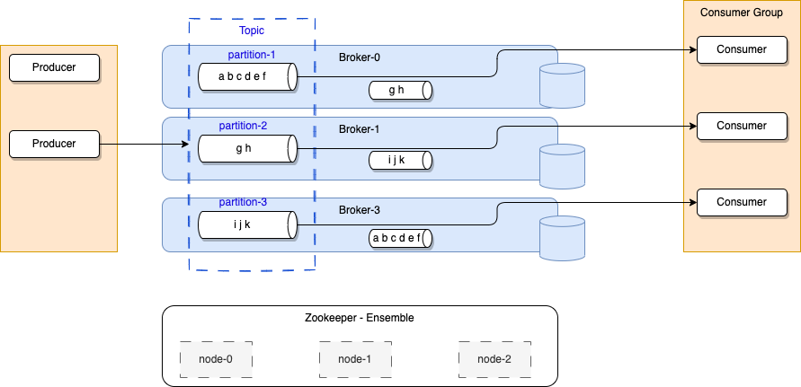

# Apache Kafka need to know

!!! Info "Update"
    Created 07/01/2023 - Updated 07/10/2023

This content is a summary of the things we need to know around Apache Kafka, one of the main event backbone to support EDA. It does not replace [the excellent introduction](https://Kafka.apache.org/intro) every developer using Kafka should read.

## Introduction

[Kafka](https://Kafka.apache.org) is a distributed real time event streaming platform with the following key capabilities:

* Publish and subscribe streams of records. Data are stored on disk so consuming applications can pull the information when they need, and keep track of what they have seen so far.
* It can handle hundreds of read and write operations per second from many producers and consumers.
* Atomic broadcast, send a record once, every subscriber gets it once.
* Replicate stream of data within the distributed cluster for fault-tolerance. Persist data for a given time period before delete.
* Elastic horizontal scaling and transparently with no downtime.
* Until version 3, it is built on top of the ZooKeeper synchronization service to keep topic, partitions and metadata highly available. After version 3 it uses it own protocol.

Here is the standard architecture view:

* **Kafka** runs as a cluster of **broker** servers that can, in theory, span multiple availability zones. Each brokers manages data replication, topic/partition management, offset management.
To cover multiple availability zones within the same cluster, the network latency needs to be very low, at the 15ms or less, as there is a lot of communication between kafka brokers and between kafka brokers and zookeeper servers.
* The **Kafka** cluster stores streams of records in **topics**. Topic is referenced by producer application to send data to, and subscribed by consumers to get data from. Data in topic is persisted to file systems for a retention time period (Defined at the topic level). The file system can be network based (SAN).

In the figure above, the **Kafka** brokers are allocated on three servers, with data within the topic are replicated two times. In production, it is recommended to use at least five nodes to authorize planned failure and un-planned failure, and when doing replicas, use a replica factor at least equals to three.
