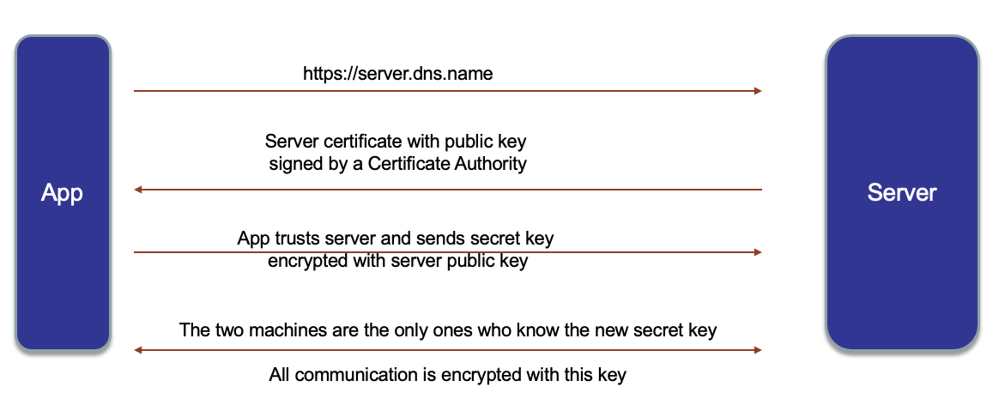
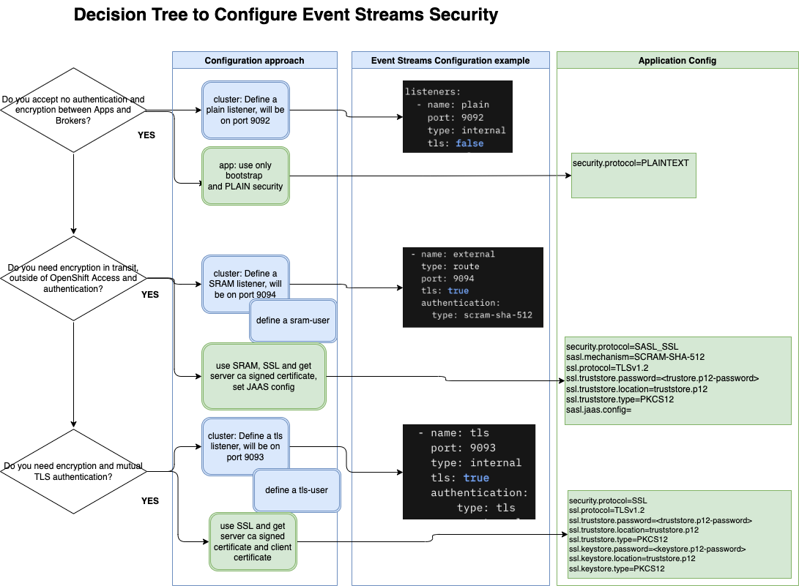

# Kafka Security Overview

???- Info "Versioning"
    Created 04/13/2022 - Updated 09/2024

Review **[this video for a refresh on SSL and TLS certificates](https://www.youtube.com/watch?v=T4Df5_cojAs)** and keep in mind what the speaker quotes:

> * Any message encrypted with Bob's public key can only be decrypted with Bob's private key
> * Anyone with access to Alice's public key can verify that a message could only have been created by someone with access to Alice's private key.



For a deeper dive into security administration see [this Confluent article ](https://docs.confluent.io/platform/current/security/overview.html) and [Kafka's product documentation](http://kafka.apache.org/documentation/#security).

We also **strongly recommend** reading Rick Osowski's Medium blogs [Part 1](https://rosowski.medium.com/kafka-security-fundamentals-the-rosetta-stone-to-your-event-streaming-infrastructure-518f49640db4) and [Part 2](https://rosowski.medium.com/kafka-security-fundamentals-adding-tls-to-your-event-driven-utility-belt-432307f4ff62) on Kafka security configuration.

## Understand the Kafka cluster listeners

You can secure your Kafka resources by managing the access each user and application has to each resource.

A Kafka cluster may be configured to expose up to 2 internal and 1 external Kafka listeners. These listeners provide the mechanism for Kafka client applications to communicate with the Kafka brokers and these can be configured as secured listeners (which is the default for the `tls` and `external` Kafka listener).

Each listener providing a connection to Kafka brokers can also be configured to authenticate connections with either Mutual TLS or SCRAM SHA 512 authentication mechanisms. 
Additionally, the Kafka cluster can be configured to authorize operations sent via an authenticated listener using access control list defined at the user level.

The following figure presents a decision tree and the actions to consider for configuring cluster and applications.



In Kafka, the following yaml snippet from an Strimzi instance definition defines the following Kafka listeners"

* One internal non secured kafka listener on port `9092` called `plain`
* One internal secured (TLS encrypted) Kafka listener on port `9093` called `tls`, which also enforces authentication throughout TLS,
* One external secured (TLS encrypted) Kafka listener on port `9094` called `external`, which also enforces authentication throughout SCRAM credentials, that is exposed through a route.

```yaml title="Cluster definition in Strimzi"
listeners:
  - name: plain
    port: 9092
    type: internal
    tls: false
  - name: tls  # (1)
    port: 9093
    type: internal  # (2)
    tls: true
    authentication:
        type: tls
  - name: external
    type: route
    port: 9094
    tls: true 
    authentication:
      type: scram-sha-512
```

1. `tls: true` enforces traffic encryption. Default is true for Kafka listeners on ports `9093` and `9094`
2. `type: internal` specifies that a Kafka listener is internal. Kafka listenes on ports `9092` and `9093` default to internal.


## Connect Kafka API

The most important and essential property to connect to Kafka brokers, is the `bootstrap.servers` property. This property tells Kafka clients what URL to use to talk to Kafka cluster. Based on that Kafka listener, developers may need to provide the application with extra configuration.

At the very minimum, they will need to set the [security.protocol](http://kafka.apache.org/documentation/#adminclientconfigs_security.protocol) property that will tell whether the application isconnecting to a secured Kafka listener or not. As a result, the values for `security.protocol` are:

* `PLAINTEXT` - using PLAINTEXT transport layer & no authentication - default value.
* `SSL` - using SSL transport layer & certificate-based authentication or no authentication.
* `SASL_PLAINTEXT` - using PLAINTEXT transport layer & SASL-based authentication.
* `SASL_SSL` - using SSL transport layer & SASL-based authentication.

Based on the above, the security protocol developers will use to connect to the different Kafka listeners that Kafka deploys are:

- `PLAINTEXT` when connecting to the non secured internal `plain` Kafka listener on port `9092`
- `SSL` when connecting to the secured (TLS encrypted) internal `tls` Kafka listener on port `9093` that also enforces authentication through TLS certificates
- `SASL_SSL` when connecting to the secured (TLS encrypted) external `external` Kafka listener on port `9094` that also enforces authentication through SCRAM credentials.

### Non-secured listener

You would only need to specify that there is no security in place for your application to connect to a non-secured kafka listener:

```properties title="Configuration properties"
security.protocol=PLAINTEXT
```

*Do not set `sasl.mechanisms` when security.protocol=PLAINTEXT*

### Secured listener

In order for the application to be able to connect to Kafka through the internal secured (TLS encrypted) Kafka listener, you need to set the appropriate value for `security.protocol`, as seen above, plus provide the Certificate Authority of the Kafka cluster (its public key).

Depending on the technology of the application, you will need to provide the Certificate Authority of the Kafka cluster for the TLS encryption either as a `PKCS12` certificate for a Java client or as a `PEM` certificate for anything else. `PKCS12` certificates (or truststores) come in the form of a `.p12` file and are secured with a password. You can inspect a `PKCS12` certificate with:

```sh
openssl pkcs12 -info -nodes -in truststore.p12
```

and providing the truststore password.

An example of the output would be:

```sh
MAC Iteration 100000
MAC verified OK
PKCS7 Encrypted data: Certificate bag
Bag Attributes
    friendlyName: ca.crt
    2.16.840.1.113894.746875.1.1: <Unsupported tag 6>
subject=/O=io.strimzi/CN=cluster-ca v0
issuer=/O=io.strimzi/CN=cluster-ca v0
-----BEGIN-----
MIIDOzCCAiOgAwIBAgI
....

Dl9DpLZo0fVoJF73k2z2mBk8gCjGqZk289octuOCr+MwXcGN6JTR2Iux05TBI6uf
924CQFYsZS2kdhl5GgqQ
-----END CERTIFICATE-----
```

On the other hand, `PEM` certificates come in the form of a `.pem` file and are not password protected.

You can inspect them using the `cat` command. 

The output should be the same certificate as the one provided within the `PKCS12` certificate:

```sh
cat es-cert.pem 
-----BEGIN CERTIFICATE-----
MIIDOzCCAiOgAwIBAgIUe0BjKXdgPF+AMpMXvPREf5XCZi8wDQYJKoZIhvcNAQEL
...
Dl9DpLZo0fVoJF73k2z2mBk8gCjGqZk289octuOCr+MwXcGN6JTR2Iux05TBI6uf
924CQFYsZS2kdhl5GgqQ
-----END CERTIFICATE-----
```

Once you have the Certificate Authority of your Kafka cluster, you will provide its location and password in your properties file through the `ssl.truststore.location` and `ssl.truststore.password` properties.


```properties title="Secured configuration"
security.protocol=SSL or SASL_SSL
ssl.protocol=TLSv1.2

ssl.truststore.password=<truststore.p12-password>
ssl.truststore.location=truststore.p12
ssl.truststore.type=PKCS12
```

where `security.protocol` will vary between `SSL` or `SASL_SSL` based on the authentication as you will see in the next section.

### Authentication

You have seen above that your Kafka listeners can require authentication to any application or client wanting to connect to the Kafka cluster through them. It was also said that authentication could be either of type SASL-based, through SCRAM (modern Salted Challenge Response Authentication Mechanism) credentials, or certificate-based (TLS). Either way, Kafka will handle authentication through `KafkaUser` objects. 

These objects that represent Kafka users of your Kafka instance will have their authentication (and authorization through ACLs) credentials or TLS certificates associated to them stored in a secret. In order to find out how to create these `KafkaUsers`, which will vary depending on the authentication method.

#### Scram

If you have created a `KafkaUser` to be used with a Kafka listener that requires SCRAM authentication, you will be able to retrieve its SCRAM credentials either from the Kafka UI at creation time or later on from the secret these are stored to:

```sh
oc extract secret/<KAFKA_USER> -n <NAMESPACE> --keys=sasl.jaas.config --to=-
```

where

- `<KAFKA_USER>` is the name of the `KafkaUser` object you created.
- `<NAMESPACE>` is the namespace where Kafka is deployed on.

Example:

```sh
oc extract secret/test-app -n tools --keys=sasl.jaas.config --to=-
# sasl.jaas.config
org.apache.kafka.common.security.scram.ScramLoginModule required username="test-app" password="VgWpkjAkvxH0";
```

You can see above your SCRAM username and password.

#### TLS

If you have created a `KafkaUser` to be used with a Kafka listener that requires TLS authentication, 
you will be able to retrieve its TLS certificates either from the Kafka UI at creation time in a zip folder or 
later on from the secret these are stored to.

First, describe the secret to see what certificates are stored in it:

```sh
$ oc describe secret test-app-tls -n tools
Name:         test-app-tls
Namespace:    tools
Labels:       app.kubernetes.io/instance=test-app-tls
              app.kubernetes.io/managed-by=strimzi-user-operator
              app.kubernetes.io/name=strimzi-user-operator
              app.kubernetes.io/part-of=eventstreams-test-app-tls
              eventstreams.ibm.com/cluster=es-inst
              eventstreams.ibm.com/kind=KafkaUser
Annotations:  <none>

Type:  Opaque

Data
====
user.key:       1704 bytes
user.p12:       2384 bytes
user.password:  12 bytes
ca.crt:         1180 bytes
user.crt:       1025 bytes
```

You can see that the secret will store the following:

- `user.key` and `user.crt` - the client certificate key-pair.
- `user.p12` - trustore that contains the `user.key` and `user.crt`.
- `user.password` - contains the `user.p12` truststore password.
- `ca.crt` - CA used to sign the client certificate key-pair.

Then, you can extract the appropriate certificate based on whether your application or Kafka client is Java based or not. In the case of a Java based application or Kafka client, extract the `user.p12` and `user.password`:

```sh
oc extract secret/<KAFKA_USER> -n <NAMESPACE> --keys=user.p12
oc extract secret/<KAFKA_USER> -n <NAMESPACE> --keys=user.password
```

where

- `<KAFKA_USER>` is the name of the `KafkaUser` object you created.
- `<NAMESPACE>` is the namespace where Kafka is deployed on.

#### Properties config

Now that you know how to get the authentication credentials or certificates for a proper authentication of your application or Kafka client you need to configure the appropriate properties for that:

- If your Kafka listener authentication method is SCRAM:

```properties title="Scram authentication with SSL encryption"
security.protocol=SASL_SSL

sasl.mechanism=SCRAM-SHA-512
sasl.jaas.config=org.apache.kafka.common.security.scram.ScramLoginModule required username\="<USERNAME>" password\="<PASSWORD>";
```

- If your Kafka listener authentication method is TLS:

```properties title="TLS authentication and SSL encryption"
security.protocol=SSL

ssl.keystore.location=<location_to_your_user.p12>
ssl.keystore.password=<user.p12-password>
ssl.keystore.type=PKCS12
```

## Recapitulation

Let's have a full look at how the Kafka communication properties, for a Java application or client, would look like for Kafka 
on RedHat OpenShift with the defaults. 

This translates to Strimzi (the open source project Kafka is based on) in:

```yaml
listeners:
  - name: tls
    port: 9093
    type: internal
    tls: true
    authentication:
        type: tls
  - name: external
    type: route
    port: 9094
    tls: true 
    authentication:
      type: scram-sha-512
```

Let's also add the `plain` non-secure Kafka listener to the picture so that all cases are covered in this recap section.

```yaml
listeners:
  plain: {}
  external:
    type: route
    authentication:
      type: scram-sha-512
  tls:
    authentication:
      type: tls
```

As a result, the Kafka instance deployed will count with:

* One internal non secured kafka listener on port `9092` called `plain`
* One internal secured (TLS encrypted) Kafka listener on port `9093` called `tls`, which also enforces authentication throughout TLS, and 
* One external secured (TLS encrypted) Kafka listener on port `9094` called `external`, which also enforces authentication throughout SCRAM credentials, that is exposed through a route.

### Plain

The Kafka properties configuration to get your application or Kafka client to properly connect and communicate through the non secured kafka listener on port `9092` called `plain` will be as follows:

```properties
# Internal plain listener
# =======================
security.protocol=PLAINTEXT
bootstrap.servers=<ES_NAME>-kafka-bootstrap.<NAMESPACE>.svc\:9092
```

where

- `<ES_NAME>` is the name of the Kafka instance deployed you are trying to connect to.
- `<NAMESPACE>` is the namespace the Kafka instance you are trying to connect to is deployed in.

### Internal tls

The Kafka properties configuration to get your application or Kafka client to properly connect and communicate through the internal s
ecured (TLS encrypted) Kafka listener on port `9093` called `tls`, which also enforces authentication throughout mTLS will be as follows:

```properties
# Internal tls listener
# =====================
bootstrap.servers=<<ES_NAME>-kafka-bootstrap.<NAMESPACE>.svc\:9093

security.protocol=SSL
ssl.protocol=TLSv1.2

## mTLS Authentication for the client.
ssl.keystore.location=<user.p12-location>
ssl.keystore.password=<user.p12-password>
ssl.keystore.type=PKCS12

## Certificate Authority of your Kafka cluster
ssl.truststore.password=<trustore.p12-password>
ssl.truststore.location=<truststore.p12-location>
ssl.truststore.type=PKCS12
```

where

- `<ES_NAME>` is the name of the Kafka instance deployed you are trying to connect to.
- `<NAMESPACE>` is the namespace the Kafka instance you are trying to connect to is deployed in.
- `<user.p12-location>` is the location of the `user.p12` truststore containing the `user.key` and `user.crt` client certificate key-pair for the application or client mTLS authentication as explained above.
- `<user.p12-password>` is the password of the `<user.p12>` truststore.
- `<truststore.p12-location>` is the location of the Certificate Authority of your Kafka cluster to establish mTLS encryted communication between your Kafka instance and your application or Kafka client.
- `<trustore.p12-password>` is the password for the `truststore.p12` truststore.

When the application is deployed on OpenShift, certificates will be mounted to the application pod. Below is an example of a Quarkus app deployment 
descriptor, with environment variables:

```yaml
env:
  - name: KAFKA_SSL_TRUSTSTORE_FILE_LOCATION
  value: /deployments/certs/server/ca.p12
- name: KAFKA_SSL_TRUSTSTORE_TYPE
  value: PKCS12
- name: KAFKA_SSL_KEYSTORE_FILE_LOCATION
  value: /deployments/certs/user/user.p12
- name: KAFKA_SSL_KEYSTORE_TYPE
  value: PKCS12
- name: KAFKA_SECURITY_PROTOCOL
  value: SSL
- name: KAFKA_USER
  value: tls-user
- name: KAFKA_CERT_PWD
  valueFrom:
    secretKeyRef:
      key: ca.password
      name: kafka-cluster-ca-cert
- name: USER_CERT_PWD
  valueFrom:
    secretKeyRef:
      key: user.password
      name: tls-user
# ...
        volumeMounts:
        - mountPath: /deployments/certs/server
          name: kafka-cert
          readOnly: false
          subPath: ""
        - mountPath: /deployments/certs/user
          name: user-cert
          readOnly: false
          subPath: ""
      volumes:
      - name: kafka-cert
        secret:
          optional: true
          secretName: kafka-cluster-ca-cert
      - name: user-cert
        secret:
          optional: true
          secretName: tls-user
```

### External tls

The Kafka properties configuration to get your application or Kafka client to properly connect and communicate through the external secured (TLS encrypted) Kafka listener on port `9094` called `external`, which also enforces authentication throughout SCRAM credentials, and that is exposed through a route will be as follows:

```properties
# External listener SCRAM
# =======================
bootstrap.servers=<ES_NAME>-kafka-bootstrap-<NAMESPACE>.<OPENSHIFT_APPS_DNS>\:443

security.protocol=SASL_SSL
ssl.protocol=TLSv1.2

## Certificate Authority of your Kafka cluster
ssl.truststore.password=<trustore.p12-password>
ssl.truststore.location=<truststore.p12-location>
ssl.truststore.type=PKCS12

## Scram credentials
sasl.mechanism=SCRAM-SHA-512
sasl.jaas.config=org.apache.kafka.common.security.scram.ScramLoginModule required username\="<SCRAM_USERNAME>" password\="<SCRAM_PASSWORD>";
```

where

- `<ES_NAME>` is the name of the Kafka instance deployed you are trying to connect to.
- `<NAMESPACE>` is the namespace the Kafka instance you are trying to connect to is deployed in.
-  `<OPENSHIFT_APPS_DNS>` is your RedHat OpenShift DNS domain for application routes.
- `<truststore.p12-location>` is the location of the Certificate Authority of your Kafka cluster to establish mTLS encryted communication between your Kafka instance and your application or Kafka client.
- `<trustore.p12-password>` is the password for the `truststore.p12` truststore.
- `<SCRAM_USERNAME>` and `<SCRAM_PASSWORD>` are your SCRAM credentials.

## Tips

Remember that if the application does not run in the same namespace as the kafka cluster then you need to copy the secrets so that 
the application developers can access the required credentials and certificates from their own namespaces with something like

```sh
if [[ -z $(oc get secret ${TLS_USER} 2> /dev/null) ]]
then
   # As the project is personal to the user, we can keep a generic name for the secret
   oc get secret ${TLS_USER} -n ${KAFKA_NS} -o json | jq -r '.metadata.name="tls-user"' | jq -r '.metadata.namespace="'${YOUR_PROJECT_NAME}'"' | oc apply -f -
fi

if [[ -z $(oc get secret ${SCRAM_USER} 2> /dev/null) ]]
then
    # As the project is personal to the user, we can keep a generic name for the secret
    oc get secret ${SCRAM_USER} -n ${KAFKA_NS} -o json |  jq -r '.metadata.name="scram-user"' | jq -r '.metadata.namespace="'${YOUR_PROJECT_NAME}'"' | oc apply -f -
fi
```

## Kafka Connect

For Kafka connector, you need to define authentication used to connect to the Kafka Cluster:

```yaml
  authentication: 
    type: tls
    certificateAndKey:
      secretName: tls-user
      certificate: user.crt
      key: user.key
```


* Get TLS public cluster certificate:

```yaml
  tls: 
    trustedCertificates:
      - secretName: dev-cluster-ca-cert
        certificate: ca.crt
```

## Working with certificates

To extract a PEM-based certificate from a JKS-based truststore, you can use the following command:

```sh
keytool -exportcert -keypass {truststore-password} -keystore {provided-kafka-truststore.jks} -rfc -file {desired-kafka-cert-output.pem}
```

To build a PKCS12 from a pem do

```sh
openssl pkcs12 -export -in cert.pem -out cert.p12
# if you want jks
keytool -importkeystore -srckeystore cert.p12 -srcstoretype pkcs12 -destkeystore cert.jks
```