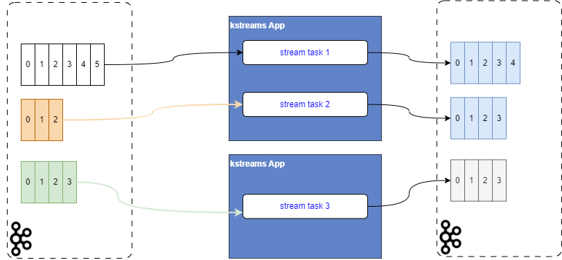
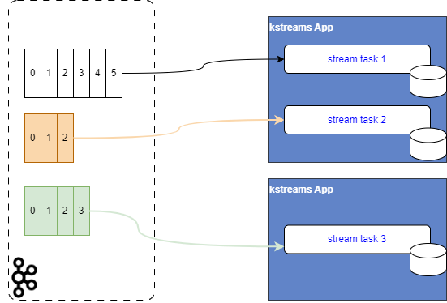
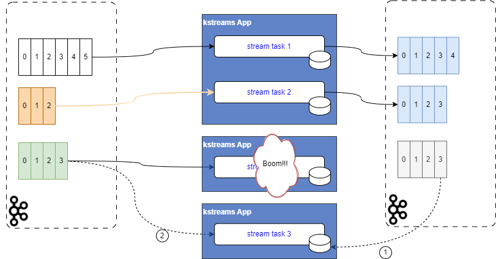
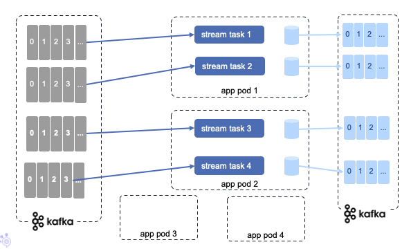
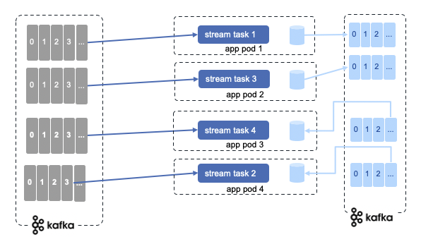

# Kafka Streams

Kafka Streams is client API to build microservices with input and output data are in Kafka. It is based on programming a graph of processing nodes to support the business logic developer wants to apply on the event streams. 

We recommend reading this excellent introduction [Kafka stream made simple](https://www.confluent.io/blog/introducing-kafka-streams-stream-processing-made-simple/) from Jay Kreps from Confluent to get a good understanding of why Kafka stream was created.


## Concepts

The business logic is implemented via **topology** which represents a graph of processing nodes.  Each node within the graph, processes events from the parent node. 

To summarize, **Kafka Streams** has the following capabilities:

* Kafka Streams applications are built on top of the producer and consumer Kafka APIs and are leveraging Kafka capabilities to do data parallelism processing, support distributed coordination of partition to task assignment, and being fault tolerant.
* Kafka supports exactly-once processing semantics to guarantee that each record is processed once and only once even when there is a failure.
* Streams processing is helpful for handling out-of-order data, *reprocessing* input as code changes, and performing stateful computations, like real time analytics. It uses stateful storage and consumer groups. It treats both past and future data the same way.
* Kafka Streams is an embedded library to integrate in any Java application. No need for separate processing cluster. As deployable container, it can scale horizontally easily within Kubernetes platform. It does not run in Kafka cluster.
* Topology consumes continuous real time flows of records and publishes new flows to one or more topics.
* A stream (represented by the KStream API) is a durable, partitioned sequence of immutable events. When a new event is added a stream, it's appended to the partition that its key belongs to.
* It can scale vertically, by increasing the number of threads for each Kafka Streams application on a single machine, and horizontally by adding additional machines or pods in kubernetes.  Each deployed instance use the same value for the `application.id` kafka stream property.

 { width="600" }

The assignment of stream partitions to stream tasks never changes, so task is the unit of parallelism. Task executes the topology, and is buffering records coming from the attached partitions. 

* **KTable** is a durable, partitioned collection that models change over time. It's the mutable counterpart of **KStreams**. It represents what is true at the current moment. Each data record is considered a contextual update. Tables are saved in state store backed up with kafka topic and may be queried. Any operation on the table such as querying, inserting, or updating a row is carried out behind the scenes by a corresponding operation on the table’s state store.

These state stores are being materialized on local disk inside the application instances
  
  { width=500}


* Stream APIs transform, aggregate and enrich data, per record with millisecond latency, from one topic to another one.
* Supports stateful and windowing operations by processing one record at a time.
* An application's processor topology is scaled by breaking it into multiple tasks.
* Tasks can then instantiate their own processor topology based on the assigned partitions.

 

### Fault tolerance

As **KTables** are persisted on state store, they are materialized on local to broker disk, as change log streams:

 

In the case of a stream processing task fails, it can rebuild its internal, in memory state store, from the kafka topic / change log (1). Once done it can consume messages again (2). The system is fault tolerant.

### Scaling

When topics have multiple partitions, each kafka streams task consumes a unique partition. 

 

If for any reasons, we need to scale by adding new instances of the application, so in term of kubernetes, adding more pods, then the system will rebalance the stream tasks allocation to new instances created.

 
 
We can start as many threads of the application as there are input Kafka topic partitions.

Another good example to illustrate threading, task and machine scaling is documented in this [on Confluent article](https://docs.confluent.io/current/streams/architecture.html#example).

## Code structure

In general the code for processing event does the following:

* Set a properties object to specify which brokers to connect to and what kind of key and value des/serialization mechanisms to use.
* Define a stream client: if you want to get the stream of records use **KStream**. If you want a changelog with the last value of a given key, use **KTable** (For example, using KTable to keep a user profile data by userid key).
* Create a topology of input source and sink target and the set of actions to perform in between.
* Start the stream client to consume records.

Programming with **KStream** and **Ktable** is not easy at first, as there are a lot of concepts for data manipulations, serialization and operations chaining. Code size stays on the low size.

A stateful operator uses the streaming Domain Specific Language, with constructs for aggregation, join and time window operations. Stateful transformations require a state store associated with the stream processor.

We recommend at this stage to do our [exercise 1 from the Tech Academy tutorial](https://jbcodeforce.github.io/eda-tech-academy/lab2/) to develop a first simple topology and test it without any Kafka cluster using the `Topology test driver`.

The following code extract, is part of the Apache Kafka Word count example and is used to illustrate the programming model used: 

```java
// Streams processing are created from a builder.
final StreamsBuilder builder = new StreamsBuilder();
// pattern to extract word
final Pattern pattern = Pattern.compile("\\W+");
// source is a kafka topic, and materialized as a KStream
KStream<String, String> textLines = builder.stream(source);
// implement the logic to count words
KTable<String, Long> wordCounts = textLines
    .flatMapValues(textLine -> Arrays.asList(pattern.split(textLine.toLowerCase())))
    .print(Printed.toSysOut())
    .groupBy((key, word) -> word)
    .count(Materialized.<String, Long, KeyValueStore<Bytes, byte[]>>as("counts-store"));
// sink is another kafka topic. Produce for each word the number of occurrence in the given doc
wordCounts.toStream().to(sink, Produced.with(Serdes.String(), Serdes.Long()));

KafkaStreams streams = new KafkaStreams(builder.build(), props);
streams.start();
```

* [KStream](https://kafka.apache.org/38/javadoc/org/apache/kafka/streams/kstream/KStream.html) represents KeyValue records coming as event stream from the input topic.
* `flatMapValues()` transforms the value of each record in "this" stream into zero or more values with the same key in a new KStream (in memory). So here the text line is split into words. The parameter is a [ValueMapper](https://kafka.apache.org/38/javadoc/org/apache/kafka/streams/kstream/ValueMapper.html) which applies transformation on values but keeps the key. Another important transformation is the [KeyValueMapper](https://kafka.apache.org/38/javadoc/org/apache/kafka/streams/kstream/KeyValueMapper.html).
* `groupBy()` Group the records of this KStream on a new key that is selected using the provided KeyValueMapper. So here it creates new KStream with the extracted word as key.
* `count()` counts the number of records in this stream by the grouped key. `Materialized` is an class to define a "store" to persist state and data. So here the state store is "counts-store". As store is a in-memory table, but it could also be persisted in external database. Could be the Facebook's [RocksDB key value persistence](https://rocksdb.org/) or a log-compacted topic in Kafka.
* Produced defines how to provide the optional parameter types when producing to new topics.
* KTable is an abstraction of a changelog stream from a primary-keyed table.

Important: map, flatMapValues and mapValues ... functions don’t modify the object or value presented as a parameter.

## Available tutorials

We found the following tutorial helpful to grow your competency on Kafka Streams:

* [Word count Kafka Stream example from product documentation](https://kafka.apache.org/38/documentation/streams/tutorial)
* [Use Quarkus and Kafka Streams to use groupBy, join with another Stream](../use-cases/kafka-streams/lab-1)
* [Quarkus and Kafka Streams guides](https://quarkus.io/guides/kafka-streams)
* [Build an inventory aggregator with Quarkus, with kstreams, ktable and interactive queries, Mutiny](../../use-cases/kafka-streams/lab-3), all deployable on OpenShift with quarkus kubernetes plugin.

## Interactive queries

State store can be queried, and this is supported by [the interactive queries](https://kafka.apache.org/10/documentation/streams/developer-guide/interactive-queries.html). Result can be from the local store, if the key is in the local store, or a remote one. The metadata of the key to task allocation is maintained and shared between tasks. 

As a Kafka stream app runs on multiple instances, the entire state of the app is distributed among the instances. 

The Stream topology will transform the stream to table with one of the groupBy or aggregate operation:

```java

items
.groupByKey(ItemStream.buildGroupDefinition())
.aggregate(
    () ->  new Inventory(),
    (k , newItem, existingInventory) 
        -> existingInventory.updateStockQuantity(k,newItem), 
        InventoryAggregate.materializeAsInventoryStore()); 
```

which then it can be materialized as queryable key - value store.

```java
// class InventoryAggregate
/**
 * Create a key value store named INVENTORY_STORE_NAME to persist store inventory
 */
public static Materialized<String, Inventory, KeyValueStore<Bytes, byte[]>> materializeAsInventoryStore() {
    return Materialized.<String, Inventory, KeyValueStore<Bytes, byte[]>>as(INVENTORY_STORE_NAME)
            .withKeySerde(Serdes.String()).withValueSerde(inventorySerde);
}
```

Each store is local to the instance it was created in:

 

The storeID is the key used in the KTable. Once the Kafka Stream is started and store created (loop to get it ready) then it is easy to access it:

```java
@Inject
KafkaStreams streams;

private ReadOnlyKeyValueStore<String, Inventory> getInventoryStockStore() {
        while (true) {
            try {
    
                StoreQueryParameters<ReadOnlyKeyValueStore<String,Inventory>> parameters = StoreQueryParameters.fromNameAndType(InventoryAggregate.INVENTORY_STORE_NAME,QueryableStoreTypes.keyValueStore());
                return streams.store(parameters);
        ...

// access one element of the store
Inventory result = getInventoryStockStore().get(storeID);

```

To get access to remote store, we need to expose each store via an API. The easiest one is a REST api, but it could be any RPC protocol. Each instance is uniquely identified via the `application.server` property. When deploying on kubernetes it could be the pod IP address accessible via the $POD_IP environment variable.  

Below is a Quarkus declaration:

```properties
hostname=${POD_IP:localhost}
quarkus.kafka-streams.application-server=${hostname}:8080
```

Now the design decision is to return the URL of the remote instance to the client doing the query call or do the call internally to the instance reached to always returning a result.

The knowledge of other application instance is done by sharing metadata. The following code example illustrates the access to metadata for store via the kafka stream context and then build a pipeline metadata to share information about host, port and partition allocation.

```java
streams.allMetadataForStore(ItemStream.ITEMS_STORE_NAME)
                .stream()
                .map(m -> new PipelineMetadata(
                        m.hostInfo().host() + ":" + m.hostInfo().port(),
                        m.topicPartitions()
                                .stream()
                                .map(TopicPartition::toString)
                                .collect(Collectors.toSet())))
                .collect(Collectors.toList());
```

## Design considerations

* Partitions are assigned to a StreamTask, and each StreamTask has its own state store. So it is important to use key and kafka will assign records with same key to same partition so lookup inside state store will work.
* Avoid external database lookup as part of the stream: As kafka can handle million of records per second, so a lookup to an external 
database to do a join between a primary key that is in the event and a table in the database to do a data enrichment, for example,
 is a bad practice. The approach will be to use Ktable, with state store and perform a join in memory.
* Reference data can be loaded inside a Ktable for event stream enrichment.
* Table and streams joins: we recommend reading [this deep dive article](https://www.confluent.io/blog/crossing-streams-joins-apache-kafka/) on joining between streams and joining stream with table. The important points from this article:

    * kstream - kstream joins are windowed to control the size of data to keep in memory to search for the matching records.


## Faust: a python library to do kafka streaming

[Faust](https://faust.readthedocs.io/en/latest/index.html) is a python library to support stream processing. It does not have its own DSL as Kafka streams in Java has, but just python functions.

It uses rocksdb to support tables.

For the installation, in your python environment do a `pipenv run pip install faust`, or `pip install faust`. Then use faust as a CLI. So to start an agent as worker use:

```shell
faust -A nameofthepythoncode -l info
```

Multiple instances of a Faust worker can be started independently to distribute stream processing across machines and CPU cores.

## Further readings

* The API and [product documentation](https://kafka.apache.org/38/documentation/streams/developer-guide/).
* [Kafka Streams  concepts from Confluent](https://docs.confluent.io/current/streams/concepts.html)
* [Deep dive explanation for the differences between KStream and KTable from Michael Noll](https://www.michael-noll.com/blog/2018/04/05/of-stream-and-tables-in-kafka-and-stream-processing-part1/)
* [Our set of samples to getting started in coding kafka streams](https://github.com/jbcodeforce/kafka-streams-samples) 
* [Distributed, Real-time Joins and Aggregations using Kafka Stream, from Michael Noll at Confluent](https://www.confluent.io/blog/distributed-real-time-joins-and-aggregations-on-user-activity-events-using-kafka-streams/)
* [Confluent Kafka Streams documentation](https://docs.confluent.io/current/streams/index.html#kafka-streams)
* [Kafka Streams architecture article from Confluent](https://docs.confluent.io/current/streams/architecture.html).
* [Andy Bryant's article on kafka stream work allocation and sub-topologies](https://medium.com/@andy.bryant/kafka-streams-work-allocation-4f31c24753cc)